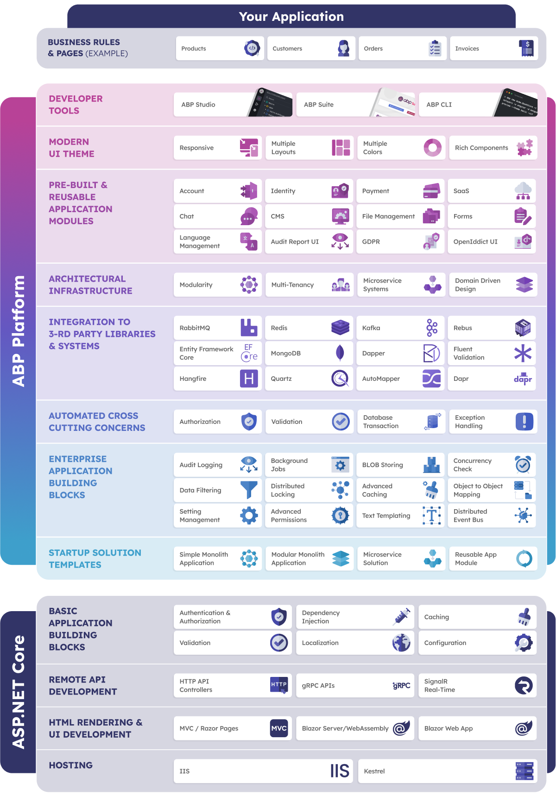

# ABP Framework

 🔹  🔹  🔹  🔹  🔹 
 🔹  🔹  🔹 

[ABP](https://abp.io/) offers an **opinionated architecture** to build enterprise software solutions with **best practices** on top of the **.NET** and the **ASP.NET Core** platforms. It provides the fundamental infrastructure, production-ready startup templates, pre-built application modules, UI themes, tooling, guides and documentation to implement that architecture properly and **automate the details** and repetitive works as much as possible.

 

## Getting Started

- [The Getting Started guide](https://abp.io/docs/latest/get-started) can be used to create and run ABP-based solutions with different options and details.
- [Quick Start](https://abp.io/docs/latest/tutorials/todo) is a single-part, quick-start tutorial to build a simple application with the ABP Framework. Start with this tutorial if you want to understand how ABP works quickly.
- [Web Application Development Tutorial](https://abp.io/docs/latest/tutorials/book-store) is a complete tutorial on developing a full-stack web application with all aspects of a real-life solution.
- [Modular Monolith Application](https://abp.io/docs/latest/tutorials/modular-crm/index): A multi-part tutorial that demonstrates how to create application modules, compose and communicate them to build a monolith modular web application.

## What ABP Provides?

ABP bridges the gap between ASP.NET Core and real-world business application requirements, and makes you focus on your own business code.

The following diagram shows the key components of the ABP at a glance:

### Architecture

ABP offers a complete architectural model to build modern enterprise software solutions. Here, the fundamental architectural structures offered and first-class supported by ABP:

* [Domain Driven Design](https://abp.io/docs/latest/framework/architecture/domain-driven-design)
* [Microservices](https://abp.io/docs/latest/framework/architecture/microservices)
* [Modularity](https://abp.io/docs/latest/framework/architecture/modularity/basics)
* [Multi-Tenancy](https://abp.io/docs/latest/framework/architecture/multi-tenancy)

### Infrastructure

There are a lot of infrastructure features provided by the ABP Framework to achieve real-world scenarios easier, like [Event Bus](https://abp.io/docs/latest/framework/infrastructure/event-bus), [Background Job System](https://abp.io/docs/latest/framework/infrastructure/background-jobs), [Audit Logging](https://abp.io/docs/latest/framework/infrastructure/audit-logging), [BLOB Storing](https://abp.io/docs/latest/framework/infrastructure/blob-storing), [Data Seeding](https://abp.io/docs/latest/framework/infrastructure/data-seeding), [Data Filtering](https://abp.io/docs/latest/framework/infrastructure/data-filtering), and much more.

[See ABP Framework features](https://abp.io/framework)

#### Cross-Cutting Concerns

ABP also simplifies (and even automates wherever possible) cross-cutting concerns and common non-functional requirements like [Exception Handling](https://abp.io/docs/latest/framework/fundamentals/exception-handling), [Validation](https://abp.io/docs/latest/framework/fundamentals/validation), [Authorization](https://abp.io/docs/latest/framework/fundamentals/authorizationn), [Localization](https://abp.io/docs/latest/framework/fundamentals/localization), [Caching](https://abp.io/docs/latest/framework/fundamentals/caching), [Dependency Injection](https://abp.io/docs/latest/framework/fundamentals/dependency-injection), [Setting Management](https://abp.io/docs/latest/framework/infrastructure/settings), etc.

### Application Modules

ABP is a modular framework and the [application modules](https://abp.io/modules) provide **pre-built application functionalities**. 

Some examples:

- [**Account**](https://abp.io/modules/Volo.Account.Pro): Provides UI for the account management and allows user to login/register to the application.
- [CMS Kit](https://abp.io/modules/Volo.CmsKit):  Brings CMS (Content Management System) capabilities to your application.
- **[Identity](https://abp.io/modules/Volo.Identity.Pro)**: Manages organization units, roles, users and their permissions based on the Microsoft Identity library.
- [**OpenIddict**](https://abp.io/modules/Volo.OpenIddict.Pro): Integrates to OpenIddict library and provides a management UI.
- [**SaaS**](https://abp.io/modules/Volo.Saas): Manages tenants and editions for a [multi-tenant](https://abp.io/docs/latest/framework/architecture/multi-tenancy) (SaaS) application.

See [all official modules](https://abp.io/modules).

### Startup Templates

The [Startup templates](https://abp.io/docs/latest/solution-templates) are pre-built Visual Studio solution templates. You can create your own solution based on these templates to **immediately start your development**.

### Tooling

ABP provides CLI and UI tools to simplify your daily development work flows.

#### ABP Studio

[ABP Studio](https://abp.io/studio) is a cross-platform desktop application for ABP developers.

It is well integrated to the ABP Framework and aims to provide a comfortable development environment for you by automating things, providing insights about your solution, making develop, run and deploy your solutions much easier.

#### ABP Suite

[ABP Suite](https://abp.io/suite) allows you to automatically generate web pages in a matter of minutes.

#### ABP CLI

[ABP CLI](https://abp.io/cli) is a command line tool to perform common operations for ABP based solutions.

## Mastering ABP Framework Book

This book will help you to gain a complete understanding of the ABP Framework and modern web application development techniques. It is written by the creator and team lead of the ABP Framework. You can buy from [Amazon](https://www.amazon.com/gp/product/B097Z2DM8Q) or [Packt Publishing](https://www.packtpub.com/product/mastering-abp-framework/9781801079242). Find further info about the book at [abp.io/books/mastering-abp-framework](https://abp.io/books/mastering-abp-framework).

## The Community

### ABP Community Web Site

The [ABP Community](https://abp.io/community) is a central hub to publish **articles** and share **knowledge** about the ABP Framework.

### Blog

Follow the [ABP Blog](https://abp.io/blog) to learn the latest happenings in the ABP Framework.

### Samples

See the [sample projects](https://abp.io/docs/latest/samples) built with the ABP Framework.

### Want to Contribute?

ABP is a community-driven open-source project. See [the contribution guide](https://abp.io/docs/latest/contribution) if you want to participate in this project.

## Official Links

* [Home Website](https://abp.io)
  * [Get Started](https://abp.io/get-started)
  * [Features](https://abp.io/framework)
* [Documents](https://abp.io/docs/latest)
* [Samples](https://abp.io/docs/latest/samples)
* [Blog](https://abp.io/blog)
* [Community](https://abp.io/community)
* [Stackoverflow](https://stackoverflow.com/questions/tagged/abp)
* [Twitter](https://twitter.com/abpframework)

## Support ABP

GitHub repository stars are an important indicator of popularity and the size of the community. If you like ABP Framework, support us by clicking the star :star: on the repository.

## Discord Server

We have a Discord server where you can chat with other ABP users. Share your ideas, report technical issues, showcase your creations, share the tips that worked for you and catch up with the latest news and announcements about ABP Framework. Join 👉 https://discord.gg/abp.
