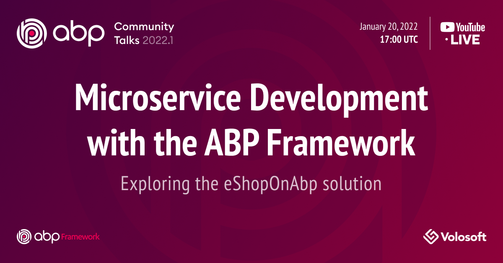

# ABP.IO Platform 5.1 Has Been Released

Today, we are releasing the [ABP Framework](https://abp.io/) and the [ABP Commercial](https://commercial.abp.io/) version 5.1 (with a version number `5.1.1`). This blog post introduces the new features and important changes in this new version.

> **Warning**
>
> For a long time we were releasing RC (Release Candidate) versions a few weeks before every minor and major release. **This version has been released without a preview version.** This is because we've accidently released all the packages with a stable version number, without a `-rc.1` suffix and there is no clear way to unpublish all the NuGet and NPM packages. Sorry about that. However, it doesn't mean that this release is buggy. We've already resolved known problems. We will publish one or more patch releases if needed. You can follow [this milestone](https://github.com/abpframework/abp/milestone/64?closed=1) for known problems or submit your own bug report. If you are worried about its stability, you can wait for the next patch release.

## Get Started with the 5.1

follow the steps below to try the version 5.1 today;

1) **Upgrade** the ABP CLI to the latest version using a command line terminal:

````bash
dotnet tool update Volo.Abp.Cli -g
````

**or install** if you haven't installed before:

````bash
dotnet tool install Volo.Abp.Cli -g
````

2) Create a **new application**:

````bash
abp new BookStore
````

See the [ABP CLI documentation](https://docs.abp.io/en/abp/latest/CLI) for all the available options.

> You can also use the *Direct Download* tab on the [Get Started](https://abp.io/get-started) page.

You can use any IDE that supports .NET 6.x development (e.g. [Visual Studio 2022](https://visualstudio.microsoft.com/downloads/)).

### Migration Notes & Breaking Changes

This is an minor feature release, mostly with enhancements and improvements based on the [version 5.0](https://blog.abp.io/abp/ABP-IO-Platform-5-0-Final-Has-Been-Released). There is no breaking change except the Angular UI upgrade. ABP 5.1 startup templates use **Angular 13**.

### Angular UI

**If you want to upgrade ABP Framework but want to continue with Angular 12**, add the following section to `package.json` file of the Angular project:

````json
"resolutions": {
    "ng-zorro-antd": "^12.1.1",
    "@ng-bootstrap/ng-bootstrap": "11.0.0-beta.2"
  }
````

## What's new with 5.1?

In this section, I will introduce some major features released with this version.

### DRAFT list of things done

#### ABP Framework

* Use new hosting model for the app template. [#10928](https://github.com/abpframework/abp/pull/10928) - what to do for existing solutions?
* Async application initialization methods on the AbpModule class [#6828](https://github.com/abpframework/abp/issues/6828)
* Angular 13?
* [#10552](https://github.com/abpframework/abp/pull/10696) Used file scoped namespaces :)
* Support markdown in CMS-Kit comments [#10792](https://github.com/abpframework/abp/pull/10792)
* eShopOnAbp is getting mature
* Nightly builds are working again
* Coming: New ABP.IO design!

All issues & PRs in [5.1 milesone](https://github.com/abpframework/abp/milestone/60?closed=1).

#### ABP Commercial

* CMS Kit Pro: URL forwarding
* LeptonX is coming for ABP Blazor and MVC UI too (share the sample dashboard)

### Header 1

TODO

## Community News

### ABP Community Talks 2021.1



This is the second episode of the ABP Community Talks and we are talking about microservice development with the ABP Framework, based on the [eShopOnAbp](https://github.com/abpframework/eShopOnAbp) reference solution. We will also briefly talk about the changes that come with ABP version 5.1. This **live meeting** will be at **January 20, 2022, 17:00 (UTC)** on YouTube.

**Join this event on the Kommunity platform: https://kommunity.com/volosoft/events/abp-community-talks-20221-microservice-development-acd0f44b**

You can also [subscribe to the Volosoft channel](https://www.youtube.com/channel/UCO3XKlpvq8CA5MQNVS6b3dQ) for reminders for further ABP events and videos.

### New ABP Community posts

Here, some of the recent posts added to the [ABP community](https://community.abp.io/):

* [Minimal API development with the ABP Framework](https://community.abp.io/articles/minimal-api-with-abp-hello-world-part-1-sg5i44p8) by [@antosubash](https://github.com/antosubash) (three parts, video tutorial).
* [Integrating the Syncfusion MVC Components to the ABP MVC UI](https://community.abp.io/articles/integrating-the-syncfusion-mvc-components-to-the-abp-mvc-ui-0gpkr1if) by [@EngincanV](https://github.com/EngincanV).
* [Add Tailwind CSS to your ABP Blazor UI](https://community.abp.io/articles/add-tailwindcss-to-your-abp-blazor-ui-vidiwzcy) by [@antosubash](https://github.com/antosubash) (video tutorial).
* [Import external users into the users Table from an ABP Framework application](https://community.abp.io/articles/import-external-users-into-the-users-table-from-an-abp-framework-application-7lnyw415) by [@bartvanhoey](https://github.com/bartvanhoey).

Thanks to the ABP Community for all the contents they have published. You can also [post your ABP and .NET related (text or video) contents](https://community.abp.io/articles/submit) to the ABP Community.

## Conclusion

In this blog post, I summarized the news about that new version and the ABP Community. Please try it and provide feedback by opening issues on [the GitHub repository](https://github.com/abpframework/abp). Thank you all!
