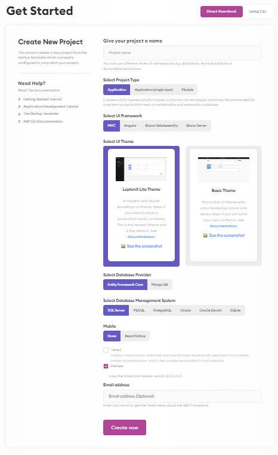
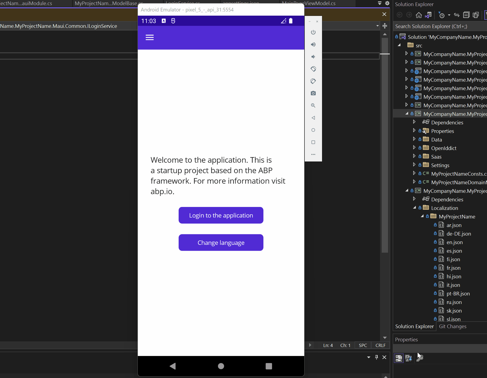
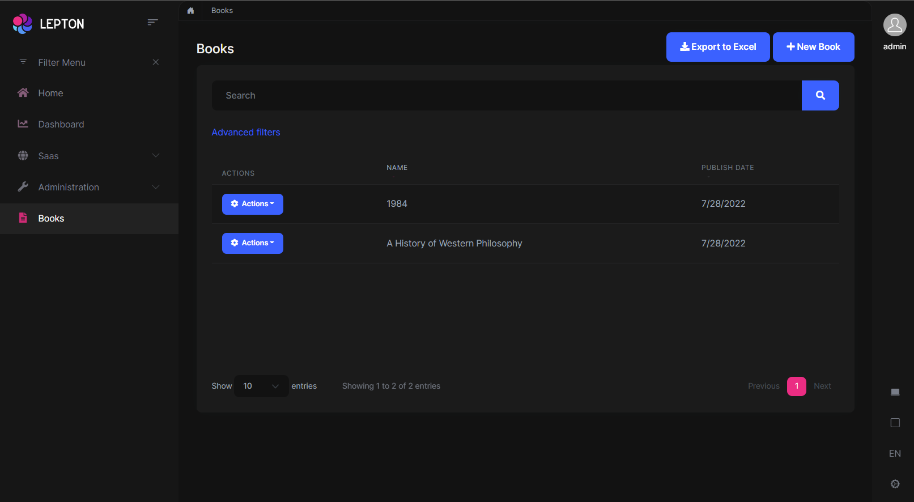

# ABP.IO Platform 6.0 RC Has Been Released

Today, we are happy to release the [ABP Framework](https://abp.io/) and  [ABP Commercial](https://commercial.abp.io/) version **6.0 RC** (Release Candidate). This blog post introduces the new features and important changes in this new version.

> **The planned release date for the [6.0.0 Stable](https://github.com/abpframework/abp/milestone/71) version is September 06, 2022**.

Please try this version and provide feedback for a more stable ABP version 6.0! Thank you all.

## Get Started with the 6.0 RC

Follow the steps below to try version 6.0.0 RC today:

1) **Upgrade** the ABP CLI to version `6.0.0-rc.1` using a command line terminal:

````bash
dotnet tool update Volo.Abp.Cli -g --version 6.0.0-rc.1
````

**or install** it if you haven't before:

````bash
dotnet tool install Volo.Abp.Cli -g --version 6.0.0-rc.1
````

2) Create a **new application** with the `--preview` option:

````bash
abp new BookStore --preview
````

See the [ABP CLI documentation](https://docs.abp.io/en/abp/latest/CLI) for all the available options.

> You can also use the *Direct Download* tab on the [Get Started](https://abp.io/get-started) page by selecting the **Preview checkbox**.

You can use any IDE that supports .NET 6.x, like **[Visual Studio 2022](https://visualstudio.microsoft.com/downloads/)**.

## Migration Guides

There are some changes in this version that may effect your applications. Please see the following migration guides, if you are upgrading from v5.3.0:

* [ABP Framework 5.3 to 6.0 Migration Guide](//TODO: link!!!)
* [ABP Commercial 5.3 to 6.0 Migration Guide](//TODO: link!!!)

## What's New with ABP Framework 6.0?

In this section, I will introduce some major features released with this version. Here is a brief list of titles explained in the next sections:

* LeptonX Lite is now the default theme for startup templates
* Optional PWA option added to [*Get Started*](https://abp.io/get-started) page
* Introducing the **OpenIddict Module** and Switching to OpenIddict for the startup templates
* New **MAUI** Startup Template
* Introducing the `ITransientCachedServiceProvider` interface
* Introducing the dynamic components for Blazor UI
* Improvements on ABP CLI
* Introducing the `Volo.Abp.RemoteServices` package
* Create/Update User Accounts For External Logins
* Sending test email in the setting page for MVC and Blazor UIs
* Improvements on the **eShopOnAbp** Project
* Other News

### LeptonX Lite Theme on Startup Templates


With this version, startup templates (`app` and `app-nolayers` templates) use the **LeptonX Lite** as the default theme. However, it's still possible to create a project with **Basic Theme** either using the **ABP CLI** or downloading the project via [*Get Started*](https://abp.io/get-started) page on [abp.io](https://abp.io/) website.

#### via ABP CLI

To create a new project with **Basic Theme**, you can use the `--theme` option as below:

```bash
abp new Acme.BookStore --theme basic --preview
```

#### via Get Started page

Also, you can create a new project with **LeptonX Lite** or **Basic Theme** on *Get Started* page.



> Preview checkbox should be checked to be able to see the theme selection section on the *Get Started* page.

### Optional PWA Option Added to Get Started Page

We've introduced the PWA support for the startup templates for Angular & Blazor WASM UIs in **v5.3**. In this version, we also add this PWA option to the [*Get Started*](https://abp.io/get-started) page on [abp.io](https://abp.io/) website.


If you checked the "Progressive Web Application" checkbox while creating an application, the all required configurations will be made for you and you will get the benefit of PWA features in your application.

### Introducing the **OpenIddict Module** and Switching to OpenIddict for the Startup Templates

We have [announced the plan of replacing the IdentityServer with OpenIddict](https://github.com/abpframework/abp/issues/11989). 

Therefore, we have created the `OpenIddict` module in this version and switched to **OpenIddict** for the startup templates. ABP Framework uses this module to add **OAuth** features into the applications. We created documentation for the **OpenIddict Module** and you can see it from [here](https://docs.abp.io/en/abp/6.0/Modules/OpenIddict) to learn overall knowledge about the **OpenIddict Module**.

Currently, we are preparing migration guides for switching to OpenIddict. You can follow the [#13403](https://github.com/abpframework/abp/pull/13403) to see the progress on the documentations.

> We will continue to ship IDS-related packages for a while but in the long term, you will need to replace it, because IDS support ends at the end of 2022. Please see the [announcement]((https://github.com/abpframework/abp/issues/11989)) for more info.

### New MAUI Startup Template


ABP Framework provides MAUI startup templates with **v6.0**. You can create a new MAUI project with command below:

```bash
abp new Acme.BookStore -t maui
```

### Introducing the `ITransientCachedServiceProvider`

ABP provides the `ICachedServiceProvider` interface to resolve the cached services within a new scope. However, in case of don't want to deal with creating scopes to resolve the cached services without creating a scope, we are introducing the `ITransientCachedServiceProvider` interface. It still resolved the all the cached services, but the service itself is **transient** rather that **scoped** like the `ICachedServiceProvider`. Please see the [#12918](https://github.com/abpframework/abp/issues/12918) for more info.

### Introducing the dynamic layout components for Blazor UI

ABP Framework provides different ways of customizing the UI and one of them is to use [Layout Hooks](https://docs.abp.io/en/abp/latest/UI/AspNetCore/Layout-Hooks) for MVC. The **Layout Hook System** allows you to add code at some specific parts of the layout and all layouts of the themes that provided by ABP framework implement these hooks.

However, BlazorUI doesn't have such a system yet and we are planning to implement [Layout Hooks for the Blazor UI](https://github.com/abpframework/abp/issues/6261) in version 7.0.

We are introducing the dynamic layout components for the Blazor UI to allow to add components to the layout of Blazor applications. 

You can configure the `AbpDynamicLayoutComponentOptions` to render your components in the layout, as below:

```csharp
Configure<AbpDynamicLayoutComponentOptions>(options =>
{
    options.Components.Add(typeof(MyBlazorComponent), null);
});
```

### Improvements on ABP CLI

There are some developments on the [ABP CLI](https://docs.abp.io/en/abp/6.0/CLI) made in this version. You can see the brief list of some of the improvements below:

* You can list the all available templates by using the `abp list-templates` command with v6.0. See [#13083](https://github.com/abpframework/abp/pull/13083).
* You can select the theme while creating a project by specifying the `--theme` option. You can see the *LeptonX Lite Theme on Startup Templates* section above for an example.
* `abp update` command now updates all package versions inside the all solutions in the sub-folders with v6.0. See [#12735](https://github.com/abpframework/abp/pull/12738).

### Introducing the `Volo.Abp.RemoteService` Package

A new `Volo.Abp.RemoteService` package has been added to the framework. Some of the classes that related with the remote service configurations such as `AbpRemoteServiceOptions` class have been moved from `Volo.Abp.Http.Client` to the this package. In this way, it became more reusable for the further uses.

### Create/Update User Accounts For External Logins

If an external login have been made to a client application, for example from the **Keycloak Server** (or any other external provider), the user is redirected to the external provider (**Keycloak** in our example), user provides credentials (username and password) it's own and redirected back to the client application as logged in. So, it's possible to user's account is not available in the local database because our backend hasn't any knowledge about this process.

To prevent this mismatch/problem, ABP Framework create this logged-in user as an external user in the database. Thanks to that, the user can bee seen in the *Users* page and set neccessary permissions for this user.

> For more info, please see [the related issue](https://github.com/abpframework/abp/issues/12203).

### Sending test email in the setting page for MVC and Blazor UIs

"Sending Test Email" feature is added to the [Setting Management](https://docs.abp.io/en/abp/6.0/Modules/Setting-Management) module, that allows to check the email settings are configured properly and sending emails succesfully to the target email address. 


After configuring the email settings such as target email address, you can click the "Send" button to sending a test email to see everything went well.

### Improvements on the eShopOnAbp Project

There are some developments on the [eShopOnAbp project](https://github.com/abpframework/eShopOnAbp) made in this version. You can see the brief descriptions of some of the improvements below:

* Some improvements have been made on the Admin Application for Order Management (Angular UI). See [#110](https://github.com/abpframework/eShopOnAbp/pull/110).
* SignalR error on Kubernetes & Docker Compose have been fixed. See [#113](https://github.com/abpframework/eShopOnAbp/pull/113).
* eShopOnAbp project has been deployed to Azure (Aks). See [#114](https://github.com/abpframework/eShopOnAbp/pull/114). You can visit [https://eshoponabp.com/](https://eshoponabp.com/) to see it on live.
* Configurations have been made for some services on `docker-compose.yml` file. See [#112](https://github.com/abpframework/eShopOnAbp/pull/112).
* Gateway Redirect Loop problem on Kubernetes has been fixed. See [the commit](https://github.com/abpframework/eShopOnAbp/commit/6413ef15c91cd8a5309050b63bb4dbca23587607).


### Other News 

* Autofac library upgraded to **v6.4.0** in this version. Please see [#12816](https://github.com/abpframework/abp/pull/12816) for more info.
* Perfomance Improvements have been made in the **Settings Module** and tabs on the *Settings* page are lazy loading now.
* Some improvements have been made in the CMS Kit Module. You can see the improvements from [here](https://github.com/abpframework/abp/issues/11965).

If you want to see more details, you can check [the release on GitHub](https://github.com/abpframework/abp/releases/tag/6.0.0-rc.1), which contains a list of all the issues and pull requests closed within this version.

## What's New with ABP Commercial 6.0?

### LeptonX Theme on Startup Templates

With this version, startup templates (`app-pro`, `app-nolayers-pro` and `microservice-pro` templates) use the **LeptonX Theme** as the default theme. However, it's still possible to create a project with **Lepton Theme** and **Basic Theme**, either using the **ABP CLI** or **Suite**.

#### via ABP CLI

To create a new project with **Lepton Theme** or **Basic Theme**, you can use the `--theme` option as below:

```bash
abp new Acme.BookStore --theme lepton --preview
```

> For "Basic Theme" specify the theme name as `--theme basic`.

#### via Suite

Also, you can create a new project with **Lepton Theme** or **Basic Theme** from Suite.


### Switching to OpenIddict for the Startup Templates

We've also switched to the **OpenIddict** for the startup templates for ABP Commercial as explained above.

### New MAUI Application as Mobile Option for Application Startup Template



ABP Commercial provides a MAUI application as mobile option for the Application Template. 

To create an Application Template with the MAUI application, you can use the command below:

```bash
abp new Acme.BookStore -t app-pro --mobile maui
```

### GDPR: Cookie Consent


With this version, **Cookie Consent** feature has been added to the **GDPR** module. It's enabled by default for the startup templates and also there are two pages in the templates: "Cookie Policy" page and "Privacy Policy" page. 

If you want to disable/hide the "Cookie Consent", you can simply open your module class and set the *IsEnabled* property as **false** for **AddAbpCookieConsent** method as below:

```csharp
context.Services.AddAbpCookieConsent(options =>
{
    options.IsEnabled = false; //disabled
});
```

> This pages are used to build up the cookie consent text and you can change the content of these pages by your needs.

If you want to use the Cookie Consent feature of GDPR module in your existing project, please see the [GDPR Module](https://docs.abp.io/en/commercial/6.0/modules/gdpr) documentation for configurations.

### Improvements/Developments on CMS Kit Poll System

Some improvements/developments have been made on the Poll System of CMS Kit module as listed briefly below:

* Some improvements have been made on the Widget rendering and Admin side for the Blazor UI.
* Widget can be picked from the editor with this version as seen in the image below.


### Blazor UI for the Chat Module

Chat Module is now also available for the Blazor UI after the MVC and Angular UIs. You can read the [Chat Module](https://docs.abp.io/en/commercial/6.0/modules/chat) documentation to get the overal knowledge about the module and add into your application.

You can view the "Features" module that allows you to enable-disable Chat Module for the application and example of a conversation that made by using the Chat Module from the following images.


### Blazor Admin UI for CMS Kit Module

All admin side **CMS Kit** and **Cms Kit Pro** features have been implemented for the Blazor UI. Blazor UI will only be available to ABP Commercial customers.

//TODO: add some screenshots!!!

### Suite: Excel Export

With v6.0, now it's possible to export the records as Excel for Blazor & MVC UIs. Angular UI is still in-progress, and we'll try to implement it until the v6.0 stable release.


While generating CRUD pages via Suite, if you checked the "Excel export" checkbox (as shown in the image above), "Excel Export" button will be added to the top of the datatable of the generated page.



Then, you can get the records in anytime you want in the .xlsx format just by clicking the "Excel Export" button. Also, before exporting records to Excel you can filter the records and get records by your needs.

### Suite: Optional PWA Support

With this version, it's possible to add the [PWA (Progressive Web App)](https://web.dev/progressive-web-apps/?gclid=Cj0KCQjwxIOXBhCrARIsAL1QFCY0IB-W5k-lsXmRCbm00sl4nyBIYynAX3IdJkjyizyNUjuCE8zeu24aApxtEALw_wcB) support for Blazor & Angular UIs while creating the application via Suite. 


You just need to checked the "Progressive web application" checkbox, while creating the application. Then, Suite will add the PWA support into your application and you will be get the full benefit of PWA features such as offline support when you published your application.

### Other News

#### Explainer Videos

We are creating explainer videos for the ABP Commercial Modules to provide overview to the developers. Within this milestone, we've created four new explainer videos and here they are:

* [Audit Logging Module](https://www.youtube.com/watch?v=NzSuFBpqfsc)
* [Identity Module](https://www.youtube.com/watch?v=W87jA_GBE54)
* [SaaS Module](https://www.youtube.com/watch?v=xXlaaXP6qqQ)
* [Forms Module](https://www.youtube.com/watch?v=MousWEPfrA8)

You can subscribe to the [Volosoft's YouTube channel](https://www.youtube.com/channel/UCO3XKlpvq8CA5MQNVS6b3dQ) to be informed about future ABP events and videos.

### Trial License


If you are considering to use the ABP Commercial, you can start a [free-trial from commercial.abp.io website](https://commercial.abp.io/pricing) and try the ABP Commercial today!

## Community News

### New ABP Community Posts

* [Alper Ebicoglu](https://twitter.com/alperebicoglu) has created a new community article to give a full overview about .NET MAUI. You can read it [here](https://community.abp.io/posts/all-about-.net-maui-gb4gkdg5).
* [Anto Subash](https://twitter.com/antosubash) has created a new video-content to show "State Management in Blazor with Fluxor". You can read it [here](https://community.abp.io/posts/blazor-state-management-with-fluxor-raskpv19).
* [Learn ABP Framework](https://community.abp.io/members/learnabp) has also created a new video-content to show "How to install LeptonX Lite Theme for ABP Framework 5.3 MVC UI". You can read it [here](https://community.abp.io/posts/how-to-install-leptonx-lite-theme-on-abp-framework-5.3-mvc-ui-epzng137).
* [Kirti Kulkarni](https://twitter.com/kirtimkulkarni) has created three new community articles. You can use the links below to read the articles:
    * [Integrating the file management module with ABP Commercial application](https://community.abp.io/posts/integrating-the-file-management-module-with-abp-commercial-application-qd6v4dsr)
    * [Work with PDF's in ABP Commercial Project using PDFTron](https://community.abp.io/posts/work-with-pdfs-in-abp-commercial-project-using-pdftron-tjw0hlgu)
    * [Create a custom login page in ABP Commercial Angular app](https://community.abp.io/posts/create-a-custom-login-page-in-abp-commercial-angular-app-r2huidx7)
* [Don Boutwell](https://community.abp.io/members/dboutwell) has created his first ABP Community article. You can read it from [here](https://community.abp.io/posts/password-required-redis-with-abp-framework-and-docker-94old5rm).

### Volosoft Has Attended the DNF Summit 2022


Core team members of ABP Framework, [Halil Ibrahim Kalkan](https://twitter.com/hibrahimkalkan) and [Alper Ebicoglu](https://twitter.com/alperebicoglu) have been attended the [DNF Summit](https://t.co/ngWnBLiAn5) on 20th of July. 

Halil Ibrahim Kalkan talked about the creation of the ABP Framework and Alper Ebicoglu showed how easy to create a project with ABP Framework within 15 minutes.


> You can watch the replay of the session from [here](https://www.youtube.com/embed/VL0ewZ-0ruo), if you haven't watched it yet!

## Conclusion 

This version comes with some features and enhancements in the existing features. You can see the [Road Map](https://docs.abp.io/en/abp/6.0/Road-Map) documentation for learn about release schedule and planned features for next releases.

The planned release date for the [6.0.0 Stable](https://github.com/abpframework/abp/milestone/71) version is September 06, 2022. Please try the ABP v6.0 RC and provide feedbacks to have a more stable release.