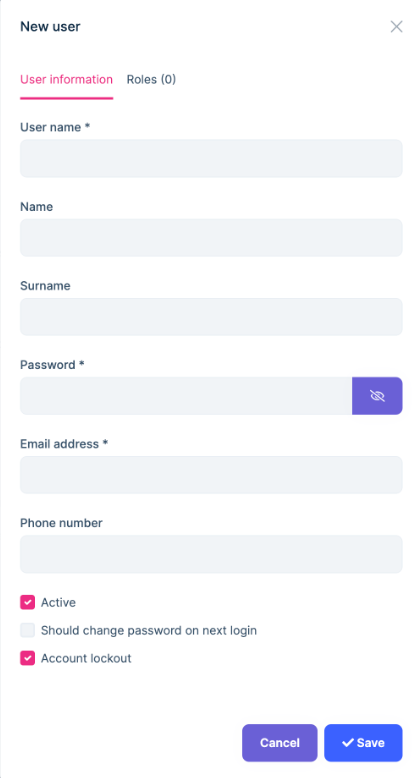
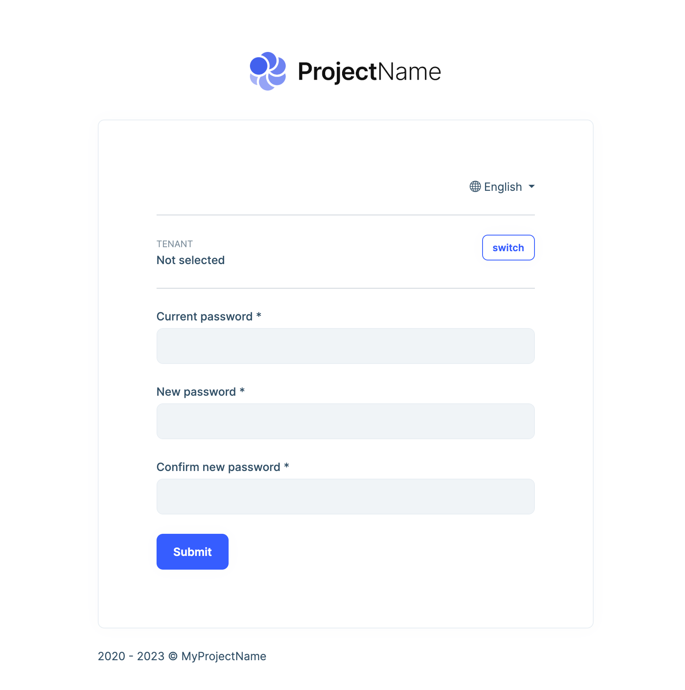
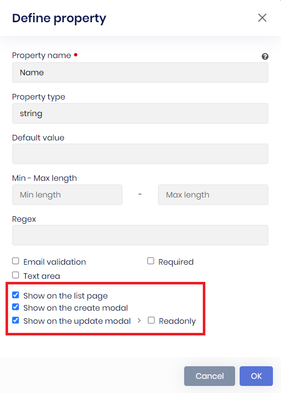

# ABP.IO Platform 7.2 RC Has Been Released

Today, we are happy to release the [ABP Framework](https://abp.io/) and [ABP Commercial](https://commercial.abp.io/) version **7.2 RC** (Release Candidate). This blog post introduces the new features and important changes in this new version.

Try this version and provide feedback for a more stable version of ABP v7.2! Thanks to all of you.

## Get Started with the 7.2 RC

Follow the steps below to try version 7.2.0 RC today:

1) **Upgrade** the ABP CLI to version `7.2.0-rc.1` using a command line terminal:

````bash
dotnet tool update Volo.Abp.Cli -g --version 7.2.0-rc.1
````

**or install** it if you haven't before:

````bash
dotnet tool install Volo.Abp.Cli -g --version 7.2.0-rc.1
````

2) Create a **new application** with the `--preview` option:

````bash
abp new BookStore --preview
````

See the [ABP CLI documentation](https://docs.abp.io/en/abp/latest/CLI) for all the available options.

> You can also use the [Get Started](https://abp.io/get-started) page to generate a CLI command to create a new application.

You can use any IDE that supports .NET 7.x, like [Visual Studio 2022](https://visualstudio.microsoft.com/downloads/).

## Migration Guides

There are breaking changes in this version that may affect your application. 
Please see the following migration documents, if you are upgrading from v7.1:

* [ABP Framework 7.1 to 7.2 Migration Guide](https://docs.abp.io/en/abp/7.2/Migration-Guides/Abp-7_2)
* [ABP Commercial 7.1 to 7.2 Migration Guide](https://docs.abp.io/en/commercial/7.2/migration-guides/v7_2)


## What's New with ABP Framework 7.2?

In this section, I will introduce some major features released in this version. Here is a brief list of the titles that will be explained in the next sections:

* Grouping of Navigation Menu Items
* Introducing the `BlazorWebAssemblyCurrentApplicationConfigurationCacheResetService`
* CMS Kit Comments: Don't Allow External URLs
* Angular UI New Components
* Others

### Grouping of Navigation Menu Items

Some applications may need to group their main menus to tidy up their menu structure. For example, you may want to group ABP's menu items, which came from modules in a group named *Admin*.

In this version, you can allow to define groups and associate menu items with a group. Then your theme can render your menu items within the specified groups. 

**Example:**

```csharp
private async Task ConfigureMainMenuAsync(MenuConfigurationContext context)
{
    //Creating a new group
    context.Menu.AddGroup("Dashboards", l["Dashboards"]);

    //Setting the group name for menu items
    context.Menu
        .AddItem(new ApplicationMenuItem("Home", l["Menu:Home"], groupName: "Dashboards")
        .AddItem(new ApplicationMenuItem("Home", l["Menu:Dashboard"], groupName: "Dashboards");
}
```

> **Note**: Currently, only the [LeptonX Theme](https://leptontheme.com/) renders groups for menu items. See the "LeptonX - Render Groups for Menu Items" section below for a demonstration.

### Introducing the `BlazorWebAssemblyCurrentApplicationConfigurationCacheResetService`

In this version, we have introduced the `BlazorWebAssemblyCurrentApplicationConfigurationCacheResetService` service to re-initialize application configurations. This service can be helpful, if you want to reset the application configurations after changing some configurations through your code. For example, you might have changed the values of some settings and might want to be able to get the new settings without the need to refresh the page. For this purpose, the `BlazorWebAssemblyCurrentApplicationConfigurationCacheResetService.ResetAsync()` method can be used to re-initialize the application configurations and cache the updated configurations for further usages.

> For more information, please see [https://github.com/abpframework/abp/issues/15887](https://github.com/abpframework/abp/issues/15887).

### CMS Kit Comments: Disallowing External URLs

CMS Kit provides a [comment system](https://docs.abp.io/en/abp/7.2/Modules/Cms-Kit/Comments) to add the comment feature to any kind of resource, like blog posts for an example. The CMS Kit comment section is good for visitor comments and can improve your interaction with your application users. 

Sometimes, malicious users (or bots) can submit advertisement links into the comment sections. With this version, you can specify *allowed external URLs* for a specific comment section and disallow any other external URLs. You just need to configure the `CmsKitCommentOptions` as follows:

```csharp
Configure<CmsKitCommentOptions>(options =>
{
    options.AllowedExternalUrls = new Dictionary<string, List<string>>
    {
      {
        "Product",
        new List<string>
        {
          "https://abp.io/"
        }
      }
    };
});
```

If you don't specify any allowed external URLs for a specific comment section, all external URLs are allowed to be used in comments. For more information, please refer to the [CMS Kit: Comments documentation](https://docs.abp.io/en/abp/latest/Modules/Cms-Kit/Comments).

### New Components for Angular UI

In this version, we have created some useful UI components for Angular UI, which are `abp-checkbox`, `abp-form-input`, and `abp-card`. Instead of using the related HTML elements and specifying bootstrap classes, from this version on, you can use these components. 

You can see the following examples for the usage of the `abp-card` component:

```html
<abp-card cardClass="mt-4 mb-5">
    <abp-card-body>
        <div>...</div>    
    </abp-card-body>
</abp-card>        
```

> See the [Card Component documentation](https://docs.abp.io/en/abp/7.2/UI/Angular/Card-Component) for more information.

### Others

* OpenIddict registered custom scopes have been added to the openid-configuration endpoint (`/.well-known/openid-configuration`) automatically. See [#16141](https://github.com/abpframework/abp/issues/16141) for more information.
* Two new tag-helpers have been added to MVC UI, which are `abp-date-picker` and `abp-date-range-picker`. See [#15806](https://github.com/abpframework/abp/pull/15806) for more information.
* Filtering/searching has been improved in the Docs Module and unified under a single *Search* section. See [#15787](https://github.com/abpframework/abp/issues/15787) for more information.

## What's New with ABP Commercial 7.2?

We've also worked on [ABP Commercial](https://commercial.abp.io/) to align the features and changes made in the ABP Framework. The following sections introduce a few new features coming with ABP Commercial 7.2.

### Authority Delegation

Authority Delegation is a way of delegating the responsibility of the current user to a different user(s) for a limited time. Thus, a user can be switched to the delegated users' account and perform actions on their behalf.

This version introduces support for the **Authority Delegation** in the [Account Module](https://docs.abp.io/en/commercial/latest/modules/account). You can check the following gif for a demonstration:


### Force Password Change at Next Logon

It's a typical need to force users to change their password after their first successful login. Especially, if you as admin create a new user (*from the Users page of the Identity Pro module*, for example) with an easy initial password or a randomly generated password. The user should change his/her password with a more secure password that only they know. 

In this version, the "Forcing Password Change at Next Logon" feature has been added for this kind of purpose. Now, it's possible to force a user to change their password on the next login.

The admin only needs to check the *Should change password on next login* option, while creating a new user:



After the first successful login, a password change page will open and force the user to change their password:



Then, the user starts using their account with a secure password that only they know.

### Periodic Password Changes (Password Aging)

**Password aging** is a mechanism to force users to periodically change their passwords. It allows you to specify a max number of days that a password can be used before it has to be changed.


You can force this behavior in the "Password renewing settings" section of the Settings page as can be seen in the image above. Then, after the specified time has passed, users will have to renew their passwords.

### LeptonX - Render Groups for Menu Items

As mentioned in the *Grouping of Navigation Menu Items* section above, the [LeptonX Theme](https://leptontheme.com/) renders groups for menu items:


### Suite: Show Properties on Create/Update/List Pages

In this version, ABP Suite allows you to choose whether a property is visible/invisible on the create/update modals and list page. It also allows you to set specific properties to *readonly* on the update modals.



## Community News

### ABP - DOTNET CONF'23


As the ABP team, we've organized 10+ [online events](https://community.abp.io/events) and gained a good experience with software talks. We are organizing ABP Dotnet Conference 2023, a full-featured software conference, in May. You can visit [https://abp.io/conference](https://abp.io/conference) to see speakers, talks, schedules, and other details.

**Less than a month left until the event**! Don't forget to take your seat and buy an early bird ticket from [https://kommunity.com/volosoft/events/1st-abp-conference-96db1a54](https://kommunity.com/volosoft/events/1st-abp-conference-96db1a54)!

### New ABP Community Posts

There are exciting articles contributed by the ABP community as always. I will highlight some of them here:

* [What’s New in .NET 8 🧐 ? Discover ALL .NET 8 Features](https://community.abp.io/posts/whats-new-in-.net-8-discover-all-.net-8-features-llcmrdre) by [Alper Ebicoglu](https://twitter.com/alperebicoglu).
* [Converting Create/Edit Modal to Page - Blazor](https://community.abp.io/posts/converting-createedit-modal-to-page-blazor-eexdex8y) by [Enis Necipoglu](https://twitter.com/EnisNecipoglu).
* [Using Dapper with the ABP Framework](https://community.abp.io/posts/using-dapper-with-the-abp-framework-shp74p2l) by [Halil Ibrahim Kalkan](https://twitter.com/hibrahimkalkan).
* [ABP React Template](https://community.abp.io/posts/abp-react-template-33pjmran) by [](https://twitter.com/antosubash).
* [How to Export Data to Excel Files with ASP.NET Core Minimal API](https://community.abp.io/posts/how-to-export-data-to-excel-files-with-asp.net-core-minimal-api-79o45u3s) by [Berkan Sasmaz](https://twitter.com/berkansasmazz).

Thanks to the ABP Community for all the content they have published. You can also [post your ABP-related (text or video) content](https://community.abp.io/articles/submit) to the ABP Community.

### New ABP Blog Posts

There are also some exciting blog posts written by the ABP team. You can see the following list for some of those articles:

* [ABP Framework: Open Source Web Application Development Framework](https://blog.abp.io/abp/open-source-web-application-development-framework) by [Alper Ebicoglu](https://twitter.com/alperebicoglu).
* [ABP Framework: The Ultimate .NET Web Framework for Rapid Application Development](https://blog.abp.io/abp/ultimate-net-web-framework-for-rapid-application-development) by [Alper Ebicoglu](https://twitter.com/alperebicoglu).
* [Top 10 .NET Core Libraries Every Developer Should Know 🔥](https://blog.abp.io/abp/Top-10-.NET-Core-Libraries-Every-Developer-Should-Know) by [Alper Ebicoglu](https://twitter.com/alperebicoglu)

## Conclusion

This version comes with some new features and a lot of enhancements to the existing features. You can see the [Road Map](https://docs.abp.io/en/abp/7.2/Road-Map) documentation to learn about the release schedule and planned features for the next releases. Please try ABP v7.2 RC and provide feedback to help us release a more stable version.

Thanks for being a part of this community!
