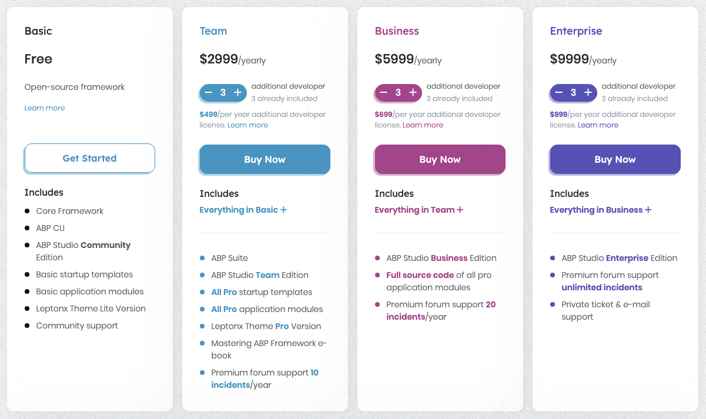

# Unifying the ABP.IO Platform

I am very excited to announce that some big changes and improvements are coming to the ABP.IO Platform soon. In this post, I will explain the changes we are currently working on. Here, a brief list of these changes:

* We are merging the subdomains of the ABP.IO Platform websites: Community.abp.io, commercial.abp.io, blog.abp.io, docs.abp.io websites and their contents are being merged into the main domain, abp.io.
* ABP (open source) and ABP Commercial documents are being merged into a single documentation.
* Introducing ABP Studio Community Edition.

These changes won't effect the license conditions. The open source part will remain the same and the commercial license contents will also be the same. The aim of the changes is to make the platform more consistent, holistic, understandable and easy to start.

Let's dive deep...

## Merging the ABP.IO Websites

ABP.IO website has many subdomains currently:

* **abp.io**: Home page of the open source ABP Framework project.
* **community.abp.io**: A website that community can share contents and we organize events.
* **commercial.abp.io**: A website to promote and sell commercial ABP licenses which have pre-built modules, themes, tooling and support on top of the ABP Framework.
* **docs.abp.io**: The technical documentation of the ABP Framework and ABP Commercial.
* **blog.abp.io**: A blog website to announce the news on the platform.
* **support.abp.io**: Premium support for the ABP Commercial customers.

All these subdomains (except the support website for now) are being merged to the abp.io domain. All their contents and UI designs are being revised and enriched.

Some fundamental purposes of that change are;

* Making content more coherent and holistic,
* Making the design more harmonious,
* Making the contents of the old subdomains more visible and reachable,
* Allow you to navigate through the web pages much easier,
* Reducing duplications between different websites,

I will highlight a few important changes in the next sections.

### The New Mega Menu

As I said above, the abp.io UI design is also being revised. One of the big revisions is the main menu. We are replacing the current main navigation by a mega menu as shown in the following figure:

We believe that new mega menu will allow you to navigate through the web pages much easier.

### The New Get Started Page

We are constantly working to improve ABP's onboarding experience. With the new platform changes, we now offer ABP Studio as the starting point for the ABP Platform. You can still use the [ABP CLI](https://docs.abp.io/en/abp/latest/CLI) to created new ABP solutions, but the new ABP Studio makes it much easier and understandable. It also provides features to easily run and monitor your applications, even in the Community edition.

***TODO: UPDATE THE PICTURE***

You can easily download and install ABP Studio, login with your abp.io account and create your first ABP solution.

### The New Pricing Page

Since the [ABP Commercial website](https://commercial.abp.io/) is merged to the main website, you will see the *Pricing* page located on the main menu of the abp.io website. We have completely revised the design and content of this page to better reflect what is open source, free, and what features are included in the paid licenses.

***TODO: UPDATE THE PICTURE***

As mentioned above, all the free & open source features are still free & open source. In addition, we included the ABP Studio Community edition (will be explained below) to the free license.

## Merging the ABP Platform Documentation

TODO
