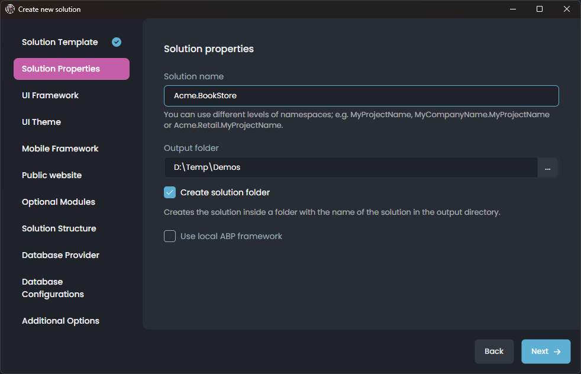
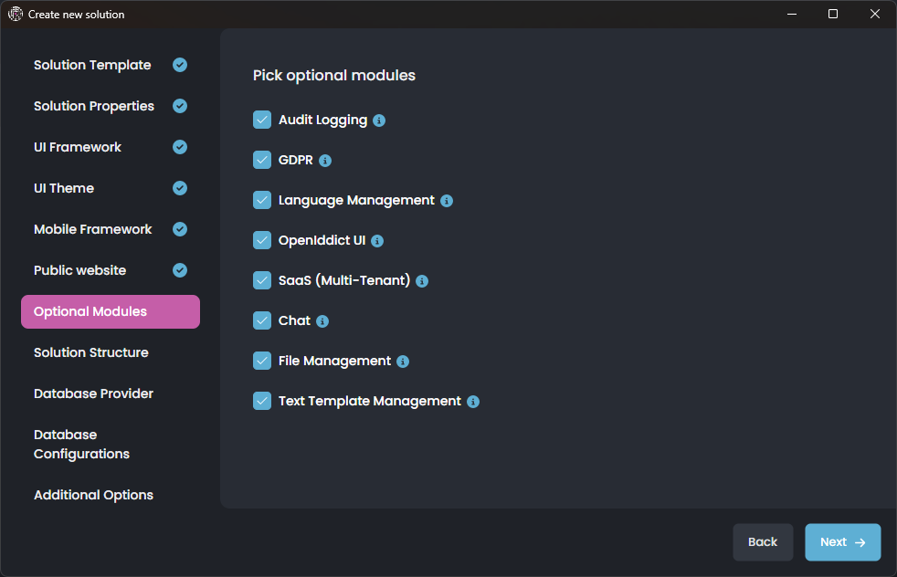

# Announcing ABP Studio (beta) General Availability

I am very excited to announce that the ABP Studio (beta) is generally available to everyone. It is now downloadable on the [get started page](https://abp.io/get-started) of the [new ABP Platform website](https://abp.io/blog/new-abp-platform-is-live).

## What is ABP Studio?

[ABP Studio](https://abp.io/docs/latest/studio) is a cross-platform desktop application for ABP and .NET developers. It aims to provide a comfortable development environment for you by automating things, providing insights about your solution, making develop, run, browse, monitor, trace and deploy your solutions much easier.

**From now on, ABP Studio is the default way to start with the ABP Platform**;

* The [get started page](https://abp.io/get-started) has updated so it offers to download ABP Studio to create a new ABP based solution.
* The ABP CLI ([Volo.Abp.Cli](https://nuget.org/packages/Volo.Abp.Cli)) is replaced by the ABP Studio CLI ([Volo.Abp.Studio.Cli](https://www.nuget.org/packages/Volo.Abp.Studio.Cli)). [The new ABP Studio CLI](https://abp.io/docs/latest/cli) is compatible with the old one, and extends it by introducing new commands.
* [Startup solution templates](https://abp.io/docs/latest/solution-templates) are completely renewed. The solution structures are similar to the old ones, but they are totally new templates built with the new templating engine.
* All the documentation and tutorials now uses ABP Studio and ABP Studio CLI.

> **ABP Studio is in beta stage now.** It is also in rapid development and release cycle. We frequently release new feature and patch versions. Please [file an issue](https://github.com/abpframework/abp/issues/new/choose) if you have any problem.
>
> If you want to continue to use the old CLI and old startup templates, please [refer that document](https://abp.io/docs/latest/cli/differences-between-old-and-new-cli).

## The New Startup Templates

As mentioned before, the [startup solution templates](https://abp.io/docs/latest/solution-templates) are completely renewed with ABP Studio. They provide much more options compared to the old startup templates. The following screenshot is taken from the New Solution wizard of ABP Studio, which provides an comfortable and easy way to create new solutions:

For example, you can now select most of the non-fundamental modules as optional while creating a new solution:

### The Microservice Startup Template

The most important change is made on the [microservice startup template](https://abp.io/docs/latest/solution-templates/microservice) (which is available only for Business or higher license holders). We've designed the solution structure, integrations, Kubernetes/Helm configuration, database migrations and all others from scratch and well documented all the decisions we've applied. Developing microservice solutions with ABP Framework is now easier and more understandable than ever.

## The Solution Explorer

One of the main purposes to build ABP Studio is to simplify to create multi-modular and distributed systems. Either you create a modular monolith application or a microservice solution, [ABP Studio's solution explorer](https://abp.io/docs/latest/studio/solution-explorer) provides a convenient way to design your high-level solution structure.

You see a microservice solution in the following screenshot:

That ABP Studio solution contains multiple separate .NET solutions (`.sln`) each has multiple .NET projects (`.csproj`). ABP Studio allows you to easily manage such a multi-solution system on a single view. You can create new packages and modules, import existing packages and modules, manage their dependencies and so on.

## The Solution Runner

...