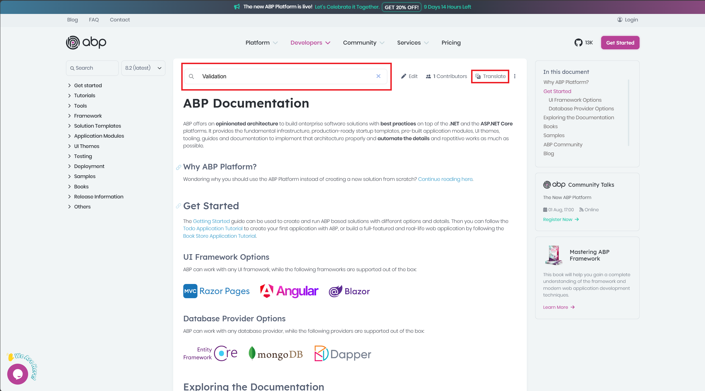
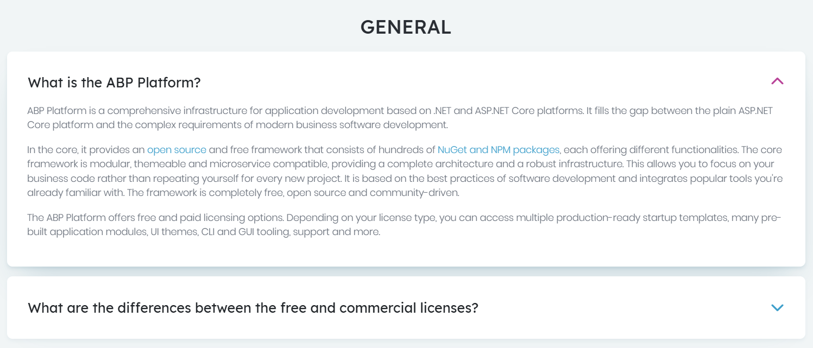
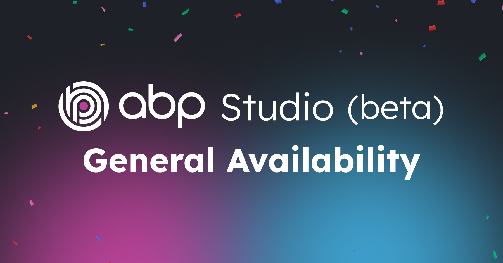

# ABP Platform 8.3 RC Has Been Released


Today, we are happy to release [ABP](abp.io) version **8.3 RC** (Release Candidate). This blog post introduces the new features and important changes in this new version.

Try this version and provide feedback for a more stable version of ABP v8.3! Thanks to you in advance.

## Get Started with the 8.3 RC

You can check the [Get Started page](https://abp.io/get-started) to see how to get started with ABP. You can either download [ABP Studio](https://abp.io/get-started#abp-studio-tab) (**recommended**, if you prefer a user-friendly GUI application - desktop application) or use the [ABP CLI](https://abp.io/docs/latest/cli).

## Migration Guide

There are a few breaking changes in this version that may affect your application. Please read the migration guide carefully, if you are upgrading from v8.2 or earlier: [ABP Version 8.3 Migration Guide](https://abp.io/docs/8.3/release-info/migration-guides/abp-8-3)

## What's New with ABP v8.3?

In this section, I will introduce some major features released in this version.
Here is a brief list of titles explained in the next sections:

* **Framework (Open-Source)**
    * CMS Kit: Marked Items/Favorites
    * CMS Kit: Approvement System for Comments
    * Docs: Added Google Translation Support & Introducing the Single Project Mode
    * Using DBFunction for Global Query Filters
* **PRO**
    * CMS Kit (PRO): FAQ
* **Package Updates (NuGet & NPM)**

### Framework (Open-Source)

In this version, we mostly worked on [CMS Kit](https://abp.io/docs/latest/modules/cms-kit) and [Docs](https://abp.io/docs/latest/modules/docs) modules and made enhancements overall in the ABP Platform.

#### CMS Kit: Marked Items/Favorites

CMS Kit provides a marking system to mark any kind of resource, like a blog post or a product, as a favorite, starred, flagged, or bookmarked.


This system is especially useful if you need to highlight some resources and differentiate them from other items. To use the marking system, you need to define an entity type with the icon name, by configuring the `CmsKitMarkedItemOptions`:

```csharp
Configure<CmsKitMarkedItemOptions>(options =>
{
    options.EntityTypes.Add(
        new MarkedItemEntityTypeDefinition(
            entityType: "product",
            icon: StandardMarkedItems.Favorite
            )
        );
});
```

You can select any of the standard marked item icons (as used in the example above) or easily customize the icons shown in the toggling components.

> Read the [CMS Kit: Marked Item System](https://abp.io/docs/8.3/modules/cms-kit/marked-items) documentation to learn more.

#### CMS Kit: Approvement System for Comments

CMS Kit Module has been provided a [Commenting System](https://abp.io/docs/8.3/modules/cms-kit/comments) for a while. This system allows you to add the comment feature to any kind of resource, like blog posts, or products. However, this system wasn't providing an approvement system, that allows system administrations to review the comments before publishing them in their application.

In this version, we have introduced the [Approvement System](https://abp.io/docs/8.3/modules/cms-kit/comments#settings), which allows you to _require approval for comments to be published_. It's disabled by default, but you can make it enabled by simply checking the related setting on the settings page:


When you enable it, whenever a user submits a comment, it can be directly seen on the back-office application (in the _cms/comments_ page), and you can determine if the comment should be approved or rejected. If you approve the comment, then it will be shown in the comment section for the related resource.

> Read the [CMS Kit: Comments](https://abp.io/docs/8.3/modules/cms-kit/comments) documentation to learn more.

#### Docs: Added Google Translation Support & Introducing the Single Project Mode

In this version, we made some improvements in the [Docs Module](https://abp.io/docs/8.3/modules/docs), added Google Translation support for better findings in the documentation, and introduced a single project mode.

The single project mode allows you to use a single name as a project name in your application. If you are not considering supporting multiple projects with their multiple docs and instead if you have a single project and want to have documentation for it, it's especially useful for you. You just need to configure the `DocsUiOptions`, set the single project mode as **enabled** and also define a constant project name:

```csharp
Configure<DocsUiOptions>(options => 
{
    options.SingleProjectMode.Enable = true;
    options.SingleProjectMode.ProjectName = "abp";
});
```

In addition to this feature, we also introduced Google Translation support for the documentation system and even integrated it into our [abp.io/docs](https://abp.io/docs/) website:




Thanks to this system, you can either translate your documentation into your own language by Google Translation System or search specific keywords to easily find the related topic in the documentation.

#### Using DBFunction for Global Query Filters

In this version, ABP has started using [User-defined function mapping](https://learn.microsoft.com/en-us/ef/core/querying/user-defined-function-mapping) for global filters to gain performance improvements and let EF Core generate more precise SQL commands under the hook.

> See the documentation for more info: [Using User-defined function mapping for global filters](https://abp.io/docs/8.3/framework/infrastructure/data-filtering#using-user-defined-function-mapping-for-global-filters)

### PRO

We've also worked for pro modules to align the features and changes made in the framework. In addition to that, we introduced the [FAQ System](https://abp.io/docs/latest/modules/cms-kit-pro/faq) for [CMS Kit (PRO)](https://abp.io/docs/latest/modules/cms-kit-pro) Module:

#### CMS Kit (PRO): FAQ

CMS Kit (PRO) provides a [FAQ System](https://abp.io/docs/8.3/modules/cms-kit-pro/faq) to allow users to create, edit, and delete FAQs. Here is an example screenshot from the FAQ page on the admin side:


You can list, create, update, and delete sections and their questions on the admin side of your solution. Then, by using the `FaqViewComponent` in your public-web application, you can display FAQs, section by section:



> Read the [CMS Kit: FAQ System](https://abp.io/docs/8.3/modules/cms-kit-pro/faq) documentation to learn more.

### Package Updates

In this version, we also updated some of the core NuGet and NPM package versions. All of the removed or deprecated methods have already been updated at the framework level. However, if you used any methods from these packages, you should be aware of the change and update it in your code accordingly. 

You can see the following list of the package version changes:

* [Updated Markdig.Signed to v0.37.0](https://github.com/abpframework/abp/pull/20195) - [NuGet](https://www.nuget.org/packages/Markdig.Signed)
* [Updated Hangfire to v1.8.12](https://github.com/abpframework/abp/pull/20009) - [NuGet](https://www.nuget.org/packages/Hangfire.AspNetCore)
* [Updated SixLabors.ImageSharp to v3.1.4](https://github.com/abpframework/abp/pull/19643) - [NuGet](https://www.nuget.org/packages/SixLabors.ImageSharp)
* [Updated Blazorise to v1.5.2](https://github.com/abpframework/abp/pull/19841) - [NuGet](https://www.nuget.org/packages/Blazorise)
* [Updated datatables.net to v2.0.2](https://github.com/abpframework/abp/pull/19340) - [NPM](https://www.npmjs.com/package/datatables.net)

## Community News

### The New ABP Platform Is Live!


We're thrilled to announce that the **new ABP.IO Platform** is now live! Our team has been hard at unifying and enhancing the entire platform to deliver a seamless, user-friendly experience. We consolidated all our services under a single domain: [abp.io](https://abp.io/); added a new mega menu that makes finding what you need much easier and faster, and also improved the UX of our application and combined both ABP (open-source) and ABP Commercial (paid) documents into a single comprehensive resource.

> Read the blog post to learn more about this unification 👉 [The new ABP Platform is live!](https://abp.io/blog/new-abp-platform-is-live)

### Announcing ABP Studio (Beta) General Availability

We're really excited to announce that the **ABP Studio (beta)** is generally available to everyone. It is now downloadable on the [get started page](https://abp.io/get-started) of the [new ABP Platform website](https://abp.io/blog/new-abp-platform-is-live).



> Read the blog post to learn more about the ABP Studio (Beta) 👉 [Announcing ABP Studio (beta) General Availability](https://abp.io/blog/announcing-abp-studio-general-availability)

### Introducing the New ABP CLI

As described above, we recently [unified the ABP platform in a single domain (abp.io)](https://abp.io/blog/new-abp-platform-is-live) and made some changes in our templating system to simplify your development. Also, we released more stable **ABP Studio** versions, which can dramatically improve and speed up your development time. 

Besides all of these changes, we have also introduced a [new ABP CLI](https://abp.io/docs/latest/cli/index) to bring you a more streamlined and efficient experience, which also extends the current commands.


The new ABP CLI extends the old ABP CLI, adds more features that are used by ABP Studio behind the scenes, and is also fully compatible with the new templating system. We created a blog post, which you can read at [https://abp.io/blog/introducing-the-new-abp-cli](https://abp.io/blog/introducing-the-new-abp-cli) to highlight the reason behind this change and insights into the new ABP CLI, you can check it out if you want to learn more.

### New ABP Community Articles

There are exciting articles contributed by the ABP community as always. I will highlight some of them here:

* [Ahmed Tarek](https://twitter.com/AhmedTarekHasa1) has created **three** new community articles:
    * [🧪 Unit Testing Best Practices In .NET C# 🤷‍♂️](https://abp.io/community/articles/-unit-testing-best-practices-in-.net-c--mnx65npu)
    * [Memory Management In .NET](https://abp.io/community/articles/memory-management-in-.net-rqwbtzvl)
    * [🧵 How String In .NET C# Works 🤷‍♂️](https://abp.io/community/articles/-how-string-in-.net-c-works--vj6d2pnm)

* [Anto Subash](https://twitter.com/antosubash) has created **two** new community videos:
    * [ABP React Template V2](https://abp.io/community/videos/abp-react-template-v2-ilc4cyqr)
    * [Migrating Tye to Aspire - .NET Microservice with ABP](https://abp.io/community/videos/migrating-tye-to-aspire-.net-microservice-with-abp-ga1t4ckr)

* [HeadChannel Team](https://headchannel.co.uk/) has created **two** new community articles:
    * [Managing Baseline Creation in Applications Based on ABP Framework](https://abp.io/community/articles/managing-baseline-creation-in-applications-based-on-abp-framework-yiacte5c)
    * [How to Test The System Using PostgreSQL and TestContainers](https://abp.io/community/articles/how-to-test-the-system-using-postgresql-and-testcontainers-8yh8t0j8)

* [Create a Generic HTTP Service to Consume a Web API](https://abp.io/community/articles/create-a-generic-http-service-to-consume-a-web-api-yidme2kq) by [Bart Van Hoey](https://github.com/bartvanhoey)
* [Use User-Defined Function Mapping for Global Filter](https://abp.io/community/articles/use-userdefined-function-mapping-for-global-filter-pht26l07) by [Liming Ma](https://github.com/maliming)
* [How to use .NET Aspire with ABP framework](https://abp.io/community/articles/how-to-use-.net-aspire-with-abp-framework-h29km4kk) by [Berkan Şaşmaz](https://twitter.com/berkansasmazz)

Thanks to the ABP Community for all the content they have published. You can also [post your ABP-related (text or video) content](https://abp.io/community/posts/submit) to the ABP Community.

## Conclusion

This version comes with some new features and a lot of enhancements to the existing features. You can see the [Road Map](https://abp.io/docs/8.3/release-info/road-map) documentation to learn about the release schedule and planned features for the next releases. Please try ABP v8.3 RC and provide feedback to help us release a more stable version.

Thanks for being a part of this community!