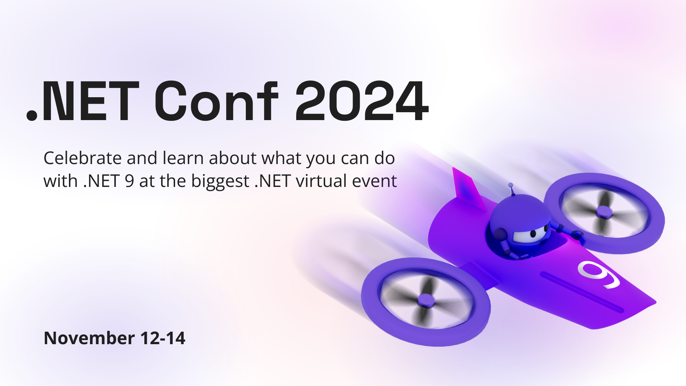
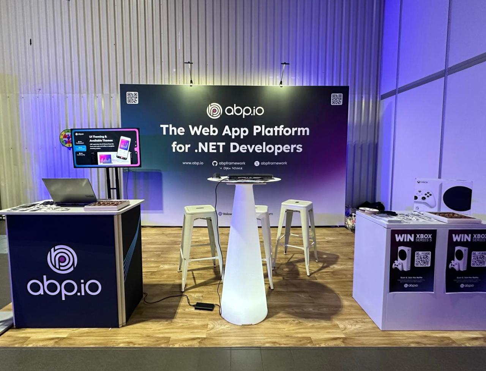
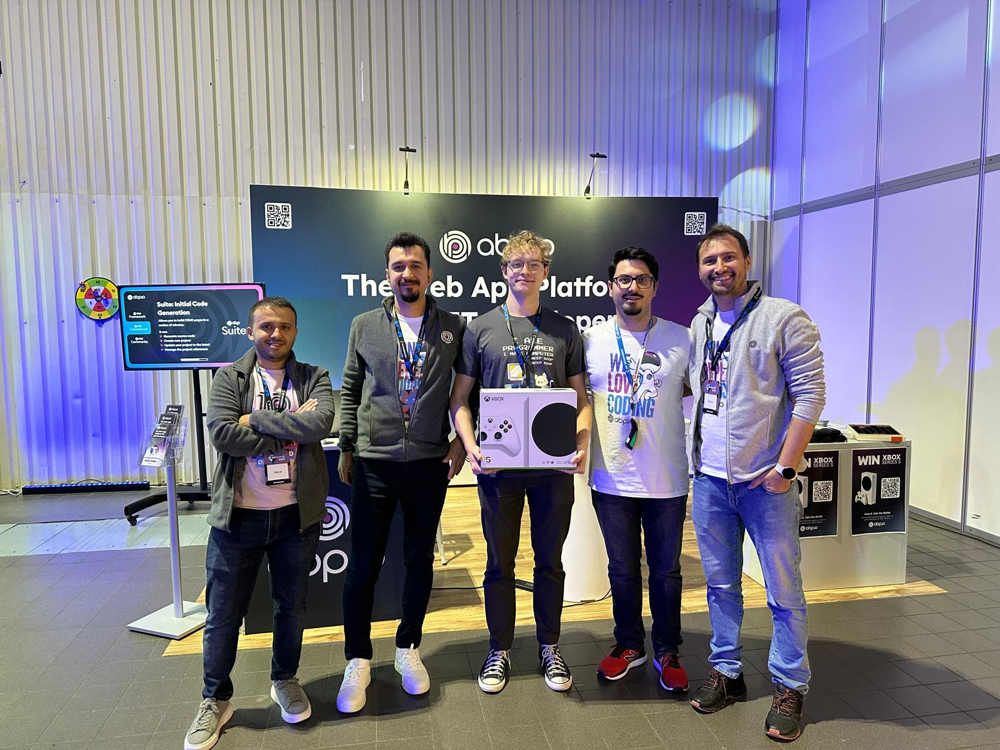

# ABP Platform 9.0 Has Been Released Based on .NET 9.0


Today, we are happy to release the [ABP](https://abp.io/) version **9.0 RC** (Release Candidate). This blog post introduces the new features and important changes in this new version.

Try this version and provide feedback for a more stable version of ABP v9.0! Thanks to all of you.

## Get Started with the 9.0 RC

You can check the [Get Started page](https://abp.io/get-started) to see how to get started with ABP. You can either download [ABP Studio](https://abp.io/get-started#abp-studio-tab) (**recommended**, if you prefer a user-friendly GUI application - desktop application) or use the [ABP CLI](https://abp.io/docs/latest/cli).

By default, ABP Studio uses stable versions to create solutions. Therefore, if you want to create a solution with a preview version, first you need to create a solution and then switch your solution to the preview version from the ABP Studio UI:


## Migration Guide

There are a few breaking changes in this version that may affect your application. Please read the migration guide carefully, if you are upgrading from v8.x: [ABP Version 9.0 Migration Guide](https://abp.io/docs/9.0/release-info/migration-guides/abp-9-0)

## What's New with ABP v9.0?

In this section, I will introduce some major features released in this version.
Here is a brief list of titles explained in the next sections:

* Upgraded to .NET 9.0
* Introducing the **Extension Property Policy**
* Allow wildcards for Redirect Allowed URLs
* Docs Module: Show larger images on the same page
* Google Cloud Storage BLOB Provider
* Removed React Native mobile option from free templates
* Suite: Better naming for multiple navigation properties to same entity
* CMS Kit Pro: Feedback feature improvements

### Upgraded to .NET 9.0

We've upgraded ABP to .NET 9.0, so you need to move your solutions to .NET 9.0 if you want to use ABP 9.0. You can check [Microsoft’s Migrate from ASP.NET Core 8.0 to 9.0 documentation](https://learn.microsoft.com/en-us/aspnet/core/migration/80-90), to see how to update an existing ASP.NET Core 8.0 project to ASP.NET Core 9.0.

> **Note:** Since the stable version of .NET 9 hasn't released yet, we upgraded ABP to .NET v9.0-rc.2. We will update the entire ABP Platform to .NET 9 stable, after Microsoft releases it on November 13-14 with the stable ABP 9.0 release.

### Introducing the Extension Property Policy

//TODO:...

### Allow Wildcards For RedirectAllowedURLs

//TODO:...

### Docs Module: Show Larger Images

//TODO:...

### Google Cloud Storage BLOB Provider

//TODO:...

### Removed React Native Mobile Option From Free Templates

In this version, we removed the **React Native** mobile option from the open source templates due to maintaining reasons. We updated the related documents and the ABP CLI (both old & new CLI) for this change, and with v9.0, you will not be able to create a free template with react-native as the mobile option.

> **Note:** Pro templates still provide the **React Native** as the mobile option and we will continue supporting it.

If you want to access the open-source React-Native template, you can visit the abp-archive repository from [here](https://github.com/abpframework/abp-archive).

### Suite: Better Naming For Multiple Navigation Properties

Prior to this version, when you defined multiple (same) navigation properties to same entity, then ABP Suite was renaming them with a duplicate number.

Consider the following scenario for an example: 

If you have a book with an author and coauthor, prior to this version ABP Suite was creating a DTO class as below:

```csharp
public class BookWithNavigationPropertiesDto
{
    public BookDto Book { get; set; }

    public AuthorDto Author { get; set; }

    public AuthorDto Author1 { get; set; }
}
```

Notice, that since the book entity has two same navigation properties, ABP Suite renamed them with a duplicate number. In this version, ABP Suite will ask you to define a propertyName for the **navigation properties** and you'll be able to specify a meaningful name such as (*CoAuthor*, in this example):

```csharp
public class BookWithNavigationPropertiesDto
{
    public BookDto Book { get; set; }

    public AuthorDto Author { get; set; }

    //used the specified property name
    public AuthorDto CoAuthor { get; set; }
}
```

ABP Suite respects the specified property name for the related navigation property and generate codes regarding that (by removing the *Id* postfix for the related places):


### CMS Kit Pro: Feedback Feature Improvements

In this version, we revised the [CMS Kit's Feedback Feature](https://abp.io/docs/9.0/modules/cms-kit-pro/page-feedback) and as a result, we made the following improvements:

* A new **auto-handle** setting has been added to the settings page. When this feature is enabled, if feedback is submitted without a user note, the feedback is automatically marked as handled.
* You can now require users to enter a note when submitting negative feedback. This can be configured in the settings page, ensuring that users provide context when they submit critical feedback.
* We've added a feedback user ID that is saved in local storage. This allows you to track the number of unique users submitting feedback or determine if the same user is sending new feedback on updated documents.

> For further information about Page Feedback System, please refer to the [documentation](https://abp.io/docs/9.0/modules/cms-kit-pro/page-feedback).

## Community News

### Join ABP at the .NET Conf 2024!

ABP is excited to sponsor the [14th annual .NET Conf](https://www.dotnetconf.net/)! We've proudly supported the .NET community for years and recognize the importance of this premier virtual event. Mark your calendars for November 12-14, 2024, and join us for 3 incredible days of learning, networking, and fun. 



Also, don't miss out on the co-founder of [Volosoft](https://volosoft.com/) and Lead Developer of [ABP](https://abp.io/), [Halil Ibrahim Kalkan](https://x.com/hibrahimkalkan)'s talk about "Building Modular Monolith Applications with ASP.NET Core and ABP Studio" at 10:00 - 10:30 AM GMT+3 on Thursday, November 14.

### ABP Team Attended the .NETDeveloperDays 2024

We are thrilled to announce that we sponsored the [.NETDevelopersDays 2024](https://developerdays.eu/warsaw/) event. It's one of the premier conferences for .NET developers with **Over 1.000 attendees**, **50+ expert speakers** and **40+ sessions and workshops**.



Core team members of the ABP Framework, [Halil Ibrahim Kalkan](https://twitter.com/hibrahimkalkan), [İsmail Çağdaş](https://x.com/ismcagdas), [Enis Necipoğlu](https://x.com/EnisNecipoglu), and [Tarık Özdemir](https://x.com/mtozdemir) attended [.NETDevelopersDays 2024](https://developerdays.eu/warsaw/) on October 22-23, 2024 at Warsaw, Poland.

These 2 days with the team were all about chatting and having fun with amazing attendees and speakers. We met with talented and passionate software developers and introduced the [ABP](https://github.com/abpframework/abp) - web application framework built on ASP.NET Core - to them.

Also, we made a raffle and gifted a Xbox Series S to the lucky winner at the event: 



Thanks to everyone who joined the fun!

### New ABP Community Articles

There are exciting articles contributed by the ABP community as always. I will highlight some of them here:

* [Alper Ebiçoğlu](https://twitter.com/alperebicoglu) has created **five** new community articles:
    * [When to Use Cookies, When to Use Local Storage?](https://abp.io/community/articles/when-to-use-cookies-when-to-use-local-storage-uexsjunf)
    * [.NET 9 Performance Improvements Summary](https://abp.io/community/articles/.net-9-performance-improvements-summary-gmww3gl8)
    * [ASP.NET Core SignalR New Features — Summary](https://abp.io/community/articles/asp.net-core-signalr-new-features-summary-kcydtdgq)
    * [Difference Between "Promise" and "Observable" in Angular](https://abp.io/community/articles/difference-between-promise-and-observable-in-angular-bxv97pkc)
    * [ASP.NET Core Blazor 9.0 New Features Summary 🆕](https://abp.io/community/articles/asp.net-core-blazor-9.0-new-features-summary--x0fovych)
* [Mohammad AlMohammad AlMahmoud](https://abp.io/community/members/Mohammad97Dev) has created **two** new community articles:
    * [Implementing Multi-Language Functionality With ABP Framework](https://abp.io/community/articles/implementing-multilanguage-functionality-with-abp-framework-loq7kfx4)
    * [Configure Quartz.Net in Abp FrameWork](https://abp.io/community/articles/configure-quartz.net-in-abp-framework-3bveq4y1)
* [.NET Aspire vs ABP Studio: Side by Side](https://abp.io/community/articles/.net-aspire-vs-abp-studio-side-by-side-t1c73d1l) by [Halil İbrahim Kalkan](https://twitter.com/hibrahimkalkan)
* [PoC of using GrapesJS for ABPs CMS Kit](https://abp.io/community/articles/poc-of-using-grapesjs-for-abps-cms-kit-1rmv4q41) by [Jack Fistelmann](https://abp.io/community/members/jfistelmann)
* [ABP-Powered Web App with Inertia.js, React, and Vite](https://abp.io/community/articles/abppowered-web-app-with-inertia.js-react-and-vite-j7cccvad) by [Anto Subash](https://antosubash.com/)
* [Multi-Tenancy Support in Angular Apps with ABP.IO](https://abp.io/community/articles/multitenancy-support-in-angular-apps-with-abp.io-lw9l36c5) by [HeadChannel Team](https://headchannel.co.uk/)

Thanks to the ABP Community for all the content they have published. You can also [post your ABP-related (text or video) content](https://abp.io/community/posts/submit) to the ABP Community.

## Conclusion

This version comes with some new features and a lot of enhancements to the existing features. You can see the [Road Map](https://abp.io/docs/9.0/release-info/road-map) documentation to learn about the release schedule and planned features for the next releases. Please try ABP v9.0 RC and provide feedback to help us release a more stable version.

Thanks for being a part of this community!