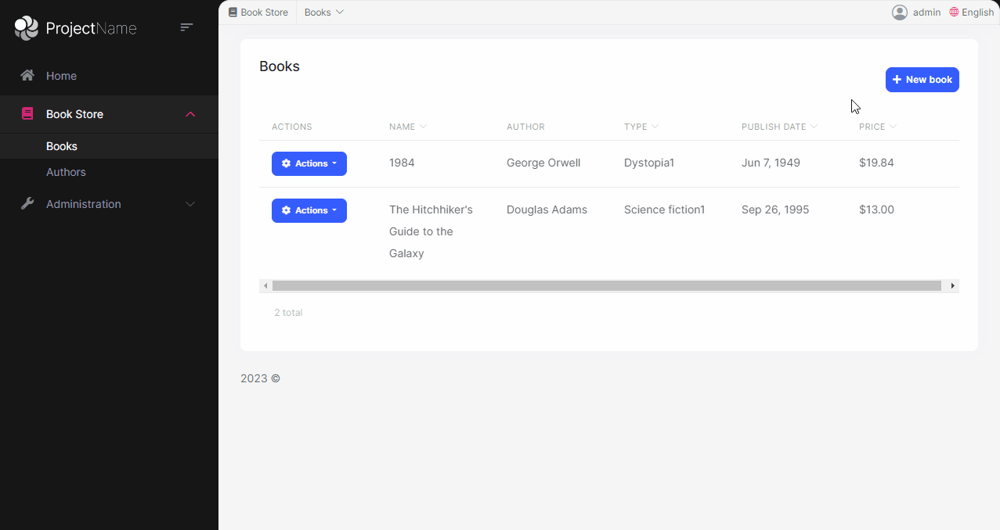
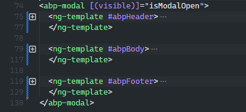
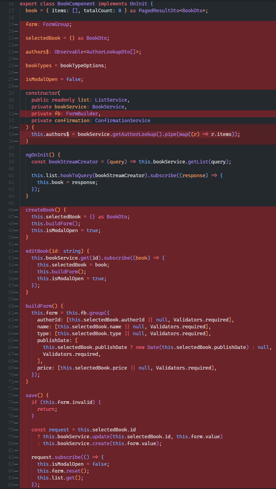

# Convert Create/Edit Modals to Page

In this document we will explain how to convert BookStore's Books create & edit modals to regular angular component pages.

## Before



## After


# BooksComponent

This is the main component of the books management. Create & Update operations are done in this page. So we'll remove create & update operations from this page and move a separate angular component for each operation. Each component will be a page.

- Remove Create & Update modal on template

  

- Modify **NewBook** button with a link to **CreateBookComponent** page.

  ```html
  <button
    *abpPermission="'BookStore.Books.Create'"
    id="create"
    class="btn btn-primary"
    type="button"
    [routerLink]="['create']"
  >
    <i class="fa fa-plus me-1"></i>
    <span>{{ '::NewBook' | abpLocalization }}</span>
  </button>
  ```

- Modify **Edit** button with a link to **EditBookComponent** page.

  ```html
  <button
    *abpPermission="'BookStore.Books.Edit'"
    ngbDropdownItem
    [routerLink]="['edit', row.id]"
  >
    {{ '::Edit' | abpLocalization }}
  </button>
  ```

- Remove all unused methods and variables in the `BookComponent` except **book** variable, **ngOnInit** and **delete** methods.


  

- Also we can clear unncessary imports

  


# CreateBookComponent Page

Create new component by name `create-book` in your project.
```bash
  yarn ng g c book/create-book --skip-tests --style=none
```

- `create-book.component.html`

```html
<div class="card">
  <div class="card-body">
    <form [formGroup]="form" (ngSubmit)="save()">
      <div class="form-group">
        <label for="author-id">Author</label><span> * </span>
        <select class="form-control" id="author-id" formControlName="authorId">
          <option [ngValue]="null">Select author</option>
          <option [ngValue]="author.id" *ngFor="let author of authors$ | async">
            {{ author.name }}
          </option>
        </select>
      </div>

      <div class="mt-2">
        <label for="book-name">Name</label><span> * </span>
        <input type="text" id="book-name" class="form-control" formControlName="name" autofocus />
      </div>

      <div class="mt-2">
        <label for="book-price">Price</label><span> * </span>
        <input type="number" id="book-price" class="form-control" formControlName="price" />
      </div>

      <div class="mt-2">
        <label for="book-type">Type</label><span> * </span>
        <select class="form-control" id="book-type" formControlName="type">
          <option [ngValue]="null">Select a book type</option>
          <option [ngValue]="type.value" *ngFor="let type of bookTypes">
            {{ '::Enum:BookType.' + type.value | abpLocalization }}
          </option>
        </select>
      </div>

      <div class="mt-2">
        <label>Publish date</label><span> * </span>
        <input
          #datepicker="ngbDatepicker"
          class="form-control"
          name="datepicker"
          formControlName="publishDate"
          ngbDatepicker
          (click)="datepicker.toggle()"
        />
      </div>

      <div class="pt-2">
        <button type="button" class="btn btn-secondary m-1" [routerLink]="['/books']">
          {{ '::Cancel' | abpLocalization }}
        </button>

        <button class="btn btn-primary">
          <i class="fa fa-check mr-1"></i>
          {{ '::Save' | abpLocalization }}
        </button>
      </div>
    </form>
  </div>
</div>
```

- `create-book.component.ts`

```ts
import { Component, inject } from '@angular/core';
import { Router } from '@angular/router';
import { FormBuilder, FormGroup, Validators } from '@angular/forms';
import { map } from 'rxjs';
import { NgbDateNativeAdapter, NgbDateAdapter } from '@ng-bootstrap/ng-bootstrap';
import { BookService, bookTypeOptions } from '@proxy/books';

const { required } = Validators;

@Component({
  selector: 'app-create-book',
  templateUrl: './create-book.component.html',
  providers: [{ provide: NgbDateAdapter, useClass: NgbDateNativeAdapter }],
})
export class CreateBookComponent {
  //inject() function came with Angular v14, detail: https://angular.io/api/core/inject
  private readonly router = inject(Router);
  private readonly fb = inject(FormBuilder);
  private readonly bookService = inject(BookService);

  form: FormGroup;
  authors$ = this.bookService.getAuthorLookup().pipe(map(({ items }) => items));
  bookTypes = bookTypeOptions;

  private buildForm() {
    this.form = this.fb.group({
      authorId: [null, required],
      name: [null, required],
      type: [null, required],
      publishDate: [undefined, required],
      price: [null, required],
    });
  }

  constructor() {
    this.buildForm();
  }

  save() {
    if (this.form.invalid) return;

    this.bookService.create(this.form.value).subscribe(() => {
      this.router.navigate(['/books']);
    });
  }
}
```

# EditBookComponent Page

Create new component by name **edit-book** in your project.

```bash
  yarn ng g c book/edit-book --skip-tests --style=none
```

- `edit-book.component.html`

```html
<div class="card">
  <div class="card-body">
    <form *ngIf="form" [formGroup]="form" (ngSubmit)="save()">
      <div class="form-group">
        <label for="author-id">Author</label><span> * </span>
        <select class="form-control" id="author-id" formControlName="authorId">
          <option [ngValue]="null">Select author</option>
          <option [ngValue]="author.id" *ngFor="let author of authors$ | async">
            {{ author.name }}
          </option>
        </select>
      </div>

      <div class="mt-2">
        <label for="book-name">Name</label><span> * </span>
        <input type="text" id="book-name" class="form-control" formControlName="name" autofocus />
      </div>

      <div class="mt-2">
        <label for="book-price">Price</label><span> * </span>
        <input type="number" id="book-price" class="form-control" formControlName="price" />
      </div>

      <div class="mt-2">
        <label for="book-type">Type</label><span> * </span>
        <select class="form-control" id="book-type" formControlName="type">
          <option [ngValue]="null">Select a book type</option>
          <option [ngValue]="type.value" *ngFor="let type of bookTypes">
            {{ '::Enum:BookType.' + type.value | abpLocalization }}
          </option>
        </select>
      </div>

      <div class="mt-2">
        <label>Publish date</label><span> * </span>
        <input
          #datepicker="ngbDatepicker"
          class="form-control"
          name="datepicker"
          formControlName="publishDate"
          ngbDatepicker
          (click)="datepicker.toggle()"
        />
      </div>

      <div class="pt-2">
        <button type="button" class="btn btn-secondary m-1" [routerLink]="['/books']">
          {{ '::Cancel' | abpLocalization }}
        </button>

        <button class="btn btn-primary">
          <i class="fa fa-check mr-1"></i>
          {{ '::Save' | abpLocalization }}
        </button>
      </div>
    </form>
  </div>
</div>
```

- `edit-book.component.ts`

```ts
import { Component, inject } from '@angular/core';
import { ActivatedRoute, Router } from '@angular/router';
import { FormBuilder, FormGroup, Validators } from '@angular/forms';
import { filter, map, switchMap, tap } from 'rxjs';
import { NgbDateNativeAdapter, NgbDateAdapter } from '@ng-bootstrap/ng-bootstrap';
import { BookDto, BookService, bookTypeOptions } from '@proxy/books';

const { required } = Validators;

@Component({
  selector: 'app-edit-book',
  templateUrl: './edit-book.component.html',
  providers: [{ provide: NgbDateAdapter, useClass: NgbDateNativeAdapter }],
})
export class EditBookComponent {
  //inject() function came with Angular v14, detail: https://angular.io/api/core/inject
  private readonly router = inject(Router);
  private readonly activatedRoute = inject(ActivatedRoute);
  private readonly fb = inject(FormBuilder);
  private readonly bookService = inject(BookService);

  id: string;
  form: FormGroup;
  authors$ = this.bookService.getAuthorLookup().pipe(map(({ items }) => items));
  bookTypes = bookTypeOptions;

  private buildForm(book: BookDto): void {
    this.form = this.fb.group({
      authorId: [book.authorId, required],
      name: [book.name, required],
      type: [book.type, required],
      publishDate: [new Date(book.publishDate), required],
      price: [book.price, required],
    });
  }

  constructor() {
    this.activatedRoute.params
      .pipe(
        filter(params => params.id),
        tap(({ id }) => (this.id = id)),
        switchMap(({ id }) => this.bookService.get(id)),
        tap(book => this.buildForm(book))
      )
      .subscribe();
  }

  save(): void {
    if (this.form.invalid) return;

    this.bookService.update(this.id, this.form.value).subscribe(() => {
      this.router.navigate(['/books']);
    });
  }
}
```

# Update BookRoutingModule
Finally add 2 item to routes array in the `book-routing.module.ts`
```ts
import { CreateBookComponent } from './create-book/create-book.component';
import { EditBookComponent } from './edit-book/edit-book.component';

const routes: Routes = [
  { path: '', component: BookComponent, canActivate: [AuthGuard, PermissionGuard] },
  { path: 'create', component: CreateBookComponent },
  { path: 'edit/:id', component: EditBookComponent },
];
```


You can check the following commit for details: https://github.com/abpframework/abp-samples/commit/351ad5e093036702edbb15169968935496afea0e
