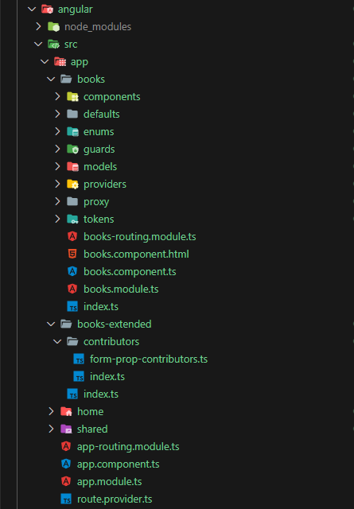
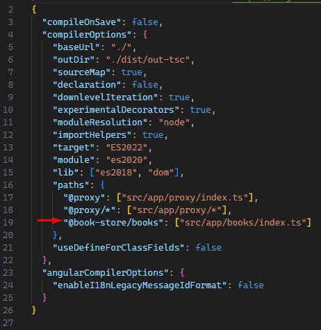
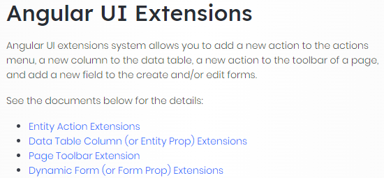
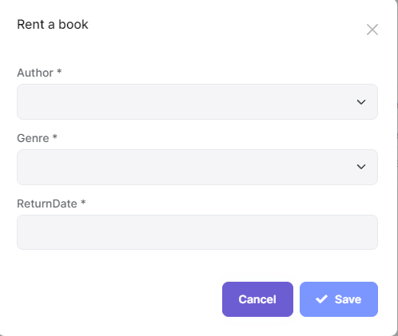

# Cascading Option Loading with Extensions System in ABP Angular

This article will show how to load cascading options with an extensions system in ABP Angular. For this example, we'll simulate renting a book process. Besides our default form properties, we'll contribute `Name` property to our `Rent Form Modal` in the Books module. This property will be loaded after `Genre` is selected.

> Before starting this article, I suggest you read the [ABP Angular Dynamic Form Extensions](https://docs.abp.io/en/abp/latest/UI/Angular/Dynamic-Form-Extensions)

### Environment

- **ABP Framework Version:** ~7.3.0 (`~` means that use the latest patch version of the specified release)
- **DB Provider:** MongoDB
- **Angular Version:** ~16.0.0

### Project structure

The books module is not a library; for this demo, it'll placed in the application itself.



- **books folder:** Contains default form properties, tokens, models, etc. It's similar to the ABP module structure.
- Also I've used **standalone** and **signals** feature in this demo.
- **books-extended folder:** Contains only `Name` property for the contribute `Rent Form Modal` inside the Books module.
- **For more readability, I've used TS path aliases in this demo. Don't forget to export files in `index.ts` file 🙂**



### First look at the demo


### What is the Extension system?



# Reviewing the code step by step

**1. Create default form properties for `Rent Form` in the `Books` module**

- `getInjected` function is the key point of the cascading loading
- We can reach and track any value from `Service` or `Component`
- In that way we can load options according to the selected value

```ts
// ~/books/defaults/default-books-form.props.ts

import { Validators } from "@angular/forms";
import { map, of } from "rxjs";
import { ePropType, FormProp } from "@abp/ng.theme.shared/extensions";
import { BookDto, AuthorService, BooksService } from "../proxy";
import { RentBookComponent } from "../components";
import { DefaultOption } from "../utils";

const { required } = Validators;

export const DEFAULT_RENT_FORM_PROPS = FormProp.createMany<BookDto>([
  {
    type: ePropType.String,
    id: "authorId",
    name: "authorId",
    displayName: "BookStore::Author",
    defaultValue: null,
    validators: () => [required],
    options: (data) => {
      const { authors } = data.getInjected(AuthorService);

      return of([
        DefaultOption,
        ...authors().map((author) => ({ value: author.id, key: author.name })),
      ]);
    },
  },
  {
    type: ePropType.String,
    id: "genreId",
    name: "genreId",
    displayName: "BookStore::Genre",
    defaultValue: null,
    validators: () => [required],
    options: (data) => {
      const rentBookComponent = data.getInjected(RentBookComponent);
      const { genres } = data.getInjected(BooksService);

      const genreOptions = genres().map(({ id, name }) => ({
        value: id,
        key: name,
      }));

      return rentBookComponent.form.controls.authorId.valueChanges.pipe(
        map((value: string | undefined) =>
          value ? [DefaultOption, ...genreOptions] : [DefaultOption]
        )
      );
    },
  },
  {
    type: ePropType.Date,
    id: "returnDate",
    name: "returnDate",
    displayName: "BookStore::ReturnDate",
    defaultValue: null,
    validators: () => [required],
  },
]);
```

**2. Configure tokens and config options**

The documentation explains these steps; that's why I won't explain it again. If documents or samples are not enough, please let me know in the comments 🙂

**Extensions Token**

```ts
// ~/books/tokens/extensions.token.ts

import { CreateFormPropContributorCallback } from "@abp/ng.theme.shared/extensions";
import { InjectionToken } from "@angular/core";
import { BookDto } from "../proxy";
import { eBooksComponents } from "../enums";
import { DEFAULT_RENT_FORM_PROPS } from "../defaults";

export const DEFAULT_BOOK_STORE_CREATE_FORM_PROPS = {
  [eBooksComponents.RentBook]: DEFAULT_RENT_FORM_PROPS,
};

export const BOOK_STORE_RENT_FORM_PROP_CONTRIBUTORS =
  new InjectionToken<CreateFormPropContributors>(
    "BOOK_STORE_RENT_FORM_PROP_CONTRIBUTORS"
  );

type CreateFormPropContributors = Partial<{
  [eBooksComponents.RentBook]: CreateFormPropContributorCallback<BookDto>[];
  /**
   * Other creation form prop contributors...
   */
  // [eBooksComponents.CreateBook]: CreateFormPropContributorCallback<BookDto>[];
}>;
```

**Extensions Config Option**

```ts
// ~/books/models/config-options.ts

import { CreateFormPropContributorCallback } from "@abp/ng.theme.shared/extensions";
import { BookDto } from "../proxy";
import { eBooksComponents } from "../enums";

export type BookStoreRentFormPropContributors = Partial<{
  [eBooksComponents.RentBook]: CreateFormPropContributorCallback<BookDto>[];
}>;

export interface BooksConfigOptions {
  rentFormPropContributors?: BookStoreRentFormPropContributors;
}
```

**3. Extensions Guard**

It'll to collect all contributors from [ExtensionsService](https://github.com/abpframework/abp/blob/dev/npm/ng-packs/packages/theme-shared/extensions/src/lib/services/extensions.service.ts)

```ts
// ~/books/guards/extensions.guard.ts

import { Injectable, inject } from "@angular/core";
import { Observable, map, tap } from "rxjs";
import { ConfigStateService, IAbpGuard } from "@abp/ng.core";
import {
  ExtensionsService,
  getObjectExtensionEntitiesFromStore,
  mapEntitiesToContributors,
  mergeWithDefaultProps,
} from "@abp/ng.theme.shared/extensions";
import {
  BOOK_STORE_RENT_FORM_PROP_CONTRIBUTORS,
  DEFAULT_BOOK_STORE_CREATE_FORM_PROPS,
} from "../tokens";

@Injectable()
export class BooksExtensionsGuard implements IAbpGuard {
  protected readonly configState = inject(ConfigStateService);
  protected readonly extensions = inject(ExtensionsService);

  canActivate(): Observable<boolean> {
    const createFormContributors =
      inject(BOOK_STORE_RENT_FORM_PROP_CONTRIBUTORS, { optional: true }) || {};

    return getObjectExtensionEntitiesFromStore(
      this.configState,
      "BookStore"
    ).pipe(
      mapEntitiesToContributors(this.configState, "BookStore"),
      tap((objectExtensionContributors) => {
        mergeWithDefaultProps(
          this.extensions.createFormProps,
          DEFAULT_BOOK_STORE_CREATE_FORM_PROPS,
          objectExtensionContributors.createForm,
          createFormContributors
        );
      }),
      map(() => true)
    );
  }
}
```

Yes, I'm still using class-based guard 🙂 much more flexible...

**4. RentBookComponent**

- Our trackable variable is defined here `(form:FormGroup)`, which means We'll track this variable in `options` property at defaults || contributors files.
- Providing `AuthorService`, also `EXTENSIONS_IDENTIFIER` for the reach dynamic properties

```ts
import {
  ChangeDetectionStrategy,
  Component,
  EventEmitter,
  Injector,
  Output,
  inject,
} from "@angular/core";
import { FormGroup } from "@angular/forms";
import { CoreModule, uuid } from "@abp/ng.core";
import { ThemeSharedModule } from "@abp/ng.theme.shared";
import {
  EXTENSIONS_IDENTIFIER,
  FormPropData,
  UiExtensionsModule,
  generateFormFromProps,
} from "@abp/ng.theme.shared/extensions";
import { AuthorService, BookDto, BooksService } from "../../proxy";
import { eBooksComponents } from "../../enums";

@Component({
  standalone: true,
  selector: "app-rent-book",
  templateUrl: "./rent-book.component.html",
  imports: [CoreModule, UiExtensionsModule, ThemeSharedModule],
  providers: [
    {
      provide: EXTENSIONS_IDENTIFIER,
      useValue: eBooksComponents.RentBook,
    },
    AuthorService,
  ],
  changeDetection: ChangeDetectionStrategy.OnPush,
})
export class RentBookComponent {
  protected readonly injector = inject(Injector);
  protected readonly authorService = inject(AuthorService);
  protected readonly booksService = inject(BooksService);

  //#region Just for demo
  readonly #authors = this.authorService.authors();
  readonly #genres = this.booksService.genres();
  readonly #books = this.booksService.books();
  //#endregion

  protected modalVisible = true;
  @Output() modalVisibleChange = new EventEmitter<boolean>();

  selected: BookDto;
  form: FormGroup;
  modalBusy = false;

  protected buildForm(): void {
    const data = new FormPropData(this.injector, this.selected);
    this.form = generateFormFromProps(data);
  }

  constructor() {
    this.buildForm();
  }

  save(): void {
    if (this.form.invalid) {
      return;
    }

    this.modalBusy = true;

    const { authorId, genreId, bookId, returnDate } = this.form.value;

    //#region Just for demo
    const authorName = this.#authors.find(({ id }) => id === authorId).name;
    const genreName = this.#genres.find(({ id }) => id === genreId).name;
    const bookName = this.#books.find(({ id }) => id === bookId).name;
    //#endregion

    this.booksService.rentedBooks.update((books) => [
      {
        id: uuid(),
        name: bookName,
        author: authorName,
        genre: genreName,
        returnDate,
      },
      ...books,
    ]);

    this.modalBusy = false;
    this.modalVisible = false;
  }
}
```

```html
<abp-modal
  [visible]="modalVisible"
  [busy]="modalBusy"
  (visibleChange)="modalVisibleChange.next($event)"
>
  <ng-template #abpHeader>
    <h3>{{ 'BookStore::RentABook' | abpLocalization }}</h3>
  </ng-template>

  <ng-template #abpBody>
    <ng-template #loaderRef>
      <div class="text-center">
        <i class="fa fa-pulse fa-spinner" aria-hidden="true"></i>
      </div>
    </ng-template>

    <form
      *ngIf="form; else loaderRef"
      [formGroup]="form"
      (ngSubmit)="save()"
      validateOnSubmit
    >
      <abp-extensible-form [selectedRecord]="selected"></abp-extensible-form>
    </form>
  </ng-template>

  <ng-template #abpFooter>
    <button abpClose type="button" class="btn btn-secondary">
      {{ 'AbpIdentity::Cancel' | abpLocalization }}
    </button>
    <abp-button
      iconClass="fa fa-check"
      [disabled]="form?.invalid"
      (click)="save()"
    >
      {{ 'AbpIdentity::Save' | abpLocalization }}
    </abp-button>
  </ng-template>
</abp-modal>
```

Up to now, we have constructed our module's default form properties.

- As you can see, there are no book names we'll add them via contributors



## Next, add new property dynamically (book name list as dropdown)

- Created new folder ./src/app/books-extended
- Create contributors/form-prop.contributors.ts

```ts
// ~/books-extened/contributors/form-prop.contributors.ts

import { Validators } from "@angular/forms";
import { map } from "rxjs";
import {
  ePropType,
  FormProp,
  FormPropList,
} from "@abp/ng.theme.shared/extensions";
import {
  BookDto,
  BookStoreRentFormPropContributors,
  BooksService,
  DefaultOption,
  RentBookComponent,
  eBooksComponents,
} from "@book-store/books";

const { required, maxLength } = Validators;

const bookIdProp = new FormProp<BookDto>({
  type: ePropType.String,
  id: "bookId",
  name: "bookId",
  displayName: "BookStore::Name",
  options: (data) => {
    const rentBook = data.getInjected(RentBookComponent);
    const { books } = data.getInjected(BooksService);
    const bookOptions = books().map(({ id, name }) => ({
      value: id,
      key: name,
    }));

    return rentBook.form.controls.genreId.valueChanges.pipe(
      map((value: string | undefined) =>
        value ? [DefaultOption, ...bookOptions] : [DefaultOption]
      )
    );
  },
  validators: () => [required, maxLength(255)],
});

export function bookIdPropContributor(propList: FormPropList<BookDto>) {
  propList.addByIndex(bookIdProp, 2);
}

export const bookStoreRentFormPropContributors: BookStoreRentFormPropContributors =
  {
    [eBooksComponents.RentBook]: [bookIdPropContributor],
  };
```

- Load new contributions via routing & forLazy method

```ts
// ~/app-routing.module.ts
import { bookStoreRentFormPropContributors } from "./books-extended/contributors/form-prop.contributors";

const routes: Routes = [
  // other routes...
  {
    path: "books",
    loadChildren: () =>
      import("@book-store/books").then((m) =>
        m.BooksModule.forLazy({
          rentFormPropContributors: bookStoreRentFormPropContributors,
        })
      ),
  },
];

@NgModule({
  imports: [RouterModule.forRoot(routes, {})],
  exports: [RouterModule],
})
export class AppRoutingModule {}
```

Finally, we've added a new property to our module, and it'll be loaded after `Genre` is selected.

## Conclusion


- In ABP Angular, we can create form properties and load dropdown options dynamically via the Extensions System
- We can reach and track any value from `Service` or `Component`
- We can create our custom library or module and contribute it to any module in the application

Thanks for reading, I hope it was helpful. If you have any questions, please let me know in the comments section. 👋👋

> You can find the source code of this article on [Github](https://github.com/abpframework/abp/tree/dev/docs/Community-Articles/2023-07-09-Cascading-Option-Loading-With-Extensions/Volo.BookStore)
