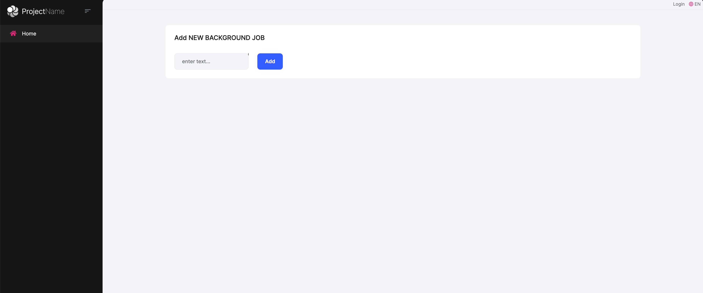
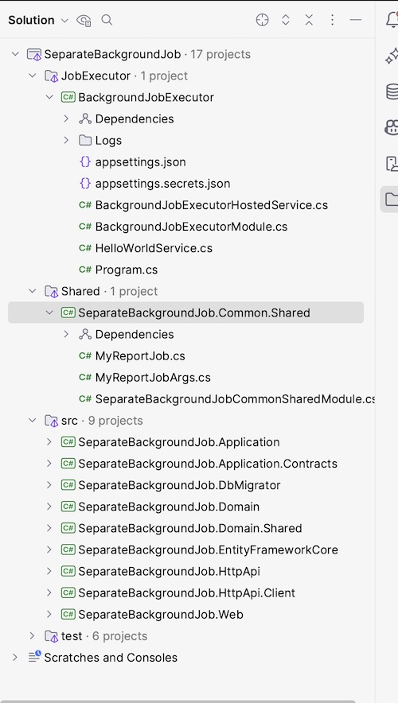
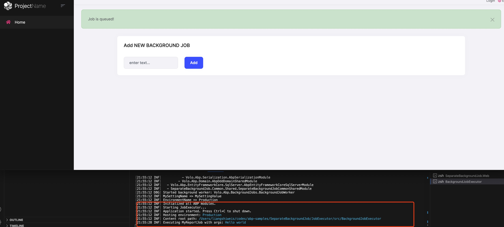

# Moving Background Job Execution To A Separate Application

In this article, I will show you how to move background job execution to a separate application.

Here are some benefits of doing this:

* if your background jobs consume high system resources (CPU, RAM or Disk), you can deploy that background application to a dedicated server and your background jobs don't affect your application's performance.
* You can scale your background job application independently from your web application. For example, you can deploy multiple instances of your background job application to a Kubernetes cluster and scale it easily.

Here are some disadvantages of doing this:
 
* You need to deploy and maintain least two applications instead of one.
* You need to implement a mechanism to share the common code between your applications. For example, you can create a shared project and add it to your applications as a project reference.

## Source code

You can find the source code of the application at [abpframework/abp-samples](https://github.com/abpframework/abp-samples/tree/master/SeparateBackgroundJob).

You can check the PR to see the changes step by step: [abpframework/abp-samples#250](https://github.com/abpframework/abp-samples/pull/250)

## Creating the Web Application

First, we need to create a new web application using the ABP CLI:

```bash
abp new SeparateBackgroundJob -t app
```

* Create a shared project named `SeparateBackgroundJob.Common.Shared` to share the `BackgroundJob` and `BackgroundJobArgs` classes between the web and job executor applications.
* Install the `Volo.Abp.BackgroundJobs.Abstractions` package to the `SeparateBackgroundJob.Common.Shared` project.

Add `SeparateBackgroundJobCommonSharedModule` class to the `SeparateBackgroundJob.Common.Shared` project:

```csharp
[DependsOn(typeof(AbpBackgroundJobsAbstractionsModule))]
public class SeparateBackgroundJobCommonSharedModule : AbpModule
{
}
```

Add `MyReportJob` and `MyReportJobArgs` classes to the `SeparateBackgroundJob.Common.Shared` project:

```csharp
public class MyReportJob : AsyncBackgroundJob<MyReportJobArgs>, ITransientDependency
{
    public override Task ExecuteAsync(MyReportJobArgs args)
    {
        Logger.LogInformation("Executing MyReportJob with args: {0}", args.Content);
        return Task.CompletedTask;
    }
}

public class MyReportJobArgs
{
    public string? Content { get; set; }
}
```

Add `SeparateBackgroundJob.Common.Shared` project reference to the `SeparateBackgroundJob.Domain` project and add `SeparateBackgroundJobCommonSharedModule` to the `DependsOn` attribute of the `SeparateBackgroundJobDomainModule` class:

```csharp
[DependsOn(
    typeof(SeparateBackgroundJobDomainSharedModule),
    typeof(AbpAuditLoggingDomainModule),
    typeof(AbpBackgroundJobsDomainModule),
    typeof(AbpFeatureManagementDomainModule),
    typeof(AbpIdentityDomainModule),
    typeof(AbpOpenIddictDomainModule),
    typeof(AbpPermissionManagementDomainOpenIddictModule),
    typeof(AbpPermissionManagementDomainIdentityModule),
    typeof(AbpSettingManagementDomainModule),
    typeof(AbpTenantManagementDomainModule),
    typeof(AbpEmailingModule),
    typeof(SeparateBackgroundJobCommonSharedModule) //Add this line
)]
public class SeparateBackgroundJobDomainModule : AbpModule
```

Open the `Index.cshtml` and replace the content with the following code:

```csharp
@page
@using Microsoft.AspNetCore.Mvc.Localization
@using SeparateBackgroundJob.Localization
@using Volo.Abp.Users
@model SeparateBackgroundJob.Web.Pages.IndexModel
@inject IHtmlLocalizer<SeparateBackgroundJobResource> L
@inject ICurrentUser CurrentUser

@section styles {
    <abp-style src="/Pages/Index.css"/>
}

@section scripts {
    <abp-script src="/Pages/Index.js"/>
}

<div class="container">
    <abp-card>
        <abp-card-header>
            <abp-card-title>
                Add NEW BACKGROUND JOB
            </abp-card-title>
        </abp-card-header>
        <abp-card-body>
            <form id="NewItemForm" method="post" class="row row-cols-lg-auto g-3 align-items-center">
                <div class="col-12">
                    <div class="input-group">
                        <input id="ReportContent" required name="ReportContent" type="text" class="form-control" placeholder="enter text...">
                    </div>
                </div>
                <div class="col-12">
                    <button type="submit" class="btn btn-primary">Add</button>
                </div>
            </form>
        </abp-card-body>
    </abp-card>
</div>
```

Open the `Index.cshtml.cs` and replace the content with the following code:

```csharp
public class IndexModel : SeparateBackgroundJobPageModel
{
    private readonly IBackgroundJobManager _backgroundJobManager;

    [BindProperty(SupportsGet = true)]
    public string? ReportContent { get; set; }

    public IndexModel(IBackgroundJobManager backgroundJobManager)
    {
        _backgroundJobManager = backgroundJobManager;
    }

    public void OnGet()
    {

    }
    
    public async Task OnPostAsync()
    {
        await _backgroundJobManager.EnqueueAsync(new MyReportJobArgs
        {
            Content = ReportContent
        });
        
        Alerts.Success("Job is queued!");
    }
}
```

Run the application and navigate to the home page. You should see the following page:



When you enter some text and click the **Add** button, the job will be queued and executed in the web application:

## Creating the Console Application

Now we split the background job execution to a separate console application.

Open the `SeparateBackgroundJobWebModule` class to disable the background job execution in the web application:

```csharp
public class SeparateBackgroundJobWebModule : AbpModule
{
    ....
        
    public override void ConfigureServices(ServiceConfigurationContext context)
    {
        ...
            
        //Disable background job execution in the web application
        Configure<AbpBackgroundJobOptions>(options =>
        {
            options.IsJobExecutionEnabled = false;
        });
    }
    
    ...
}
```

* Create a new console application using the ABP CLI:

```bash
abp new BackgroundJobExecutor -t console
```

* Add `BackgroundJobExecutor` project to the solution of the web application.
* Add `SeparateBackgroundJob.Common.Shared` project reference to the `BackgroundJobExecutor` project.
* Install the `Volo.Abp.BackgroundJobs.EntityFrameworkCore` and `Volo.Abp.EntityFrameworkCore.SqlServer` packages to the `BackgroundJobExecutor` project.

Update the `BackgroundJobExecutorModule` class as follows:

```csharp
[DependsOn(
    typeof(AbpAutofacModule),
    typeof(AbpBackgroundJobsEntityFrameworkCoreModule),
    typeof(AbpEntityFrameworkCoreSqlServerModule),
    typeof(SeparateBackgroundJobCommonSharedModule)
)]
public class BackgroundJobExecutorModule : AbpModule
{
    public override void ConfigureServices(ServiceConfigurationContext context)
    {
        Configure<AbpDbContextOptions>(options =>
        {
            options.UseSqlServer();
        });
    }
    
    ....
}
```

Open the `appsettings.json` file to configure the [connection string](https://docs.abp.io/en/abp/latest/Connection-Strings#configure-the-connection-strings):

```json
{
  "ConnectionStrings": {
    "AbpBackgroundJobs": "Server=(LocalDb)\\MSSQLLocalDB;Database=SeparateBackgroundJob;Trusted_Connection=True"
  }
}
```

> You must use the same connection string for the web application, `AbpBackgroundJobs` is the default connection string name for the background job module.

The solution structure should look like this:



Now, run the web and console application. When you enter some text and click the **Add** button, the job will be queued and executed in the console application:

