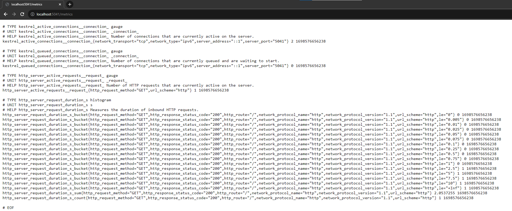
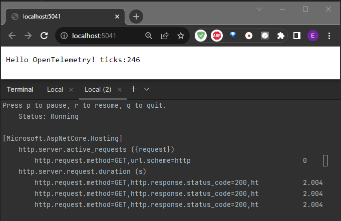

# .NET 8 - ASP.NET Core Metrics

In this article, I'll show you new built-in metrics of .NET 8, which are basically numerical measurements reported over time in your application and can be used to monitor the health of your application and generate reports according to those numerical values. We will see what the metrics are, why to use them, and how to use them in detail. So, let's dive in.

## What Are Metrics?

Metrics are numerical measurements reported over time. These measurements are crucial for monitoring the health of an application and generating alerts when necessary. In the context of a web service, various metrics can be tracked, such as:

* Requests per second.
* Response time.
* Status code counts etc...

These metrics are not just collected; they are reported to a monitoring system at regular intervals. By doing so, the development and operations teams can visualize these metrics on dashboards (we will see it in the _[Creating Custom Metrics in ASP.NET Core Applications](#creating-custom-metrics-in-aspnet-core-applications)_ section). These dashboards provide a real-time overview of the application's performance and health.

## Pre-Built Metrics

ASP.NET Core has many built-in metrics. You can see the following figure for a list of built-in metrics for ASP.NET Core:


> See https://learn.microsoft.com/en-us/dotnet/core/diagnostics/built-in-metrics-aspnetcore and https://github.com/dotnet/aspnetcore/issues/47536 for all built-in metrics and their descriptions.

For example, we have the `kestrel-current-connections` metric that shows _number of connections that are currently active on the server_ and `http-server-request-duration` metric that shows _the duration of HTTP requests on the server_. 

All of these and other built-in metrics are produced by using the [**System.Diagnostics.Metrics**](https://learn.microsoft.com/en-us/dotnet/api/system.diagnostics.metrics) API and with a small amount of code, we can use & view them.

## Using Pre-Built Metrics

Let's see the pre-built metrics in action.

Create a new ASP.NET Core app with the following command and change the directory to the created application folder:

```bash
dotnet new web -o MetricsDemo
cd MetricsDemo
```

After that open the application in your favourite IDE and add the following service registration code to your application:

```csharp
var builder = WebApplication.CreateBuilder(args);

builder.Services.AddOpenTelemetry()
    .WithMetrics(builder =>
    {
        builder.AddPrometheusExporter();

        builder.AddMeter("Microsoft.AspNetCore.Hosting",
            "Microsoft.AspNetCore.Server.Kestrel");
        builder.AddView("http.server.request.duration",
            new ExplicitBucketHistogramConfiguration
            {
                Boundaries = new double[] { 0, 0.005, 0.01, 0.025, 0.05,
                    0.075, 0.1, 0.25, 0.5, 0.75, 1, 2.5, 5, 7.5, 10 }
            });
    });
```

Here, we have done the following things:

* `AddOpenTelemetry` method registers the required **OpenTelemetry** services into the DI container.
* `WithMetrics` method, we add pre-built metrics to the `OpenTelemetryBuilder` in the `AddMeter` method (_Microsoft.AspNetCore.Hosting_ and _Microsoft.AspNetCore.Server.Kestrel_ are pre-built metrics provided by ASP.NET Core). 
* Also, we have used the `AddView` method to customize the output of the metrics by the SDK. Also, it can be used to customize which [Instruments](https://github.com/open-telemetry/opentelemetry-specification/blob/main/specification/metrics/api.md#instrument) are to be processed or ignored.

After making the related configurations, let's add the middlewares below and view the metrics: 

```csharp
app.MapPrometheusScrapingEndpoint();

app.MapGet("/", () =>
{
    Thread.Sleep(2000);
    
    return "Hello, ABP Community member: " + DateTime.Now.Ticks.ToString()[^3..];
});
```

* `MapPrometheusScrapingEndpoint`: Adds OpenTelemetry Prometheus scraping endpoint middleware to the pipeline and then we can see the all metrics by navigating to the **/metrics** endpoints (optional):



### View Metrics

You can use the `dotnet-counters` command-line tool, which allows you to view live metrics for .NET Core apps. You can run the following command to install the tool:

```bash
dotnet tool update -g dotnet-counters
```

After the tool is installed, you can run the application and by running the `dotnet-counters` tool in a terminal, you can monitor for the specific metrics:

```bash
dotnet-counters monitor -n Acme.BookStore --counters Microsoft.AspNetCore.Hosting
```

When you run the command, it will print a message like in the below and will wait an initial request to your application:

```txt
Press p to pause, r to resume, q to quit. 
    Status: Waiting for initial payload...
```

If you send a request to your application, then the related built-in metrics that you have added will be collected and will be show in the terminal instantly:



Also, you can check for the other metric that we have used in the configuration, which is _Microsoft.AspNetCore.Server.Kestrel_ by setting it as a counter as in the command below, and when you send a request to your application, you will see different metrics:

```bash
dotnet-counters monitor -n Acme.BookStore --counters Microsoft.AspNetCore.Server.Kestrel
```

## Creating Custom Metrics in ASP.NET Core Applications

So far, we have seen what metrics are, which built-in metrics are provided by ASP.NET Core and see a sample application with the built-in metrics and also run the `dotnet-counters` global tool to view metrics.

//TODO: create custom metrics by using the `IMeterFactory` interface and see it in prometheus or grafana!!!

## References

* https://learn.microsoft.com/en-us/aspnet/core/log-mon/metrics/metrics?view=aspnetcore-8.0
* https://devblogs.microsoft.com/dotnet/announcing-dotnet-8-preview-5/
* https://www.youtube.com/watch?v=A2pKhNQoQUU