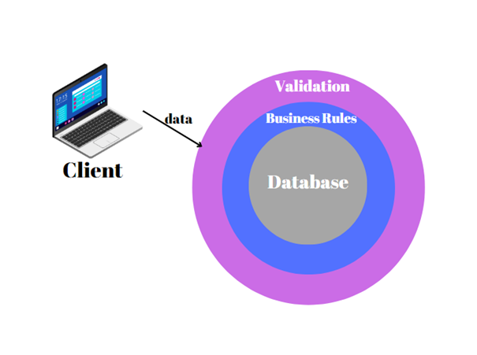

# Using FluentValidation with ABP

## What is Validation? Why Do We Need to Validate?
Validation is checking whether a data is valid or not. We can liken validations to the cell membrane of our application. Just as the cell does not want to let in harmful substances, we do not want to add erroneous data to the database, which is critical to our application. Validations allow data that follows the rules to reach the database. Data that does not comply with the rules will not access the database at all, and the operation will fail.



Validations make your application run more efficiently because they are not connected to the database.  Validations should be applied in different layers of applications. Validations are applied on the UI side. Validations should also be applied on the backend side and database to prevent malicious users from passing these validations. Fluent validation is often used to create validations on the backend side.

## What is Fluent Validation?
Fluent validation is a library for checking whether data is valid or not. Fluent validation can be applied to your code in a fluent and understandable way.


## Why We Should Use Fluent Validation?
Fluent Validation allows you to define your validation rules in a clear and flexible way. This means you can comfortably handle complex validation scenarios in your code. This makes your development process much more manageable. The readability that Fluent Validation offers really makes things easier. Having a clear understanding of what your validation rules do is a huge advantage when working on your code. In short, your code is cleaner and clearer. Fluent Validation is also very functional in terms of testability. By defining your validation rules in separate classes, you can easily test and maintain these rules. Fluent Validation is a widely used validation library on the .NET platform. As such, it has become a common standard among .NET developers. This provides advantages in terms of community support and compatibility. So, using Fluent Validation simplifies your development process by making your code more understandable, manageable and testable.

## How to Use Fluent Validation in ABP?


Using Fluent validation with Abp is quite simple. Open a command line window in the folder of the project (.csproj file) and type the following command: 
abp add-package Volo.Abp.FluentValidation
If you have not created your abp project, review the [steps to create](https://docs.abp.io/en/abp/latest/Tutorials/Todo/Overall) it now.

Create your product object like this: 
````csharp
  public class Product: FullAuditedAggregateRoot<Guid>
   {
       public string Name { get; set; } = string.Empty;
       public decimal Price { get; set; }
       public int Stock { get; set; }
       public string? LicenseKey { get; set; }
    }
````
Create the controller of your product object by following the [documentation](https://docs.abp.io/en/abp/latest/Tutorials/Todo/Index?UI=NG&DB=EF) 
You must have ProductCreateDto :
````csharp
      public class ProductCreateDto
    {
        public string Name { get; set; } 
        public decimal Price { get; set; }
        public int Stock { get; set; }
        public string? LicenseKey { get; set; }
     }
````
Create the ProductCreateDtoValidator class in the products folder in the Application.Contacts layer. 
````csharp
  public class ProductCreateDtoValidator :AbstractValidator<ProductCreateDto>
{
    public ProductCreateDtoValidator()
    {
        RuleFor(p=>p.Name).
          NotEmpty().
            WithMessage("Product name cannot be empty");
        
        RuleFor(p=>p.Name).
            MinimumLength(3).
            MaximumLength(100).
            WithMessage("Product name must be between 3 and 100 characters");

        RuleFor(p => p.Stock).
            GreaterThanOrEqualTo(0).
            WithMessage("Product stock should not be negative");

        RuleFor(p => p.Price).
           GreaterThanOrEqualTo(0).
           WithMessage("Product Price should not be negative");
    }
}
````
Fluent validation provides you with ready-made methods that you can use to write validations very easily. 
You can add a method to write your own customized validation code. For example, let's write the code that requires the license key field to contain the word “key”.
````csharp
  private bool ContainsKey(string arg)
  {
      return arg.IndexOf("key", StringComparison.OrdinalIgnoreCase) >= 0;
  }
````

Add the code to the constructor to use this method: 

````csharp
RuleFor(p => p.LicenseKey).
	Must(ContainsKey).
	WithMessage("Product license key must contain the word 'key'");
	
````


When I write code that does not follow the rule, we get this error	


 
For more information on Fluent validation, see the [documentation](https://docs.fluentvalidation.net/en/latest/)
 

