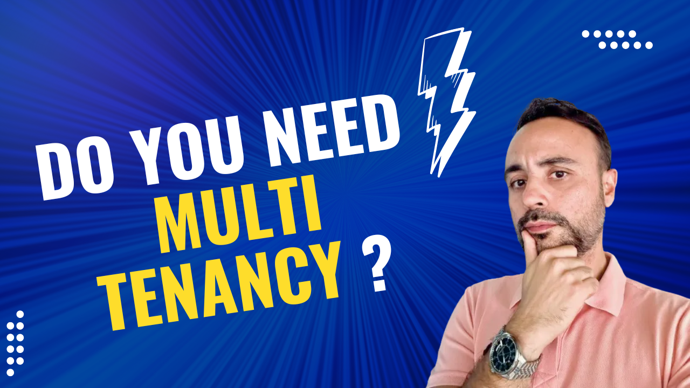
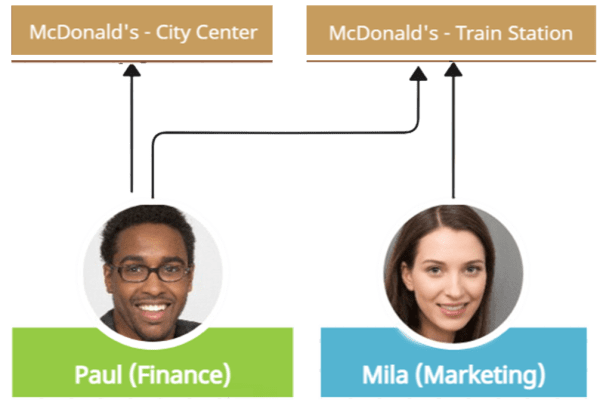

# Do You Really Need Multi-tenancy?

This article discusses whether you need a multi-tenancy architecture for your next project. Answer my critical questions to decide if multi-tenancy suits your application or not!



## What’s Multi-tenancy?

It’s an architectural approach to building SaaS solutions. In this model, the hardware and software resources are shared between tenants, and application data is virtually or physically isolated between tenants. Here, **the main goal is minimizing costs and maximizing customer count**.

**An ideal multi-tenant application should be;**

- A multi-tenancy system should be designed to **work seamlessly** and make your application code **multi-tenancy aware** as much as possible.
- When a customer wants to separate their database, it **should also be deployable to on-premise**.


---


## Multi-tenant Development is Hard - Reconsider!

**Developing a multi-tenant application is harder** compared to non-multi-tenant applications. You add `TenandId` to all your shared entities. And each time you make a query, you need to filter by `TenantId`. There is an increased risk of security breaches if one tenant's data is compromised.  Multi-tenancy can limit the extent of customization available to each tenant since they all operate on the same core infrastructure. Also, in a microservice environment, things get two times more complicated. So you should carefully consider if you need multi-tenancy or not. Sometimes, I got questions like;


**No! These are not multi-tenant applications.** It just needs a simple filtering by your different branches/faculties/departments/holding sub-companies/ groups or whatever hierarchy is… 
You are confusing "grouping" with "resource sharing".

---


## Do I Really Need Multi-tenancy?

Ask yourself the following questions if you cannot decide whether your app needs multi-tenancy or not;

1. Can a user be shared among other tenants?
2. Any tenant needs to see other tenant's data?
3. Does your application break when you physically move one of the tenants?
4. Do your customers need higher security and better GDPR enforcement?
5. Do you need cumulative queries over your tenants?


Let's answer these questions;


##### **1. Can a user be shared among other tenants?**

If you need to *share a user among other tenants, or in other words, users can be members of different tenants,* then **your application is definitely not multi-tenant**! Multi-tenancy means a tenant’s data is always isolated, even if it’s logically separated. **You cannot share a user among your tenants.** The reason is simple: In the future, if you move a tenant to on-premise, then your application will break!



##### **2. Does any tenant need to see other tenants' data?**

If your answer is **YES**, **then** **your application is not multi-tenant**. In multi-tenant apps, the tenant's data cannot be shared in any circumstances among the other tenants. Business decision-makers sometimes want to share some entities with other tenants. If there's this requirement, you shouldn't start a multi-tenant architecture. You can simply group these tenants manually. Again, reply to this question; **In the future, if I move a tenant physically to another environment, will my app still work properly?** In this case, it will not! 


Let's say your app is *Amazon.com* and you have a product entity *iPhone* that you want to share with other sellers. This requirement violates the multi-tenant rule. While your *Amazon.com* is still SaaS, it shouldn't be multi-tenant. 

On the other hand, if you serve several online shopping websites dedicated to different brands. Let's say Nike and Adidas want to have their own e-commerce websites. And your ***Amazon.com* provides these companies with their own subdomains: *nike.amazon.com* and *adidas.amazon.com***. In this architecture, these companies will have their own user, roles, settings. Also these companies will have their own branding like custom login screen, custom logo, different theme layouts, menu items,  language options, payment gateways etc... Hence, **this is %100 multi-tenant.**


##### **3. Does your application break when you physically move one of the tenants?**

If your answer is **YES**, you should **stop making it multi-tenant**. It is **not a multi-tenant app**! This means your tenants are tightly coupled with the application's infrastructure or database, and this requirement prevents you from making it multi-tenant because it disrupts the entire system when you take out a tenant. 


##### **4. Do your customers need higher security and better GDPR enforcement?**

If your answer is **YES**, you **should not make it multi-tenancy.**  When a **hacker** gets into your server, he can **steal all your client data**. Also, if you have a security hole, **a tenant can gain access** to other tenants' data. Especially your tenants' data is being shared in the same database... On the other hand, some customers, for example, government agencies or banks, may be required to locate the database in their own geo-location and make it unreachable from the main application. In this case, you should go with a single-tenant architecture. Another difficulty is that some tenants may have **different data retention policies**, so you must implement different strategies for each tenant. In this case, you should also consider making it a single-tenant.


##### **5. Do you need cumulative queries over your tenants?**

This question is not a clear decision parameter for multi-tenancy. But it can be a supportive parameter for your decision. Actually, this is a common feature in multi-tenant systems where aggregated reporting or analytics across tenants is required. In a virtually isolated multi-tenant environment, you can easily do this by just disabling the multi-tenancy filter. However, when some of your tenants have separate databases or application instances, it becomes harder to get aggregate reports.

Do you need cumulative queries over your tenants? If your answer is YES, then you should keep all your tenants' data in a shared database to easily query them. But if you still need to physically move some of the tenants, then you have the following strategies:

* First, all your databases need to be on the same network so that you can gather data from different databases.
* Second, in some cases, according to the GDPR requirements or government agency regulations, you must locate the database in their geo-location. And you cannot connect to these databases. In this case, you can create a Web API in your application that gives you a report for this specific tenant. Later, you'll gather the reports from all your tenants like this and merge them.
* Third; When the tenant databases are in different geo-location (inaccessible), then each tenant can send their report to your central server. So you can generate cumulative reports.


## Conclusion

- It's important to decide on the first day whether your application needs to be multi-tenant. To decide this, consider these topics; 

  - **Do my tenants really have a relationship with each other?** No, they have nothing to do in common; **OK, go with multi-tenancy**. 
  - **My tenants don't have a relationship** with each other, and the only thing they have in common is sharing my application. **OK, go with multi-tenancy**. 
  - **When a tenant leaves the system (by removing their data), the other tenants also stop working** This means that the tenants are coupled. **Do not do multi-tenancy!**


---


We’ve been working for a long time on multi-tenancy, microservices, modular development topics, and developing tools and frameworks for repetitive development tasks. Check out the amazing open-source [ABP Framework](https://github.com/abpframework/abp), which provides all the alternative solutions to implement a multi-tenant architecture. The multi-tenancy logic is seamlessly done at the core level, and you can simply focus on your business code. Keep it simple, nice and neat with ABP.


```bash
ABP.IO: The Modern Way of Developing Web Apps for .NET Developers!
```

 

Alper Ebicoglu / [x.com/alperebicoglu](https://x.com/alperebicoglu)

— ABP Team
