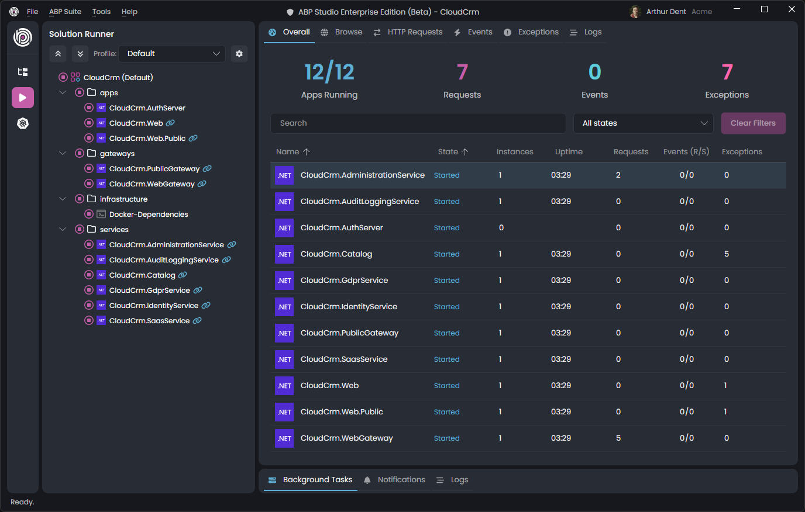

# .NET Aspire vs ABP Studio: Side by Side

In this article, I will compare [.NET Aspire](https://learn.microsoft.com/en-us/dotnet/aspire/) by [ABP Studio](https://abp.io/docs/latest/studio) by explaining their similarities and differences.

## Introduction

While .NET Aspire and ABP Studio are tools for different purpose with different scope and they have different approaches to solve the problems, many developers still may confuse since they also have some similar functionalities and solves some common problems.

Let's start by briefly define what are .NET Aspire and ABP Studio.

### What is .NET Aspire?

**[.NET Aspire](https://learn.microsoft.com/en-us/dotnet/aspire/)** is a **cloud-ready framework** designed to simplify building distributed, observable, and production-ready applications. It provides a set of opinionated tools and NuGet packages tailored for cloud-native concerns like **orchestration**, **service integration** (e.g., Redis, PostgreSQL), and **telemetry**. Aspire focuses on the **local development experience**, making it easier to manage complex, multi-service apps by **abstracting away configuration details**.

Here, a screenshot from [.NET Aspire dashboard](https://learn.microsoft.com/en-us/dotnet/aspire/fundamentals/dashboard/overview) that is used for application monitoring and inspection:

### What is ABP Studio?

**[ABP Studio](https://abp.io/docs/latest/studio)** is a cross-platform **desktop application** designed to **simplify development** on the ABP Framework by **automating various tasks** and offering a streamlined, **integrated development environment**. It allows developers to **build**, **run**, **test**, **monitor**, and **deploy applications** more efficiently. With features like Kubernetes integration and support for complex multi-application systems, ABP Studio **enhances productivity**, especially in **microservice or modular monolith architectures**.

Here, a screenshot from the ABP Studio [Solution Runner panel](https://abp.io/docs/latest/studio/running-applications) that is used to run, browse, monitor and inspect applications:

## A Brief Comparison

Before deep diving details, I want to show a **table of features** to compare ABP Studio and .NET aspire side by side:

## Comparing the Features

In the next sections, I will go through each feature and explain differences and similarities.

### Integration Packages

ABP Framework has tens of integration packages to 3rd-party libraries and services. .NET Aspire also has some library integrations. But these integrations have different purposes:

* ABP Framework's integrations (like [MongoDB](https://abp.io/docs/latest/framework/data/mongodb), [RabbitMQ](https://abp.io/docs/latest/framework/infrastructure/background-jobs/rabbitmq), [Dapr](https://abp.io/docs/latest/framework/dapr), etc) are integrations for its abstractions and aimed to be used directly by your application code. They are complete and sophisticated integrations with the ABP Framework and your codebase.
* .NET Aspire's integrations (like [MongoDB](https://learn.microsoft.com/en-us/dotnet/aspire/database/mongodb-integration), [RabbitMQ](https://learn.microsoft.com/en-us/dotnet/aspire/messaging/rabbitmq-integration), [Dapr](https://learn.microsoft.com/en-us/dotnet/aspire/frameworks/dapr), etc), on the other hand, for simplifying configuration, service discovery, orchestration and monitoring of these tools within .NET Aspire host. Basically, these are mostly for integrating to .NET Aspire, not for integrating to your application.

For example, ABP's [MongoDB](https://abp.io/docs/latest/framework/data/mongodb) integration allows you to use MongoDB over [repository services](https://abp.io/docs/latest/framework/architecture/domain-driven-design/repositories), automatically handles database transactions, [audit logs](https://abp.io/docs/latest/framework/infrastructure/audit-logging), [event publishing](https://abp.io/docs/latest/framework/infrastructure/event-bus/distributed) on data saves, dynamic [connection string](https://abp.io/docs/latest/framework/fundamentals/connection-strings) management, [multi-tenancy](https://abp.io/docs/latest/framework/architecture/multi-tenancy) integration and so on.

On the other hand, .NET Aspire's [MongoDB](https://learn.microsoft.com/en-us/dotnet/aspire/database/mongodb-integration) integration basically adds [MongoDB driver library](https://www.nuget.org/packages/MongoDB.Driver/) to your .NET Aspire host application and configures it so you can discover MongoDB server on runtime, use a MongoDB Docker container and see its health status, logs and traces on .NET Aspire dashboard.

### Starter Templates

Both of ABP Studio and .NET Aspire provide startup solution templates for new applications. However, there are huge differences between these startup solution templates and their purpose are completely different.

* ABP Studio provides production-ready and [advanced solution templates](https://abp.io/docs/latest/solution-templates) for layered, modular or microservice solution development. They are well configured for local development and deploying to Kubernetes and other production environments. They provide different UI and database options, many optional modules and configuration. For example, you can check the [microservice solution template](https://abp.io/docs/latest/solution-templates/microservice/overview) to see how sophisticated it is.
* .NET Aspire's [project templates](https://learn.microsoft.com/en-us/dotnet/aspire/fundamentals/setup-tooling?tabs=windows&pivots=visual-studio#net-aspire-project-templates)' main purpose is to provide a minimal application structure that is pre-integrated to .NET Aspire libraries.

So, when you start with .NET Aspire project template, you will need to deal with a lot of work to make your solution production and enterprise ready. On the other hand, ABP Studio's solution templates are ready to lunch your system from the first day and they provide you a perfect starting point for your new business idea.

### Monitoring

Monitoring applications and services is an important requirement for building complex distributed systems. Both of ABP Studio and .NET Aspire provide excellent tools for that purpose.