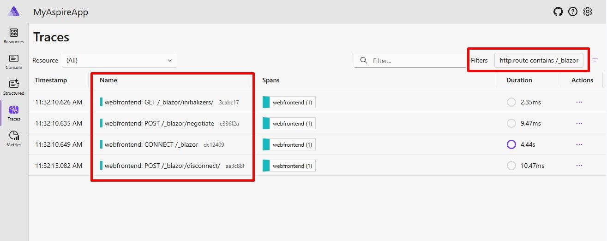

# .NET Aspire 9.0 Features

.NET Aspire 9.0 Release Candidate 1 is the next major release, supporting both .NET 8 and .NET 9. This version includes new features and improvements.

## Upgrade to .NET Aspire 9 RC1

Now, you don't need workloads to develop .NET Aspire applications. In your project, you can add an SDK reference to `Aspire.AppHost.Sdk`.
For more information, you can check out [https://learn.microsoft.com/en-us/dotnet/aspire/whats-new/dotnet-aspire-9-release-candidate-1?tabs=windows&pivots=visual-studio#upgrade-to-net-aspire-9-rc1](https://learn.microsoft.com/en-us/dotnet/aspire/whats-new/dotnet-aspire-9-release-candidate-1?tabs=windows&pivots=visual-studio#upgrade-to-net-aspire-9-rc1) which explains upgrading an existing project in details.

## Dashboard

.NET Aspire offers a nice dashboard for developers to observe the performance and behavior of their applications. In this version, there are some enhancements;

* **Manage resource lifecycle**: You can stop, start, and restart resources.
* **Mobile and responsive support**: The .NET Aspire dashboard is now mobile-friendly.
* **Sensitive properties**: Properties can be marked as sensitive, automatically masking them in the dashboard UI.
* **Volumes**: Configured container volumes are listed in resource details.
* **Health checks**: .NET Aspire 9 RC1 adds support for health checks.

## Telemetry

.NET Aspire 9 RC1 comes with many new features to the Telemetry service.

* **Improve telemetry filtering**: Telemetry data can now be filtered by attribute values. 
* **Combine telemetry from multiple resources**: If a resource has multiple replicas, you can now filter telemetry data to view from all instances.
* **Browser telemetry support**: The dashboard now supports OpenTelemetry Protocol (OTLP) over HTTP and cross-origin resource sharing (CORS).

## Orchestration

The .NET App Host is a core component of the .NET runtime that helps launch and execute .NET applications. 
.NET Aspire 9 RC1 introduces many new features to the app host. Let's take a look;

* **Waiting for dependencies**: You can configure a resource to wait for another resource to start before starting.
* **Resource health checks**: The `Waiting for dependencies` feature uses health checks to determine if a resource is ready. 

## Integrations

.NET Aspire has integrations with some services and tools that make it easy to get started. New integrations are coming with .NET Aspire 9 RC1.

* Redis Insight
* OpenAI (Preview)
* MongoDB
* Azure

For Azure part, it is better to check the official documentation here [https://learn.microsoft.com/en-us/dotnet/aspire/whats-new/dotnet-aspire-9-release-candidate-1?tabs=windows&pivots=visual-studio#azure](https://learn.microsoft.com/en-us/dotnet/aspire/whats-new/dotnet-aspire-9-release-candidate-1?tabs=windows&pivots=visual-studio#azure) because it has a very detailed explanation.

## ABP Studio

.NET Aspire and [ABP Studio](https://abp.io/studio) are tools for different purposes with different scopes, and they have different approaches to solving problems; many developers may still be confused since they also have some similar functionalities and solve some common problems. You can check the comparison of .NET Aspire and ABP Studio in this [article](https://abp.io/community/articles/.net-aspire-vs-abp-studio-side-by-side-t1c73d1l).

