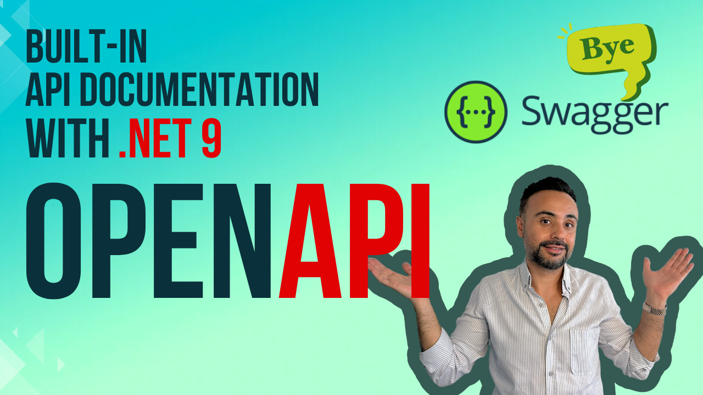
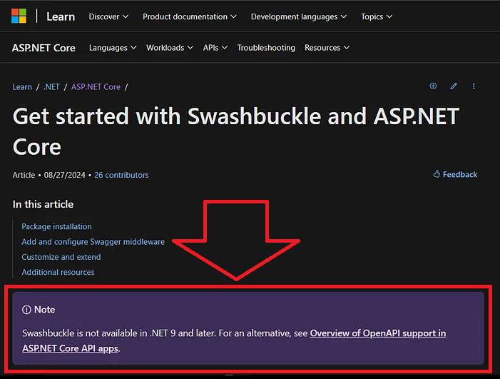
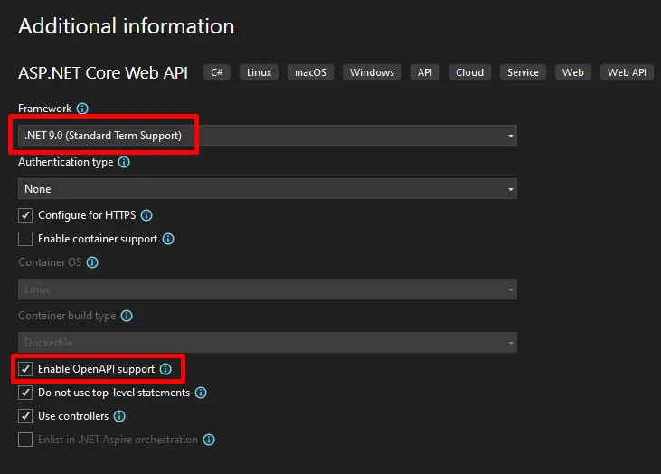

Built-in OpenAPI Document Generation with .NET 9 — No more SwaggerUI! 👋
========================================================================



What’s Swagger UI?
------------------

[Swagger UI](https://swagger.io/) is an open-source tool that automatically generates an interactive, web-based documentation interface for APIs defined using the OpenAPI Specification (OAS). It simplifies the process of exploring and testing APIs directly from the browser, making it a popular choice for developers and API consumers. It provides paid also free services.

> Previously, Swagger was included by default from **.NET 5** to **.NET 8**, which provides OpenAPI support.

What’s OpenAPI?
---------------

OpenAPI is a standard specification for defining RESTful APIs. Its website is [https://www.openapis.org/](https://www.openapis.org/). Their specifications let developers create, understand, document, and integrate APIs more efficiently.

OpenAPI Microsoft Documentation 👉 [https://aka.ms/aspnet/openapi](https://aka.ms/aspnet/openapi)


Replacement of Swagger UI with OpenAPI for API projects — Bye Swashbuckle 👋
----------------------------------------------------------------------------



Swagger UI, a third-party tool used for documenting and testing APIs, is no longer integrated into NET 9, as Microsoft wants a solution with first-class support, better control, and enhanced security.

In March 2024, the ASP.NET Core team announced plans to remove the `Swashbuckle.AspNetCore` dependency from web API templates in the upcoming .NET 9 release.

> This decision was influenced by the project's lack of active maintenance and the absence of an official release for .NET 8.

The team intends to enhance the `Microsoft.AspNetCore.OpenApi` package to provide built-in OpenAPI document generation capabilities, reducing reliance on external tools. Community members expressed concerns about the inactivity of Swashbuckle and discussed alternatives like contributing to or forking the project. The ASP.NET Core team has engaged with the maintainers of both Swashbuckle and NSwag to explore potential collaborations and ensure a smooth transition for developers.

In the below issue, you can see the details of this decision:

* https://github.com/dotnet/aspnetcore/issues/54599


**Jeremy** -Product Manager- at Microsoft answers why they took this decision in [this post](https://github.com/dotnet/aspnetcore/issues/54599#issuecomment-2004975574).


Why is SwaggerUI Removed from .NET 9?
-------------------------------------

**The change is due to a lack of maintenance of the Swagger library**, although it has seen some recent updates.

This change aims to reduce dependency on external tools and provide a streamlined, out-of-the-box experience for generating OpenAPI documentation for ASP.NET Core Web APIs.


What are the Benefits of the New OpenAI Documentation?
---------------------------------------------------------------

1. **Native Support and Reduced Dependency**

The new `Microsoft.AspNetCore.OpenApi` package provides first-class support for OpenAPI.Reduces reliance on external tools like Swashbuckle or NSwag for basic documentation needs.

2. **Simplified Configuration**

No need for extensive setup or third-party integrations. Just by defining controllers and endpoints, the framework can automatically generate OpenAPI specifications.

3. **Better Integration with Minimal APIs**

- The built-in support is optimized for **Minimal APIs**, a feature introduced in .NET 6. Automatically includes metadata for routes, request parameters, and responses.

4. **Performance Improvement**

- The native implementation leverages source generators to reduce runtime overhead. Faster and more efficient than traditional runtime-based solutions like Swashbuckle.

5. **Compatibility with Existing Tools**

*   The OpenAPI output can still be consumed by Swagger UI, NSwag, or other tools for visualization, testing, or client generation.

How to Use the New OpenAPI in .NET9?
------------------------------------

If you are creating a new ASP.NET Core project, you can see the below checkbox to add OpenAPI.



When I created a new .NET 9 web project, I saw that OpenAPI had already been added.


Add the required NuGet package [Microsoft.AspNetCore.OpenApi](https://www.nuget.org/packages/Microsoft.AspNetCore.OpenApi)

```
dotnet add package Microsoft.AspNetCore.OpenApi
```

### Enable OpenAPI Support

Add the following services and middleware in `Program.cs`

```
var builder = WebApplication.CreateBuilder();
builder.Services.AddOpenApi(); //<<-----
var app = builder.Build();
app.MapOpenApi(); //<<-----
app.MapGet("/", () => "Test");
app.Run();
```

Your OpenAPI document URL is [_https://localhost:7077/openapi/v1.json_](https://localhost:7077/openapi/v1.json) 

Change the port to your active port. This is how it looks like:


Alternative 3rd Party Tool: Scalar
==================================

**Scalar** is an open-source API platform for RestAPI documentation. Also, it provides an interface for interacting with RESTful API. Generates interactive and user-friendly API documentation. Supports OpenAPI and Swagger specifications. It’s open-source with **7K stars** on GitHub. 

See the repo 👉 [https://github.com/scalar/scalar](https://github.com/scalar/scalar).


**References**

* [https://learn.microsoft.com/en-us/aspnet/core/release-notes/aspnetcore-9.0?view=aspnetcore-8.0#openapi](https://learn.microsoft.com/en-us/aspnet/core/release-notes/aspnetcore-9.0?view=aspnetcore-8.0#openapi)

  
