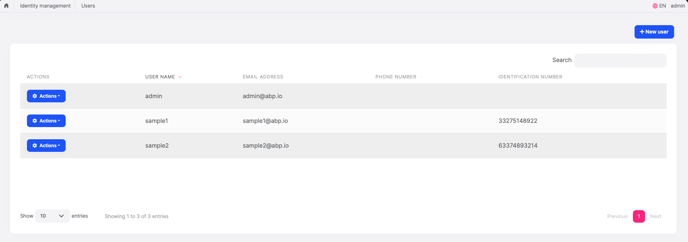

## Introduction
In this article, I will talk about the relationships of IdentityServer in every web application you create using ABP framework. When you read this article, you will learn how to extend the user entity in applications you develop using the ABP framework with a primitive type, extending the user by associating the user with another entity (User-many-to-one-X).


## Creating the Solution 
In this article we will use EF Core as the database and MVC as the user interface. But Angular will also work on Blazor Server and Blazor WebAssembly. Abp Framework offers starter templates to get started faster. We can create a new starter template using the Abp CLI:

```
abp new IdentityRelationship
```

After the download is complete, you can run the `IdentityRelationship.DbMigrator` project to create database migrations. You can then run the `IdentityRelationship.Web` project to see our application running.

> Default admin username is **admin** and password is **1q2w3E\***


## Module Entity Extensions

Module entity extension system is a high level extension system that allows you to define new properties for existing entities of the depended modules. It automatically adds properties to the entity, database, HTTP API and the user interface in a single point.

### Extending the User Entity With a Primitive Type

Open the `IdentityRelationshipModuleExtensionConfigurator` class inside the `Domain.Shared` project of your solution and change the `ConfigureExtraPropertiesmethod` as shown below to add a `IdentificationNumber property` to the `IdentityUser` entity of the [Identity Module](https://docs.abp.io/en/abp/latest/Modules/Identity).

```csharp
public static void ConfigureExtraProperties()
{
    OneTimeRunner.Run(() =>
    {
        ObjectExtensionManager.Instance.Modules()
            .ConfigureIdentity(identity =>
            {
                identity.ConfigureUser(user =>
                {
                    user.AddOrUpdateProperty<string>( //property type: string
                        "IdentificationNumber", //property name
                        property =>
                        {
                            //validation rules
                            property.Attributes.Add(new RequiredAttribute());
                            property.Attributes.Add(
                                new StringLengthAttribute(64) {
                                    MinimumLength = 4
                                }
                            );

                            //...other configurations for this property
                        }
                    );
                });
            });
    });
}
```
> This method is called inside the YourProjectNameDomainSharedModule at the beginning of the application. OneTimeRunner is a utility class that guarantees to execute this code only one time per application, since multiple calls are unnecessary.

If you want to localize, open the `IdentityRelationship.Domain.Shared` project and create a new localization in your `/Localization/IdentityRelationship/en.json` file.

```json
 "IdentificationNumber": "Identification Number"
 ```
Once you define a property, it appears in the create and update forms of the related entity:

 

 New properties also appear in the data table of the related page:

 


### Navigation Properties / Foreign Keys

It is supported to add an extension property to an entity that is Id of another entity (foreign key).


```csharp
ObjectExtensionManager.Instance.Modules()
    .ConfigureIdentity(identity =>
    {
        identity.ConfigureUser(user =>
        {
            user.AddOrUpdateProperty<Guid>(
                "DepartmentId",
                property =>
                {
                    property.UI.Lookup.Url = "/api/app/departments";
                    property.UI.Lookup.DisplayPropertyName = "name";
                }
            );
        });
    });
```

`UI.Lookup.Url` option takes a URL to get list of departments to select on edit/create forms. This endpoint can be a typical controller, an auto API controller or any type of endpoint that returns a proper JSON response.


