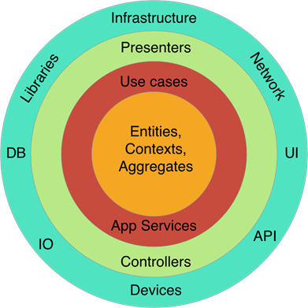

# Implementing Domain Driven Design

## Introduction

### Goals

This is an **integrative guide** for implementing the Domain Driven Design (DDD). The goals of this document are;

* **Introduce and explain** the DDD architecture, concepts, principles, patterns and building blocks.
* Explain the **layered architecture** & solution structure offered by the ABP Framework.
* Introduce **explicit rules** to implement DDD patterns and best practices by giving **concrete examples**.
* Show what **ABP Framework provides** you as the infrastructure for implementing DDD in a proper way.

### Simple Code!

> **Playing football** is very **simple**, but **playing simple football** is the **hardest thing** there is.
> &mdash; <cite>Johan Cruyff</cite>

If we take this famous quote for programming, we can say;

> **Writing code** is very **simple**, but **writing simple code** is the **hardest thing** there is.
> &mdash; <cite>???</cite>

In this document, we will introduce **simple rules** those are **easy to implement**.

Once your **application grows**, it will be **hard to follow** these rules. Sometimes you find **breaking rules** will save your time in a short term. However, the saved time in the short term will bring much **more time loss** in the middle and long term. Your code base becomes **complicated** and hard to maintain. Most of the business applications are **re-written** just because you **can't maintain** it anymore.

If you **follow the rules and best practices**, your code base will be simpler and easier to maintain. Your application **react to changes** faster.

## What is the Domain Driven Design?

Domain-driven design (DDD) is an approach to software development for **complex** needs by connecting the implementation to an **evolving** model;

DDD is suitable for **complex domains** and **large-scale** applications rather than simple CRUD applications. It focuses on the **core domain logic** rather than the infrastructure details. It helps to build a **flexible**, modular and **maintainable** code base.

### OOP & SOLID

Implementing DDD highly relies on the Object Oriented Programming (OOP) and [SOLID](https://en.wikipedia.org/wiki/SOLID) principles. Actually, it **implements** and **extends** these principles. So, a **good understanding** of OOP & SOLID helps you a lot while truly implementing the DDD.

### DDD Layers & Clean Architecture

There are four fundamental layers of a Domain Driven Based Solution;

**Business Logic** places into two layers, the *Domain layer* and the *Application Layer*, while they contains different kinds of business logic;

* **Domain Layer** implements the core, use-case independent business logic of the domain/system.
* **Application Layer** implements the use cases of the application based on the domain. A use case can be thought as a user interaction on the User Interface (UI).
* **Presentation Layer** contains the UI elements (pages, components) of the application.
* **Infrastructure Layer** supports other layer by implementing the abstractions and integrations to 3rd-party library and systems.

The same layering can be shown as the diagram below and known as the **Clean Architecture**, or sometimes the **Onion Architecture**:

In the Clean Architecture, each layer only **depends on the layer directly inside it**. The most independent layer is shown in the most inner circle and it is the Domain Layer.

### Core Building Blocks

DDD mostly focuses on the Domain & Application Layers and ignores the Presentation and Infrastructure. They are seen as *details* and the business layers should not depend on them.

This section introduces the essential building blocks of the Domain & Application Layers.

#### Domain Layer Building Blocks

* **Entity**: An [Entity](Entities.md) is an object with its own properties (state, data) and methods that implements the business logic that is executed on these properties. An entity is represented by its unique identifier (Id). Two entity object with different Ids are considered as different entities.
* **Value Object**: A [Value Object](Value-Objects.md) is another kind of domain object that is identified by its properties rather than a unique Id. That means two Value Objects with same properties are considered as the same object. Value objects are generally implemented as immutable and mostly are much simpler than the Entities.
* **Aggregate & Aggregate Root**: An [Aggregate](Entities.md) is a cluster of objects (entities and value objects) bound together by an **Aggregate Root** object. The Aggregate Root is a specific type of an entity with some additional responsibilities.
* **Repository**: A [Repository](Repositories.md) is a collection-like interface that is used by the Domain and Application Layers to access to the data persistence system (the database). It hides the complexity of the DBMS from the business code.

#### Application Layer Building Blocks