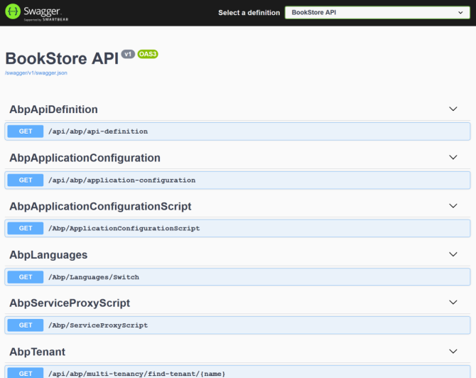
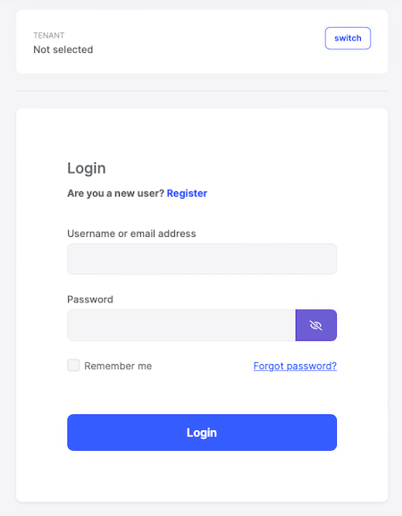

# Getting Started

````json
//[doc-params]
{
    "UI": ["MVC", "Blazor", "BlazorServer", "NG"],
    "DB": ["EF", "Mongo"]
}
````

> This document assumes that you prefer to use **{{ UI_Value }}** as the UI framework and **{{ DB_Value }}** as the database provider. For other options, please change the preference on top of this document.

## Create the Database

### Connection String

Check the **connection string** in the `appsettings.json` file under the `YourProject` project.

{{ if DB == "EF" }}

````json
"ConnectionStrings": {
  "Default": "Server=(LocalDb)\MSSQLLocalDB;Database=BookStore;Trusted_Connection=True"
}
````

> **About the Connection Strings and Database Management Systems**
>
> The solution is configured to use **Entity Framework Core** with **MS SQL Server** by default. However, if you've selected another DBMS using the `-dbms` parameter on the ABP CLI `new` command (like `-dbms MySQL`), the connection string might be different for you.
>
> EF Core supports [various](https://docs.microsoft.com/en-us/ef/core/providers/) database providers and you can use any supported DBMS. See [the Entity Framework integration document](Entity-Framework-Core.md) to learn how to [switch to another DBMS](Entity-Framework-Core-Other-DBMS.md) if you need later.

{{ else if DB == "Mongo" }}

````json
"ConnectionStrings": {
  "Default": "mongodb://localhost:27017/BookStore"
}
````

The solution is configured to use **MongoDB** in your local computer, so you need to have a MongoDB server instance up and running or change the connection string to another MongoDB server.

{{ end }}

### Seed Initial Data

Before running the application, you need to create the database and seed the initial data. To do that, you can run the following command in the directory of your project (in the same folder of the `.csproj` file):

```bash
dotnet run --migrate-database
```


## Run the Application

{{if UI=="MVC" || UI=="BlazorServer"}}

Running the application is pretty straight-forward, you can run the application with any IDE that supports .NET or by running the `dotnet run` CLI command in the directory of your project: 

{{else if UI=="Blazor"}}

Running the application is pretty straight-forward, you just need to run the `TodoApp.Host` application with any IDE that supports .NET or by running the `dotnet run` CLI command in the directory of your project.

> **Note:** The `host` application hosts and serves the `blazor` application. Therefore, you should run the `host` application only.

After the application runs, open the application in your default browser.

{{else if UI=="NG"}}

The solution has two main applications:

* `TodoApp` (in the .NET solution) hosts the server-side HTTP API, so the Angular application can consume it. (server-side application)
* `angular` folder contains the Angular application. (client-side application)

Firstly, run the `TodoApp` project in your favorite IDE (or run the `dotnet run` CLI command on your project directory) to see the server-side HTTP API on [Swagger UI](https://swagger.io/tools/swagger-ui/).



You can explore and test your HTTP API with this UI. If it works, then we can run the Angular client application.

You can run the application using the following (or `yarn start`) command:

````bash
npm start
````

This command takes time, but eventually runs and opens the application in your default browser:

{{end}}

After running the project, the index page should be seen as below:


Enter **admin** as the username and **1q2w3E*** as the password to login to the application. The application is up and running. You can start developing your application based on this startup template.

