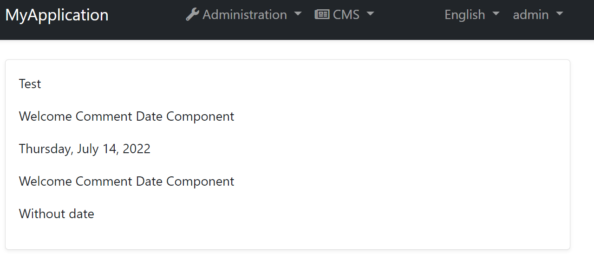

# Dynamic Widget

CMS kit provides a widget system to render dynamic [widgets](https://docs.abp.io/en/abp/latest/UI/AspNetCore/Widgets) in pages and blog posts. Its means, that in static content you can use dynamic content. We will mention how you can do it.

## Options 
To configure the widget, you should define the below code in YourModule.cs 

```csharp
Configure<CmsKitContentWidgetOptions>(options =>
    {
        options.AddWidget(widgetKey: "ExampleWidget", widgetName: "ExampleDate", editorWidgetName: "ExampleModalDate");
    }); 
```

Let's look at these parameters in detail
* `widgetKey` is used for end-user and more readable names. The following bold word represents widgetKey.
[Widget Type="**ExampleWidget**" IsShow="true"]
> This output is only an example. It changes according to your modal widget (`editorWidgetName`).

* `widgetName` is used for your widget name used in code for the name of the `ViewComponent`.
```csharp
[Widget]
[ViewComponent(Name = "ExampleDate")]
public class ExampleDateViewComponent : AbpViewComponent
{
    public IViewComponentResult Invoke(string isShow)
    {
        return View("YourRazorPage.cshtml", 
        new ExampleDateModel() { IsShow = bool.Parse(isShow) });
    }
} 
```
```html
<p>Welcome Comment Date Component</p>
@if (Model.IsShow)
{
    <p> @DateTime.Today.ToLongDateString()</p>
}
else
{
    <p>Without date</p>
}
```
* `editorWidgetName` is used the for editor component side to see on the `Add Widget` modal.
After choosing the widget type from listbox (now just defined `ExampleWidget`) and renders this widget automatically.

```csharp
[Widget]
[ViewComponent(Name = "ExampleModalDate")]
public class ExampleModalDateViewComponent : AbpViewComponent
{
    public IViewComponentResult Invoke()
    {
        return View("YourModalRazorPage.cshtml", 
        new ExampleModalDateViewModel() { IsShow = bool.Parse(isShow) });
    }
}
```
> Important Note: To get properties properly you should set the `name` property on the razor page or you may use the ABP component. ABP handles that automatically.

```html
 <abp-input asp-for="IsShow" />
```

Now ready to see the changes at the Page/Blogpost create/update pages. To the right of the editor, you will see the customized `W` button to add a dynamic widget like the below image. Don't forget please this is design mode and you need to view your page in view mode after saving. Also `Preview` tab on the editor will be ready to check your output easily for widget configurations in the next features.


In this image, after choosing your widget (on the other case, it changes automatically up to your configuration, mine is `Example Widget`. Its parameter name `editorWidgetName` and its value is `ExampleModalDate`) you will see the next widget. Enter input values or choose them and click `Add`. You will see the below output.

> [Widget Type="ExampleWidget" IsShow="true"]

You can edit this output manually if do any wrong coding for that (wrong value or typo) you won't see the widget (ex, the first two lines have wrong values in the editor and they aren't shown in view mode), even so, your page will be viewed successfully. 

After completing the above steps, you should see the above screenshot by going `Pages/Slug`
