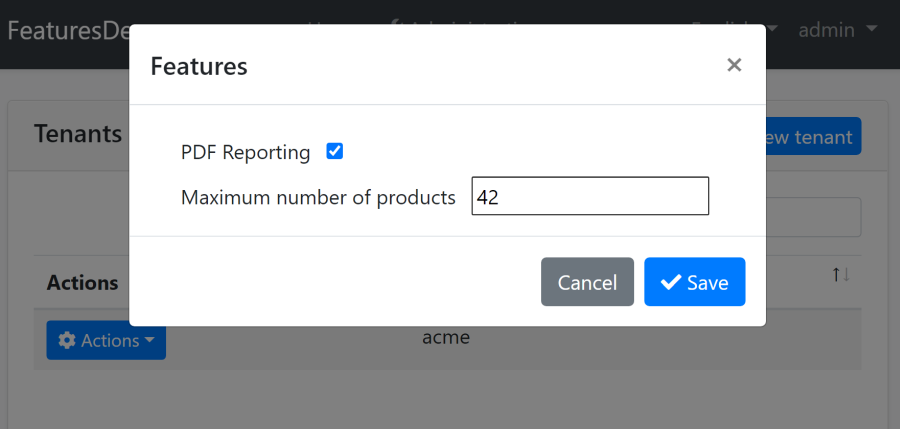

# Feature Management Module

The Feature Management module implements the `IFeatureManagementStore` interface defined by the [Feature System](../Features.md).

> This document covers only the feature management module which persists feature values to a database. See [the features](../Features.md) document for more about the feature system.

## How to Install

This module comes as pre-installed (as NuGet/NPM packages) when you [create a new solution](https://abp.io/get-started) with the ABP Framework. You can continue to use it as package and get updates easily, or you can include its source code into your solution (see `get-source` [CLI](../CLI.md) command) to develop your custom module.

### The Source Code

The source code of this module can be accessed [here](https://github.com/abpframework/abp/tree/dev/modules/feature-management). The source code is licensed with [MIT](https://choosealicense.com/licenses/mit/), so you can freely use and customize it.

## User Interface

### Feature Management Dialog

Feature management module provides a reusable dialog to manage features related to an object. For example, the [Tenant Management Module](Tenant-Management.md) uses it to manage permissions of tenants in the Tenant Management page.


When you click *Actions* -> *Features* for a tenant, the feature management dialog is opened. An example screenshot from this dialog with two features defined:



In this dialog, you can enable, disable or set values for the features for a tenant.

## IFeatureManager

`IFeatureManager` is the main service provided by this module. It is used to read and change the setting values for the tenants in a multi-tenant application. `IFeatureManager` is typically used by the *Feature Management Dialog*. However, you can inject it if you need to set a feature value.

> If you just want to read feature values, use the `IFeatureChecker` as explained in the [Features document](../Features.md).

**Example: Get/set a feature's value for a tenant**

````csharp
using System;
using System.Threading.Tasks;
using Volo.Abp.DependencyInjection;
using Volo.Abp.FeatureManagement;

namespace Demo
{
    public class MyService : ITransientDependency
    {
        private readonly IFeatureManager _featureManager;

        public MyService(IFeatureManager featureManager)
        {
            _featureManager = featureManager;
        }

        public async Task SetFeatureDemoAsync(Guid tenantId, string value)
        {
            await _featureManager
                .SetForTenantAsync(tenantId, "Feature1", value);
            
            var currentValue = await _featureManager
                .GetOrNullForTenantAsync("Feature1", tenantId);
        }
    }
}
````

## Feature Management Providers

Features Management Module is extensible, just like the [features system](../Features.md).  You can extend it by defining feature management providers. There are 3 pre-built feature management providers registered it the following order:

* `DefaultValueFeatureManagementProvider`: Gets the value from the default value of the feature definition. It can not set the default value since default values are hard-coded on the feature definition.
* `EditionFeatureManagementProvider`: Gets or sets the feature values for an edition. Edition is a group of features assigned to tenants. Edition system has not implemented by the Tenant Management module. You can implement it yourself or purchase the ABP Commercial [SaaS Module](https://commercial.abp.io/modules/Volo.Saas) which implements it and also provides more SaaS features, like subscription and payment.
* `TenantFeatureManagementProvider`: Gets or sets the features values for tenants.

`IFeatureManager` uses these providers on get/set methods. Typically, every feature management provider defines extension methods on the `IFeatureManager` service (like `SetForTenantAsync` defined by the tenant feature management provider).

If you want to create your own provider, implement the `IFeatureManagementProvider` interface or inherit from the `FeatureManagementProvider` base class:

````csharp
public class CustomFeatureProvider : FeatureManagementProvider
{
    public override string Name => "Custom";

    public CustomFeatureProvider(IFeatureManagementStore store)
        : base(store)
    {
    }
}
````

`FeatureManagementProvider` base class makes the default implementation (using the `IFeatureManagementStore`) for you. You can override base methods as you need. Every provider must have a unique name, which is `Custom` in this example (keep it short since it is saved to database for each feature value record).

Once you create your provider class, you should register it using the `FeatureManagementOptions` [options class](../Options.md):

````csharp
Configure<FeatureManagementOptions>(options =>
{
    options.Providers.Add<CustomFeatureProvider>();
});
````

The order of the providers are important. Providers are executed in the reverse order. That means the `CustomSettingProvider` is executed first for this example. You can insert your provider in any order in the `Providers` list.

## See Also

* [Features](../Features.md)

