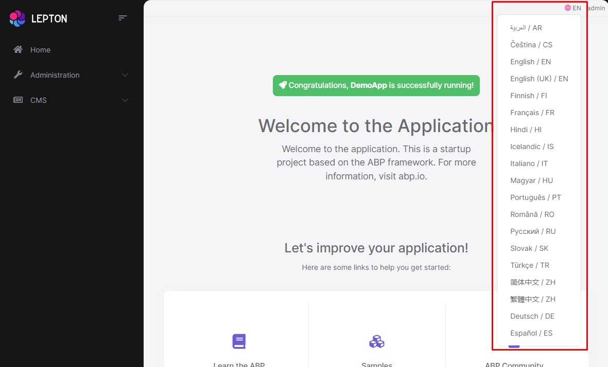
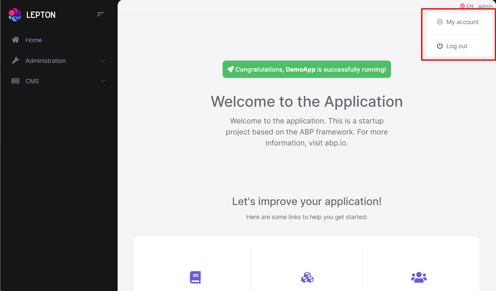
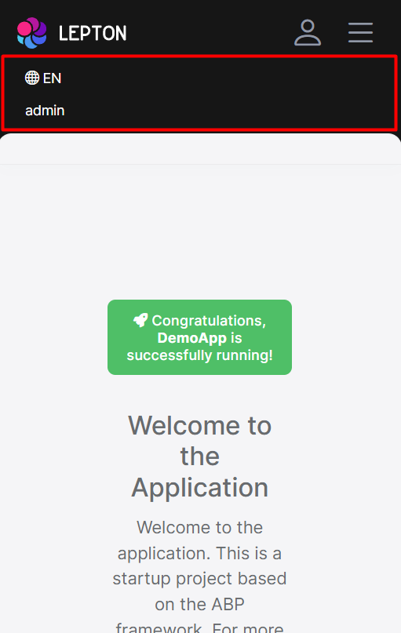

# LeptonX Lite Blazor UI

````json
//[doc-params]
{
    "UI": ["Blazor", "BlazorServer"]
}
````

LeptonX Lite has implementation for the ABP Framework Blazor WebAssembly & Blazor Server. It's a simplified variation of the [LeptonX Theme](https://x.leptontheme.com/).

>   If you are looking for a professional, enterprise ready theme, you can check the [LeptonX Theme](https://x.leptontheme.com/), which is a part of [ABP Commercial](https://commercial.abp.io/).

> See the [Theming document](https://docs.abp.io/en/abp/latest/UI/AspNetCore/Theming) to learn about themes.

## Installation

This theme is **already installed** when you create a new solution using the startup templates. If you are using any other template, you can install this theme by following the steps below:

{{if UI == "Blazor"}}
- Complete the [MVC Razor Pages Installation](AspNetCore.md#installation) for the **HttpApi.Host** application first. _If the solution is tiered/micro-service, complete the MVC steps for all MVC applications such as **HttpApi.Host** and if identity server is separated, install to the **OpenIddict**_.


- Add **Volo.Abp.AspNetCore.Components.WebAssembly.LeptonXLiteTheme** package to your **Blazor WebAssembly** application with the following command:

  ```bash
  dotnet add package Volo.Abp.AspNetCore.Components.WebAssembly.LeptonXLiteTheme --prerelease
  ```

- Remove **Volo.Abp.AspNetCore.Components.WebAssembly.BasicTheme** reference from the project since it's not necessary after switching to LeptonX Lite.

- Remove the old theme from the **DependsOn** attribute in your module class and add the **AbpAspNetCoreComponentsWebAssemblyLeptonXLiteThemeModule** type to the **DependsOn** attribute.

```diff
[DependsOn(
     // Remove BasicTheme module from DependsOn attribute
-    typeof(AbpAspNetCoreComponentsWebAssemblyBasicThemeModule),

    // Add LeptonX Lite module to DependsOn attribute
+    typeof(AbpAspNetCoreComponentsWebAssemblyLeptonXLiteThemeModule),
)]
```

- Change startup App component with the LeptonX one.

```csharp
// Make sure the 'App' comes from 'Volo.Abp.AspNetCore.Components.Web.LeptonXLiteTheme.Themes.LeptonXLite' namespace.
builder.RootComponents.Add<App>("#ApplicationContainer");
```

- Run the `abp bundle` command in your **Blazor** application folder.

{{end}}


{{if UI == "BlazorServer"}}

- Complete the [MVC Razor Pages Installation](AspNetCore.md#installation) first. _If the solution is tiered/micro-service, complete the MVC steps for all MVC applications such as **HttpApi.Host** and **AuthServer**_.

- Add **Volo.Abp.AspNetCore.Components.Server.LeptonXLiteTheme** package to your **Blazor server** application with the following command:

  ```bash
  dotnet add package Volo.Abp.AspNetCore.Components.Server.LeptonXLiteTheme --prerelease
  ```

- Remove **Volo.Abp.AspNetCore.Components.Server.BasicTheme** reference from the project since it's not necessary after switching to LeptonX Lite.


- Remove old theme from the **DependsOn** attribute in your module class and add the **AbpAspNetCoreComponentsServerLeptonXLiteThemeModule** type to the **DependsOn** attribute.

  ```diff
  [DependsOn(
      // Remove BasicTheme module from DependsOn attribute
  -    typeof(AbpAspNetCoreComponentsServerBasicThemeModule),

      // Add LeptonX Lite module to DependsOn attribute
  +    typeof(AbpAspNetCoreComponentsServerLeptonXLiteThemeModule)
  )]
  ```

- Replace `BlazorBasicThemeBundles` with `BlazorLeptonXLiteThemeBundles` in `AbpBundlingOptions`:
  ```diff
  options.StyleBundles.Configure(
    // Remove following line
  - BlazorBasicThemeBundles.Styles.Global,
    // Add following line instead
  + BlazorLeptonXLiteThemeBundles.Styles.Global,
    bundle =>
    {
        bundle.AddFiles("/blazor-global-styles.css");
        //You can remove the following line if you don't use Blazor CSS isolation for components
        bundle.AddFiles("/MyProjectName.Blazor.styles.css");
    });
  ```

- Update `_Host.cshtml` file. _(located under **Pages** folder by default.)_

  - Add following usings to Locate **App** and **BlazorLeptonXLiteThemeBundles** classes.
    ```csharp
    @using Volo.Abp.AspNetCore.Components.Web.LeptonXLiteTheme.Themes.LeptonXLite
    @using Volo.Abp.AspNetCore.Components.Server.LeptonXLiteTheme.Bundling
    ```
  - Then replace script & style bundles as following:
    ```diff
    // Remove following line
    - <abp-style-bundle name="@BlazorBasicThemeBundles.Styles.Global" />
    // Add following line instead
    + <abp-style-bundle name="@BlazorLeptonXLiteThemeBundles.Styles.Global" />
    ```

    ```diff
    // Remove following line
    - <abp-script-bundle name="@BlazorBasicThemeBundles.Scripts.Global" />
    // Add following line instead
    + <abp-script-bundle name="@BlazorLeptonXLiteThemeBundles.Scripts.Global" />
    ```

{{end}}


---

## Customization

### Layout

* Create a razor page, like `MyMainLayout.razor`, in your blazor application as shown below:

```html
@using Volo.Abp.AspNetCore.Components.Web.LeptonXLiteTheme.Themes.LeptonXLite;
@using Volo.Abp.DependencyInjection

@inherits MainLayout
@attribute [ExposeServices(typeof(MainLayout))]
@attribute [Dependency(ReplaceServices = true)]

@Name
``` 

* If you prefer to use a code-behind file for the C# code of your component, create a razor component, like `MyMainLayout.razor.cs`, in your blazor application as shown below:

```csharp	
[ExposeServices(typeof(MainLayout))]
[Dependency(ReplaceServices = true)
namespace LeptonXLite.DemoApp.Blazor.MyComponents
{
    public partial class MyMainLayout
    {
        public string Name = "My Main Layout";
    }
}
```	

> Don't forget to remove the repeated attributes from the razor page!

### Toolbars

LeptonX Lite includes separeted toolbars for desktop & mobile. You can manage toolbars independently. Toolbar names can be accessible in the **LeptonXLiteToolbars** class.

- `LeptonXLiteToolbars.Main`
- `LeptonXLiteToolbars.MainMobile`

```csharp
public async Task ConfigureToolbarAsync(IToolbarConfigurationContext context)
{
    if (context.Toolbar.Name == LeptonXLiteToolbars.Main)
    {
        context.Toolbar.Items.Add(new ToolbarItem(typeof(MyDesktopComponent)));
    }

    if (context.Toolbar.Name == LeptonXLiteToolbars.MainMobile)
    {
        context.Toolbar.Items.Add(new ToolbarItem(typeof(MyMobileComponent)));
    }

    return Task.CompletedTask;
}
```

{{if UI == "BlazorServer"}}

> _You can visit the [Toolbars Documentation](https://docs.abp.io/en/abp/latest/UI/Blazor/Toolbars) for better understanding._

{{end}}

## Components

LeptonX Blazor is built on the basis of components. You can use the components in your application as you wish, or you can customize the components by overriding them. If you want to override a component please follow the steps.

### Branding Component

The **branding component** is a simple component that can be used to display your brand. It contains a **logo** and a **company name**.


#### How to Override Branding Component

* Create a razor page, like `MyBrandingComponent.razor`, in your blazor application as shown below:

```html
@using Volo.Abp.AspNetCore.Components.Web.LeptonXLiteTheme.Themes.LeptonXLite;
@using Volo.Abp.DependencyInjection

@inherits Branding
@attribute [ExposeServices(typeof(Branding))]
@attribute [Dependency(ReplaceServices = true)]

@Name
``` 

* If you prefer to use a code-behind file for the C# code of your component, create a razor component, like `MyBrandingComponent.razor.cs`, in your blazor application as shown below:

```csharp	
namespace LeptonXLite.DemoApp.Blazor.MyComponents
{
    public partial class MyBrandingComponent
    {
        public string Name = "My Branding Component";
    }
}
```	

### How to override the favicon

Startup templates contain `favicon.ico` files under the `wwwroot` folder of the Blazor application. You can change this file to override the current favicon. 

### Breadcrumb Component

On websites that have a lot of pages, **breadcrumb navigation** can greatly **enhance the way users find their way** around. In terms of **usability**, breadcrumbs reduce the number of actions a website **visitor** needs to take in order to get to a **higher-level page**, and they **improve** the **findability** of **website sections** and **pages**.


#### How to Override the BreadCrumb Component

* Create a razor page, like `MyBreadcrumbsComponent.razor`, in your blazor application as shown below:

```html
@using Volo.Abp.AspNetCore.Components.Web.LeptonXLiteTheme.Themes.LeptonXLite;
@using Volo.Abp.DependencyInjection

@inherits Breadcrumbs
@attribute [ExposeServices(typeof(Breadcrumbs))]
@attribute [Dependency(ReplaceServices = true)]

@Name
``` 

* If you prefer to use a code-behind file for the C# code of your component, create a razor component, like `MyBreadcrumbsComponent.razor.cs`, in your blazor application as shown below:
* 
```csharp	
using Volo.Abp.AspNetCore.Components.Web.LeptonXLiteTheme.Themes.LeptonXLite;
using Volo.Abp.DependencyInjection;

namespace LeptonXLite.DemoApp.Blazor.MyComponents
{
    [ExposeServices(typeof(Breadcrumbs))]
    [Dependency(ReplaceServices = true)]
    public partial class MyBreadcrumbsComponent
    {
        public string Name = "My Breadcrumbs Component";
    }
}
```	

### Main Menu Component

Sidebar menus have been used as **a directory for Related Pages** for a **Service** offering, **Navigation** items for a **specific service** or topic and even just as **Links** the user may be interested in.


#### How to Override the Main Menu Component

* Create a razor page, like `MyMainMenuComponent.razor`, in your blazor application as shown below:

```html
@using Volo.Abp.AspNetCore.Components.Web.LeptonXLiteTheme.Themes.LeptonXLite.Navigation;
@using Volo.Abp.DependencyInjection

@inherits MainMenu
@attribute [ExposeServices(typeof(MainMenu))]
@attribute [Dependency(ReplaceServices = true)]

@Name
``` 

* If you prefer to use a code-behind file for the C# code of your component, create a razor component, like `MyMainMenu.razor.cs`, in your blazor application as shown below:

```csharp	
using Volo.Abp.AspNetCore.Components.Web.LeptonXLiteTheme.Themes.LeptonXLite.Navigation;
using Volo.Abp.DependencyInjection;

namespace LeptonXLite.DemoApp.Blazor.MyComponents
{
    [ExposeServices(typeof(MainMenu))]
    [Dependency(ReplaceServices = true)]
    public partial class MainMenu
    {
        public string Name = "My Main Menu Component";
    }
}
```	

> The **main menu** renders the menu items **dynamically**. The **menu item** is a **razor component** named `MainMenuItem.razor.cs` in the same namespace with **main menu** and you can **override it** like the main menu. 

### Toolbar Items Component

Toolbar items are used to add **extra functionality to the toolbar**. The toolbar is a **horizontal bar** that **contains** a group of **toolbar items**. 

#### How to Override the Toolbar Items Component

* Create a razor page, like `MyToolbarItemsComponent.razor`, in your blazor application as shown below:

```html
@using Volo.Abp.AspNetCore.Components.Web.LeptonXLiteTheme.Themes.LeptonXLite;
@using Volo.Abp.DependencyInjection

@inherits ToolbarItemsComponent
@attribute [ExposeServices(typeof(ToolbarItemsComponent))]
@attribute [Dependency(ReplaceServices = true)]

@Name
``` 

* If you prefer to use a code-behind file for the C# code of your component, create a razor component, like `MyToolbarItemsComponent.razor.cs`, in your blazor application as shown below:

```csharp	
using Volo.Abp.AspNetCore.Components.Web.LeptonXLiteTheme.Themes.LeptonXLite;
using Volo.Abp.DependencyInjection;

namespace LeptonXLite.DemoApp.Blazor.MyComponents
{
    [ExposeServices(typeof(ToolbarItemsComponent))]
    [Dependency(ReplaceServices = true)]
    public partial class MyToolbarItemsComponent
    {
        public string Name = "My Toolbar Items Component";
    }
}
```	

### Language Switch Component

Think about a **multi-lingual** website and the first thing that could **hit your mind** is **the language switch component**. A **navigation bar** is a **great place** to **embed a language switch**. By embedding the language switch in the navigation bar of your website, you would **make it simpler** for users to **find it** and **easily** switch the **language**  <u>**without trying to locate it across the website.**</u>



#### How to Override the Language Switch Component

* Create a razor page, like `MyLanguageSwitchComponent.razor`, in your blazor application as shown below:

```html
@using Volo.Abp.AspNetCore.Components.Web.LeptonXLiteTheme.Themes.LeptonXLite.Toolbar;
@using Volo.Abp.DependencyInjection

@inherits LanguageSwitchComponent
@attribute [ExposeServices(typeof(LanguageSwitchComponent))]
@attribute [Dependency(ReplaceServices = true)]

@Name
``` 

* If you prefer to use a code-behind file for the C# code of your component, create a razor component, like `MyLanguageSwitchComponent.razor.cs`, in your blazor application as shown below:

```csharp	
using Volo.Abp.AspNetCore.Components.Web.LeptonXLiteTheme.Themes.LeptonXLite.Toolbar;
using Volo.Abp.DependencyInjection;

namespace LeptonXLite.DemoApp.Blazor.MyComponents
{
    [ExposeServices(typeof(LanguageSwitchComponent))]
    [Dependency(ReplaceServices = true)]
    public partial class MyLanguageSwitchComponent
    {
        public string Name = "My Language Switch Component";
    }
}
```	

### Mobile Language Switch Component

The **mobile** **language switch component** is used to switch the language of the website **on mobile devices**. The mobile language switch component is a **dropdown menu** that **contains all the languages** of the website.


#### How to Override the Mobile Language Switch Component

* Create a razor page, like `MyMobilLanguageSwitchComponent.razor`, in your blazor application as shown below:

```html
@using Volo.Abp.AspNetCore.Components.Web.LeptonXLiteTheme.Themes.LeptonXLite.Toolbar;
@using Volo.Abp.DependencyInjection

@inherits MobilLanguageSwitchComponent
@attribute [ExposeServices(typeof(MobilLanguageSwitchComponent))]
@attribute [Dependency(ReplaceServices = true)]

@Name
``` 

* If you prefer to use a code-behind file for the C# code of your component, create a razor component, like `MyMobilLanguageSwitchComponent.razor.cs`, in your blazor application as shown below:

```csharp	
using Volo.Abp.AspNetCore.Components.Web.LeptonXLiteTheme.Themes.LeptonXLite.Toolbar;
using Volo.Abp.DependencyInjection;

namespace LeptonXLite.DemoApp.Blazor.MyComponents
{
    [ExposeServices(typeof(MobilLanguageSwitchComponent))]
    [Dependency(ReplaceServices = true)]
    public partial class MyMobilLanguageSwitchComponent
    {
        public string Name = "My Mobile Language Switch Component";
    }
}
```	

### User Menu Component

The **User Menu** is the **menu** that **drops down** when you **click your name** or **profile picture** in the **upper right corner** of your page (**in the toolbar**). It drops down options such as **Settings**, **Logout**, etc.



#### How to Override the User Menu Component

* Create a razor page, like `MyUserMenuComponent.razor`, in your blazor application as shown below:

```html
@using Volo.Abp.AspNetCore.Components.Server.LeptonXLiteTheme.Themes.LeptonXLite.Toolbar;
@using Volo.Abp.DependencyInjection

@inherits MobilLanguageSwitchComponent
@attribute [ExposeServices(typeof(MobilLanguageSwitchComponent))]
@attribute [Dependency(ReplaceServices = true)]

@Name
``` 

* If you prefer to use a code-behind file for the C# code of your component, create a razor component, like `MyUserMenuComponent.razor.cs`, in your blazor application as shown below:

```csharp	
using Volo.Abp.AspNetCore.Components.Server.LeptonXLiteTheme.Themes.LeptonXLite.Toolbar;
using Volo.Abp.DependencyInjection;

namespace LeptonXLite.DemoApp.Blazor.MyComponents
{
    [ExposeServices(typeof(UserMenuComponent))]
    [Dependency(ReplaceServices = true)]
    public partial class MyUserMenuComponent
    {
        public string Name = "My User Menu Component";
    }
}
```	

### Mobile User Menu Component

The **mobile user menu component** is used to display the **user menu on mobile devices**. The mobile user menu component is a **dropdown menu** that contains all the **options** of the **user menu**.



#### How to override the Mobile User Menu Component

* Create a razor page, like `MyMobileUserMenuComponent.razor`, in your blazor application as shown below:

```html
@using Volo.Abp.AspNetCore.Components.Server.LeptonXLiteTheme.Themes.LeptonXLite.Toolbar;
@using Volo.Abp.DependencyInjection

@inherits MobilUserMenuComponent
@attribute [ExposeServices(typeof(MobilUserMenuComponent))]
@attribute [Dependency(ReplaceServices = true)]

@Name
``` 

* If you prefer to use a code-behind file for the C# code of your component, create a razor component, like `MyMobileUserMenuComponent.razor.cs`, in your blazor application as shown below:

```csharp	
using Volo.Abp.AspNetCore.Components.Server.LeptonXLiteTheme.Themes.LeptonXLite.Toolbar;
using Volo.Abp.DependencyInjection;

namespace LeptonXLite.DemoApp.Blazor.MyComponents
{
    [ExposeServices(typeof(MobileUserMenuComponent))]
    [Dependency(ReplaceServices = true)]
    public partial class MyMobileUserMenuComponent
    {
        public string Name = "My Mobile User Menu Component";
    }
}
```	
