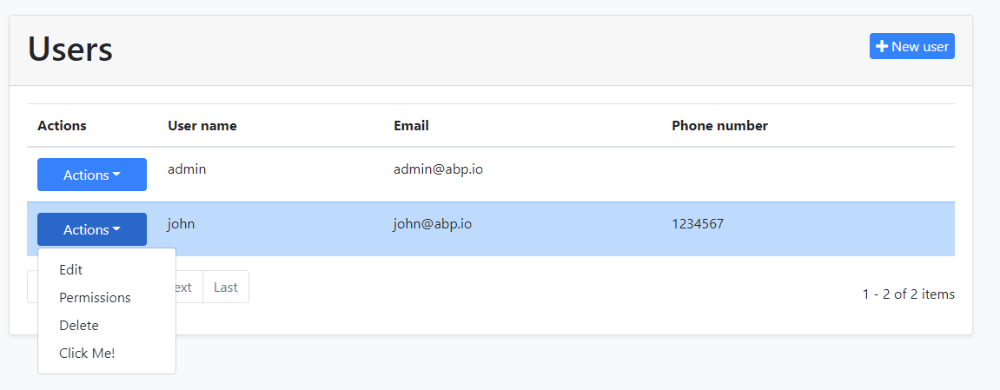

# Entity Action Extensions for Blazor UI

## Introduction

Entity action extension system allows you to add a **new action** to the action menu for an entity. A **Click Me** action was added to the *User Management* page below:



You can take any action (open a modal, make an HTTP API call, redirect to another page... etc) by writing your custom code. You can access to the current entity in your code.

## How to Set Up

In this example, we will add a "Click Me!" action and execute a C# code for the user management page of the [Identity Module](../../Modules/Identity.md).

### Create a C# File

First, add a new C# file to your solution. We added inside the `/Pages/Identity/` folder of the `.Blazor` project:


We will use the [component override system](Customization-Overriding-Components.md) in the Blazor. After creating a class inherits from the `UserManagement` component, we will override the `SetToolbarItemsAsync` method and add the entity action programmatically.

Here, the content of the overridden `SetToolbarItemsAsync` method.

```csharp
protected override async ValueTask SetToolbarItemsAsync()
{
    await base.SetToolbarItemsAsync();
    var clickMeAction = new EntityAction()
    {
        Text = "Click Me!",
        Clicked = (data) =>
        {
            //TODO: Write your custom code

            return Task.CompletedTask;
        }
    };
    
    EntityActions.Get<UserManagement>().Add(clickMeAction);
}
```

In the `Clicked` property, you can do anything you need.

Here, the entire content of the file. 
```csharp
using System.Threading.Tasks;
using Volo.Abp.AspNetCore.Components.Web.Extensibility.EntityActions;
using Volo.Abp.DependencyInjection;
using Volo.Abp.Identity.Blazor.Pages.Identity;

namespace MyCompanyName.MyProjectName.Blazor.Pages.Identity
{
    [ExposeServices(typeof(UserManagement))]
    [Dependency(ReplaceServices = true)]
    public class CustomizedUserManagement : UserManagement
    {
        protected override async ValueTask SetToolbarItemsAsync()
        {
            await base.SetToolbarItemsAsync();
            var clickMeAction = new EntityAction()
            {
                Text = "Click Me!",
                Clicked = (data) =>
                {
                    //TODO: Write your custom code

                    return Task.CompletedTask;
                }
            };
            EntityActions.Get<UserManagement>().Add(clickMeAction);
        }
    }
}
```

## Customizing Entity Actions

This section explains how to customize entity actions using the properties in the `EntityAction` type. 

Here, the list of the properties that you use in the `EntityAction`.
* `Text` : Entity action text.
* `Clicked` : Click event handler for the action. You can use the `data` parameter to access the selected item in the `DataGrid`.
* `Icon` : Icon for the action.
* `Color` : Color for the action.
* `Visible`: Visible function to determine the actions' visibility based on the data grid items individually. You can make the action invisible for some data grid items. You can also use the `data` parameter to access the selected item in the `DataGrid`.
* `Confirmation`: Confirmation message for the action. You can use the `data` parameter to access the selected item in the `DataGrid`.

#### Example

```csharp
var clickMeAction = new EntityAction()
{
    Text = "Click Me!",
    Clicked = (data) =>
    {
        //TODO: Write your custom code

        return Task.CompletedTask;
    },
    Color = Blazorise.Color.Danger,
    Icon = "fas fa-hand-point-right",
    ConfirmationMessage = (data) => "Are you sure you want to click to the action?",
    Visible = (data) =>
    {
        //TODO: Write your custom visibility action
        //var selectedUser = data.As<IdentityUserDto>();
    }
};
```
