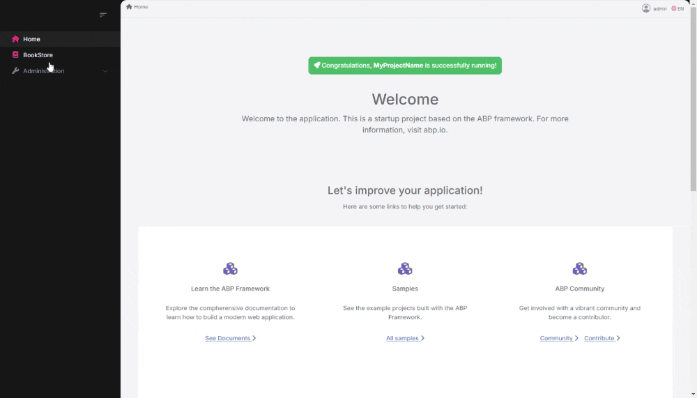

# Working with Lists

`ListService` is a utility service to provide easy pagination, sorting, and search implementation.


## Getting Started

`ListService` is **not provided in root**. The reason is, this way, it will clear any subscriptions on component destroy. You may use the optional `LIST_QUERY_DEBOUNCE_TIME` token to adjust the debounce behavior.

```js
import { ListService } from '@abp/ng.core';
import { BookDto } from '../models';
import { BookService } from '../services';

@Component({
  /* class metadata here */
  providers: [
    // [Required]
    ListService,

    // [Optional]
    // Provide this token if you want a different debounce time.
    // Default is 300. Cannot be 0. Any value below 100 is not recommended.
    { provide: LIST_QUERY_DEBOUNCE_TIME, useValue: 500 },
  ],
  template: `
    
  `,
})
class BookComponent {
  items: BookDto[] = [];
  count = 0;

  constructor(
    public readonly list: ListService,
    private bookService: BookService,
  ) {
    // change ListService defaults here
    this.list.maxResultCount = 20;
  }

  ngOnInit() {
    // A function that gets query and returns an observable
    const bookStreamCreator = query => this.bookService.getList(query);

    this.list.hookToQuery(bookStreamCreator).subscribe(
      response => {
        this.items = response.items;
        this.count = response.count;
        // If you use OnPush change detection strategy,
        // call detectChanges method of ChangeDetectorRef here.
      }
    ); // Subscription is auto-cleared on destroy.
  }
}
```

> Noticed `list` is `public` and `readonly`? That is because we will use `ListService` directly in the component's template. That may be considered as an anti-pattern, but it is much quicker to implement. You can always use public component members to expose the `ListService` instance instead.

Bind `ListService` to ngx-datatable like this:

```html
<ngx-datatable
  [rows]="items"
  [count]="count"
  [list]="list"
  default
>
  <!-- column templates here -->
</ngx-datatable>
```

## Extending query with custom variables

You can extend the query parameter of the `ListService`'s `hookToQuery` method.

Firstly, you should pass your own type to `ListService` as shown below:

```typescript
constructor(public readonly list: ListService<BooksSearchParamsDto>) { }
```

Then update the `bookStreamCreator` constant like following:

```typescript
const bookStreamCreator = (query) => this.bookService.getList({...query, name: 'name here'});
```

You can also create your params object.

Define a variable like this:

```typescript
booksSearchParams = {} as BooksSearchParamsDto;
```

Update the `bookStreamCreator` constant:

```typescript
const bookStreamCreator = (query) => this.bookService.getList({...query, ...this.booksSearchParams});
```

Then you can place inputs to the HTML:

```html
<div class="form-group">
  <input
    class="form control"
    placeholder="Name"
    (keyup.enter)="list.get()"
    [(ngModel)]="booksSearchParams.name"
  />
</div>
```

`ListService` emits the hookToQuery stream when you call the `this.list.get()` method.

## Usage with Observables

You may use observables in combination with [AsyncPipe](https://angular.io/guide/observables-in-angular#async-pipe) of Angular instead. Here are some possibilities:

```js
  book$ = this.list.hookToQuery(query => this.bookService.getListByInput(query));
```

```html
<!-- simplified representation of the template -->

<ngx-datatable
  [rows]="(book$ | async)?.items || []"
  [count]="(book$ | async)?.totalCount || 0"
  [list]="list"
  default
>
  <!-- column templates here -->
</ngx-datatable>

<!-- DO NOT WORRY, ONLY ONE REQUEST WILL BE MADE -->
```

## Handle request status
To handle the request status `ListService` provides a `requestStatus$` observable. This observable emits the current status of a request, which can be one of the following values: `idle`, `loading`, `success` or `error`. These statuses allow you to easily manage the UI flow based on the request's state.



```js
import { ListService } from '@abp/ng.core';
import { AsyncPipe } from '@angular/common';
import { Component, inject } from '@angular/core';
import { BookDto, BooksService } from './books.service';

@Component({
  standalone: true,
  selector: 'app-books',
  templateUrl: './books.component.html',
  providers: [ListService, BooksService],
  imports: [AsyncPipe],
})
export class BooksComponent {
  list = inject(ListService);
  booksService = inject(BooksService);

  items = new Array<BookDto>();
  count = 0;

  //It's an observable variable
  requestStatus$ = this.list.requestStatus$;

  ngOnInit(): void {
    this.list
      .hookToQuery(() => this.booksService.getList())
      .subscribe(response => {
        this.items = response.items;
        this.count = response.totalCount;
      });
  }
}
```

```html
<div class="card">
  <div class="card-header">
    @if (requestStatus$ | async; as status) {
      @switch (status) {
        @case ('loading') {
          <div style="height: 62px">
            <div class="spinner-border" role="status" id="loading">
              <span class="visually-hidden">Loading...</span>
            </div>
          </div>
        }
        @case ('error') {
          <h4>Error occured</h4>
        }
        @default {
          <h4>Books</h4>
        }
      }
    }
  </div>
  <table class="table">
    <thead>
      <tr>
        <th>Id</th>
        <th>Name</th>
      </tr>
    </thead>

    <tbody>
      @for (book of items; track book.id) {
        <tr>
          <td>{{ book.id }}</td>
          <td>{{ book.name }}</td>
        </tr>
      }
    </tbody>
  </table>
</div>
```

## How to Refresh Table on Create/Update/Delete

`ListService` exposes a `get` method to trigger a request with the current query. So, basically, whenever a create, update, or delete action resolves, you can call `this.list.get();` and it will call hooked stream creator again.

```js
  this.bookService.createByInput(form.value)
    .subscribe(() => {
      this.list.get();

      // Other subscription logic here
    });
```

## How to Implement Server-Side Search in a Table

`ListService` exposes a `filter` property that will trigger a request with the current query and the given search string. All you need to do is to bind it to an input element with two-way binding.

```html
<!-- simplified representation -->

<input type="text" name="search" [(ngModel)]="list.filter">
```
ABP doesn't have a built-in filtering mechanism. You need to implement it yourself and handle the `filter` property in the backend.
