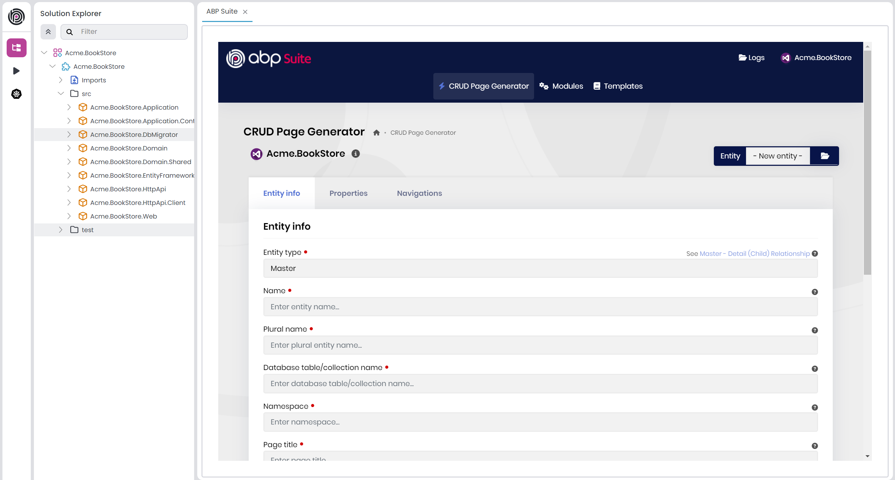
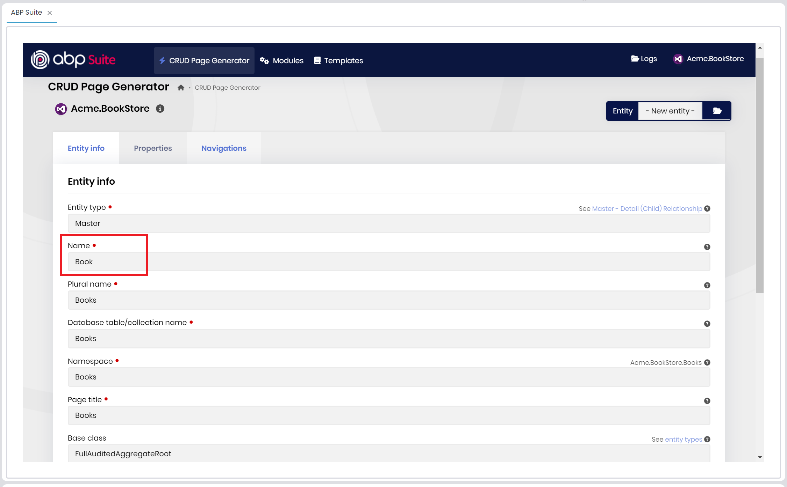
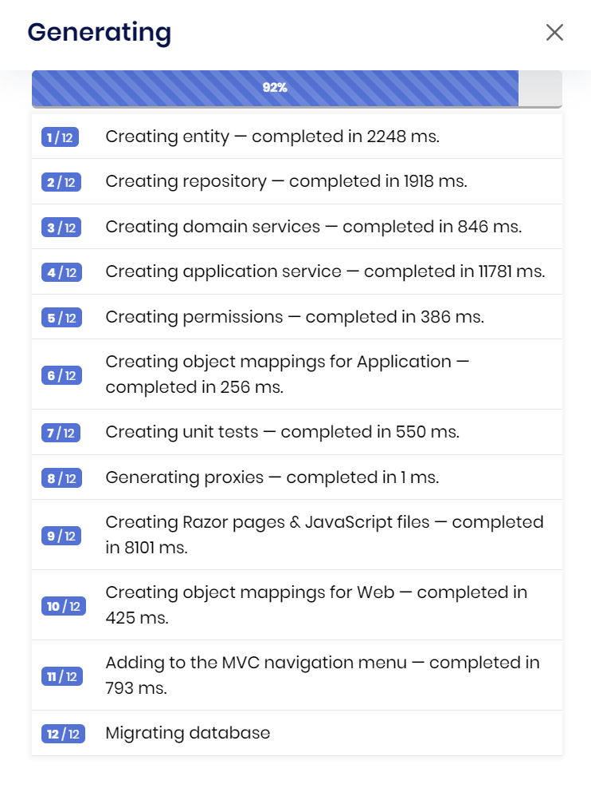

# Web Application Development (with ABP Suite) Tutorial - Part 2: Creating the Books
````json
//[doc-params]
{
    "UI": ["MVC"],
    "DB": ["EF"]
}
````
````json
//[doc-nav]
{
  "Previous": {
    "Name": "Creating the Solution",
    "Path": "tutorials/book-store-with-abp-suite/part-01"
  },
  "Next": {
    "Name": "Creating the Authors",
    "Path": "tutorials/book-store-with-abp-suite/part-03"
  }
}
````

In this part, you will create a new entity named `Book` and generate CRUD pages for the related entities with everything that you would normally implement manually (including application services, tests, CRUD pages, database relations and more...) via [ABP Suite](../../suite/index.md) with few clicks.

## Opening the ABP Suite

After creating our solution in the previous part, now we can open the ABP Suite and start generating CRUD pages. You can select the *ABP Suite -> Open* command on the main menu to open ABP Suite:


After clicking the related command, pre-integrated browser of ABP Studio should be opened, then we can start generating entities and all related codes with a few configurations:



## Creating the Book Entity

Let's create a `Book` entity with some properties. First, type `Book` for the *Name* field and leave the other options as is. ABP Suite automatically calculates proper values for the rest of the inputs for you:



ABP Suite sets:

* Entity type as **master** (ABP Suite allows you to establish [master-child relationship](../../suite/creating-master-detail-relationship.md)),
* Base class as **FullAuditedAggregateRoot** ([see other possible values](../../framework/architecture/domain-driven-design/entities.md)),
* Primary key type as **Guid**,
* Plural name, database name, namespace, page title, menu item and more...

Let's change the menu-item value as **book** to show a proper icon in the generated UI, and also enable **code customization**, **creating unit & integration tests**, and other options as you wish:


After, specifying the entity metadata, open the *Properties* tab and create the properties shown in the following figure:


Here the details:

* `Name` is **required**, it's a **string** property and maximum length is **128**.
* `Type` is an **enum** and the enum file path is *\Acme.BookStore.Domain.Shared\Books\BookType.cs* (we will create the file, in the next section).
* `PublishDate` is a **DateTime** property and **not nullable**.
* `Price` is a **float** property and **required**.

You can leave the other configurations as default.

> ABP Suite allows you to define properties with a great range of options, for example, you can specify the property type as *string*, *int*, *float*, *Guid*, *DateTime*, and even *File* (for file upload) and also you can set any options by building up your properties, such as specifying it as *required*, or *nullable*, setting *max-min length*, *default value* and more...

While defining the properties, we defined a *Type* property with the type of *enum*. ABP Suite asks for an enum path to read the enum file, and set the namespace, and enum name in the generated code. 

For that purpose, we should create a `BookType` enum in the `Acme.BookStore.Domain.Shared` project under the **Books** folder as follows:

```csharp
namespace Acme.BookStore.Books;

public enum BookType
{
    Undefined,
    Adventure,
    Biography,
    Dystopia,
    Fantastic,
    Horror,
    Science,
    ScienceFiction,
    Poetry
}
```

Then, you can specify the enum path for the `Type` property in ABP Suite like in the following figure:


After that, you can click the **Save and Generate** button to start the code generation process:



ABP Suite will generate the necessary code for you. It will take some time to complete the process. After the process is completed, you will see a success message, you can click the *Ok* button, and build & start the application by clicking the *Run -> Build & Start* button in the *Solution Runner* panel:


After the application is started, you can right-click and *Browse* on the application to open it in the ABP Studio's pre-integrated browser. You can see the Books page in the following figure with a single record:


## Summary

In this part, we've created a new entity named `Book` and generated the necessary code for it with [ABP Suite](../../suite/index.md) within a few clicks. ABP Suite generated the all code for us, including the **entity**, **application service**, **database relations**, **unit & integration tests**, **UI** and **defined the custom hooks for code customization**.