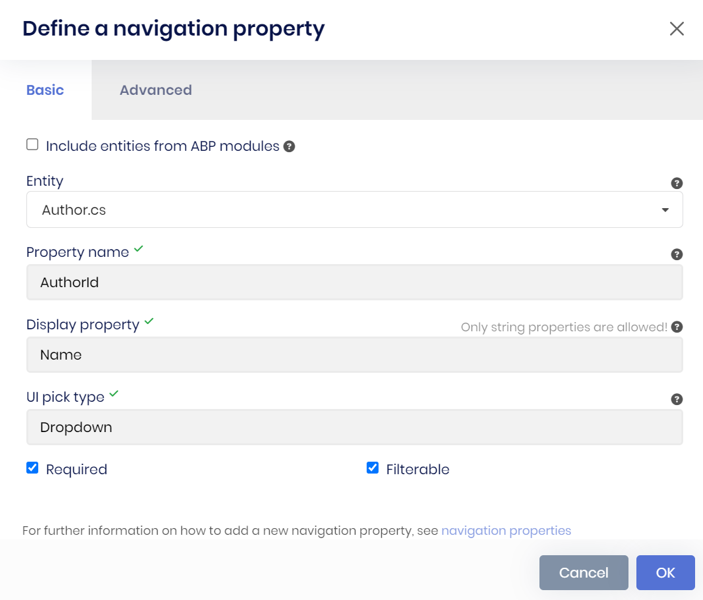
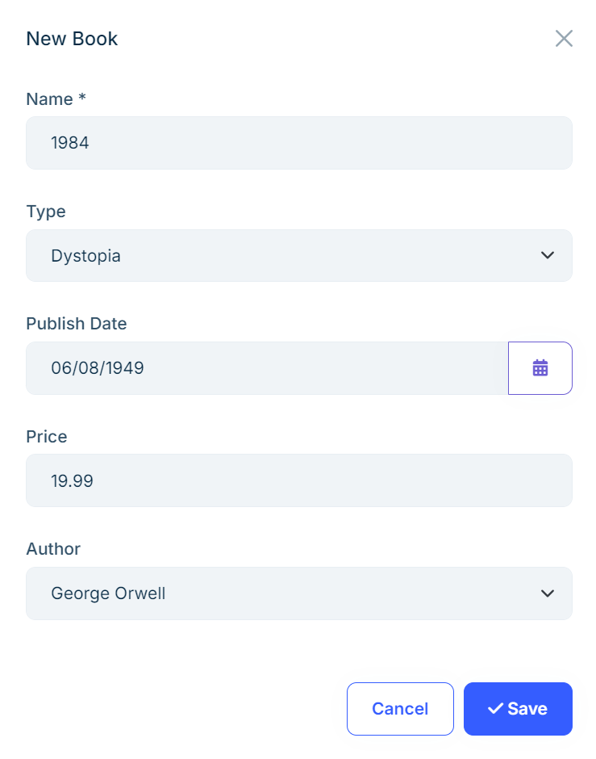

# Web Application Development (with ABP Suite) Tutorial - Part 4: Book to Author Relation
````json
//[doc-params]
{
    "UI": ["MVC"],
    "DB": ["EF"]
}
````
````json
//[doc-nav]
{
  "Previous": {
    "Name": "Creating the Author",
    "Path": "tutorials/book-store-with-abp-suite/part-03"
  },
  "Next": {
    "Name": "Customizing the Generated Code",
    "Path": "tutorials/book-store-with-abp-suite/part-05"
  }
}
````

In the previous parts, we have created the `Book` and `Author` entities (& generated code for all functionalities) for the book store application. However, currently there is no relation between these entities.

In this part, we will establish to **one-to-many relation** between the `Book` and `Author` entities.

## Establishing Relations with ABP Suite

ABP Suite allows establishing both **one-to-many** and [many-to-many](../../suite/creating-many-to-many-relationship.md) relationships. 

In this tutorial, we will only establish **one-to-many relation** between `Book` and `Author` entities. It's pretty straightforward to establish a relationship with ABP Suite. You should just need to navigate to the *Navigations* tab, and provide the metadata for navigation property (1-n) or navigation collection (n-n) relations.

## Creating Book to Author Relationship

> Please **stop the application** in ABP Studio's *Solution Runner* panel, because ABP Suite will make changes in the solution and it might need to build the solution in some steps and running the solution prevents to build it.

To establish **one-to-many relations** between *Book* and *Author* entities, select the `Book` entity from the entity selection box on the top-right of the *CRUD page generation* page:


Then, you can open the *Navigations* tab, and click the **Add navigation property (1-n)** button. After that, a navigation property model will be opened, and you can fill the inputs like in the following figure:



Here is the details:

* Selected the entity as `Author`. (ABP Suite will establish one-to-many relation between *Book* and *Author* entities with this configuration)
* Set the property name as *AuthorId*, it will be set as foreign-key restriction in the database and all related database configurations will be made by ABP Suite.
* Selected the display property as *Name*, this will be used in the dropdown component, to set an author with a book. 
* Also, made the relation **required** and also made it **filterable** so books can be filterable by authors.

After, specifying the metadata, you can click the *Ok* button to close the modal. Then, click the **Save and generate** button to start code generation process. ABP Suite will establish one-to-many relationship between the entities, and will generate all necessary code automatically:


It will take some time to complete the process. After the process is completed, you will see a success message, you can click the *Ok* button, and build & start the application by clicking the *Run -> Build & Start* button in the *Solution Runner* panel:


After the application is started, you can right-click and *Browse* on the application to open it in the ABP Studio's pre-integrated browser. You can first create an author and then create a book with the author:



Also, notice that, in the advanced filter section, there is an **Author** dropdown, which you can use to filter books by authors (remember we set **filterable** while defining navigation property and thanks to that, ABP Suite generated the code accordingly):


## Summary

So far, we have created the all functionality for the bookstore application without needing to write any single line of code. ABP Suite generated the entities, application services, UI components, unit & integration tests and more...

In the next part, we will write some code and modify the ABP Suite's generated code by writing the code in the specified hookpoints. Thanks to [ABP Suite's Customized Code Support](../../suite/customizing-the-generated-code.md), in the next generation, our custom code will not be overridden and will be preserved.