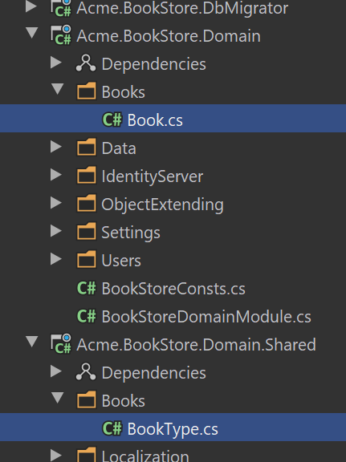
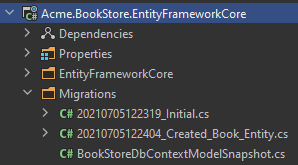
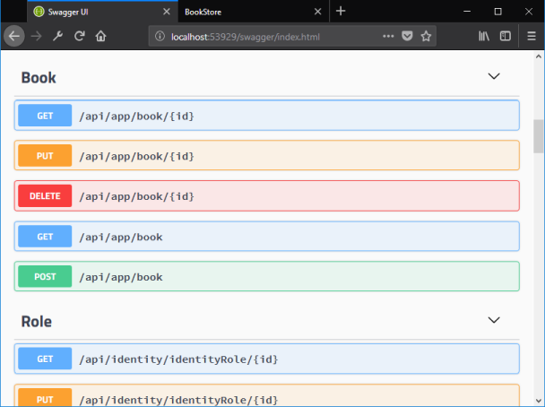

# Web Application Development Tutorial - Part 1: Creating the Server Side
````json
//[doc-params]
{
    "UI": ["MVC","Blazor","BlazorServer", "BlazorWebApp","NG"],
    "DB": ["EF","Mongo"]
}
````
````json
//[doc-nav]
{
  "Next": {
    "Name": "The Book List Page",
    "Path": "tutorials/book-store/part-02"
  }
}
````

## Creating the Solution

Before starting the development, create a new solution named `Acme.BookStore` and run it by following the [getting started tutorial](../../get-started/layered-web-application.md).

## After Creating the Solution

### Installing the Client-Side Packages

[ABP CLI](../../cli) runs the `abp install-libs` command behind the scenes to install the required NPM packages for your solution while creating the application. 

However, sometimes this command might need to be manually run. For example, you need to run this command, if you have cloned the application, or the resources from *node_modules* folder didn't copy to *wwwroot/libs* folder, or if you have added a new client-side package dependency to your solution.

For such cases, run the `abp install-libs` command on the root directory of your solution to install all required NPM packages:

```bash
abp install-libs
```

> We suggest you install [Yarn](https://classic.yarnpkg.com/) to prevent possible package inconsistencies, if you haven't installed it yet.

{{if UI=="Blazor" || UI=="BlazorWebApp"}}

### Bundling and Minification

`abp bundle` command offers bundling and minification support for client-side resources (JavaScript and CSS files) for Blazor projects. This command automatically run when you create a new solution with the [ABP CLI](../../cli).

However, sometimes you might need to run this command manually. To update script & style references without worrying about dependencies, ordering, etc. in a project, you can run this command in the directory of your `*.Blazor.Client` project:

```bash
abp bundle
```

> For more details about managing style and script references in Blazor or MAUI Blazor apps, see [Managing Global Scripts & Styles](../../framework/ui/blazor/global-scripts-styles.md).

{{end}}

## Create the Book Entity

**Domain layer** in the startup template is separated into two projects:

- `Acme.BookStore.Domain` contains your [entities](../../framework/architecture/domain-driven-design/entities.md), [domain services](../../framework/architecture/domain-driven-design) and other core domain objects.
- `Acme.BookStore.Domain.Shared` contains `constants`, `enums` or other domain related objects that can be shared with clients.

So, define your entities in the domain layer (`Acme.BookStore.Domain` project) of the solution. 

The main entity of the application is the `Book`. Create a `Books` folder (namespace) in the `Acme.BookStore.Domain` project and add a `Book` class inside it:

````csharp
using System;
using Volo.Abp.Domain.Entities.Auditing;

namespace Acme.BookStore.Books;

public class Book : AuditedAggregateRoot<Guid>
{
    public string Name { get; set; }

    public BookType Type { get; set; }

    public DateTime PublishDate { get; set; }

    public float Price { get; set; }
}
````

* ABP has two fundamental base classes for entities: `AggregateRoot` and `Entity`. **Aggregate Root** is a [Domain Driven Design](../../framework/architecture/domain-driven-design) concept which can be thought as a root entity that is directly queried and worked on (see the [entities document](../../framework/architecture/domain-driven-design/entities.md) for more).
* The `Book` entity inherits from the `AuditedAggregateRoot` which adds some base [auditing](../../framework/infrastructure/audit-logging.md) properties (like `CreationTime`, `CreatorId`, `LastModificationTime`...) on top of the `AggregateRoot` class. ABP automatically manages these properties for you.
* `Guid` is the **primary key type** of the `Book` entity.

> This tutorial leaves the entity properties with **public get/set** for the sake of simplicity. See the [entities document](../../framework/architecture/domain-driven-design/entities.md) if you want to learn more about DDD best practices.

### BookType Enum

The `Book` entity uses the `BookType` enum. Create a `Books` folder (namespace) in the `Acme.BookStore.Domain.Shared` project and add a `BookType` inside it:

````csharp
namespace Acme.BookStore.Books;

public enum BookType
{
    Undefined,
    Adventure,
    Biography,
    Dystopia,
    Fantastic,
    Horror,
    Science,
    ScienceFiction,
    Poetry
}
````

The final folder/file structure should be as shown below:



### Add the Book Entity to the DbContext

{{if DB == "EF"}}

EF Core requires that you relate the entities with your `DbContext`. The easiest way to do so is adding a `DbSet` property to the `BookStoreDbContext` class in the `Acme.BookStore.EntityFrameworkCore` project, as shown below:

````csharp
public class BookStoreDbContext : AbpDbContext<BookStoreDbContext>
{
    public DbSet<Book> Books { get; set; }
    //...
}
````

{{end}}

{{if DB == "Mongo"}}

Add a `IMongoCollection<Book> Books` property to the `BookStoreMongoDbContext` inside the `Acme.BookStore.MongoDB` project:

```csharp
public class BookStoreMongoDbContext : AbpMongoDbContext
{
    public IMongoCollection<Book> Books => Collection<Book>();
    //...
}
```

{{end}}

{{if DB == "EF"}}

### Map the Book Entity to a Database Table

Navigate to the `OnModelCreating` method in the `BookStoreDbContext` class and add the mapping code for the `Book` entity:

````csharp
using Acme.BookStore.Books;
...

namespace Acme.BookStore.EntityFrameworkCore;

public class BookStoreDbContext : 
    AbpDbContext<BookStoreDbContext>,
    IIdentityDbContext,
    ITenantManagementDbContext
{
    ...

    protected override void OnModelCreating(ModelBuilder builder)
    {
        base.OnModelCreating(builder);

        /* Include modules to your migration db context */

        builder.ConfigurePermissionManagement();
        ...

        /* Configure your own tables/entities inside here */

        builder.Entity<Book>(b =>
        {
            b.ToTable(BookStoreConsts.DbTablePrefix + "Books",
                BookStoreConsts.DbSchema);
            b.ConfigureByConvention(); //auto configure for the base class props
            b.Property(x => x.Name).IsRequired().HasMaxLength(128);
        });
    }
}
````

* `BookStoreConsts` has constant values for the schema and table prefixes for your tables. You don't have to use it, but it's suggested to control the table prefixes in a single point.
* The `ConfigureByConvention()` method gracefully configures/maps the inherited properties. Always use it for all your entities.

### Add Database Migration

The startup solution is configured to use [Entity Framework Core Code First Migrations](https://docs.microsoft.com/en-us/ef/core/managing-schemas/migrations/). Since we've changed the database mapping configuration, we should create a new migration and apply changes to the database.

Open a command-line terminal in the directory of the `Acme.BookStore.EntityFrameworkCore` project and type the following command:

```bash
dotnet ef migrations add Created_Book_Entity
```

This will add a new migration class to the project:



> If you are using Visual Studio, you may want to use the `Add-Migration Created_Book_Entity` and `Update-Database` commands in the *Package Manager Console (PMC)*. In this case, ensure that `Acme.BookStore.EntityFrameworkCore` is the startup project in Visual Studio and `Acme.BookStore.EntityFrameworkCore` is the *Default Project* in PMC.

{{end}}

### Add Sample Seed Data

> It's good to have some initial data in the database before running the application. This section introduces the [Data Seeding](../../framework/infrastructure/data-seeding.md) system of the ABP. You can skip this section if you don't want to create the data seeding, but it is suggested to follow along and learn this useful ABP feature.

Create a class that implements the `IDataSeedContributor` interface in the `*.Domain` project by copying the following code:

```csharp
using System;
using System.Threading.Tasks;
using Acme.BookStore.Books;
using Volo.Abp.Data;
using Volo.Abp.DependencyInjection;
using Volo.Abp.Domain.Repositories;

namespace Acme.BookStore;

public class BookStoreDataSeederContributor
    : IDataSeedContributor, ITransientDependency
{
    private readonly IRepository<Book, Guid> _bookRepository;

    public BookStoreDataSeederContributor(IRepository<Book, Guid> bookRepository)
    {
        _bookRepository = bookRepository;
    }

    public async Task SeedAsync(DataSeedContext context)
    {
        if (await _bookRepository.GetCountAsync() <= 0)
        {
            await _bookRepository.InsertAsync(
                new Book
                {
                    Name = "1984",
                    Type = BookType.Dystopia,
                    PublishDate = new DateTime(1949, 6, 8),
                    Price = 19.84f
                },
                autoSave: true
            );

            await _bookRepository.InsertAsync(
                new Book
                {
                    Name = "The Hitchhiker's Guide to the Galaxy",
                    Type = BookType.ScienceFiction,
                    PublishDate = new DateTime(1995, 9, 27),
                    Price = 42.0f
                },
                autoSave: true
            );
        }
    }
}
```

* This code simply uses the `IRepository<Book, Guid>` (the default [repository](../../framework/architecture/best-practices/repositories.md)) to insert two books to the database in case there weren't any books in it.

### Update the Database

Run the `Acme.BookStore.DbMigrator` application to update the database:


`.DbMigrator` is a console application that can be run to **migrate the database schema** and **seed the data** on **development** and **production** environments.

## Create the Application Service

The application layer is separated into two projects:

* `Acme.BookStore.Application.Contracts` contains your [DTO](../../framework/architecture/domain-driven-design/data-transfer-objects.md)s and [application service](../../framework/architecture/domain-driven-design/application-services.md) interfaces.
* `Acme.BookStore.Application` contains the implementations of your application services.

In this section, you will create an application service to get, create, update and delete books using the `CrudAppService` base class of the ABP.

### BookDto

`CrudAppService` base class requires to define the fundamental DTOs for the entity. Create a `Books` folder (namespace) in the `Acme.BookStore.Application.Contracts` project and add a `BookDto` class inside it:

````csharp
using System;
using Volo.Abp.Application.Dtos;

namespace Acme.BookStore.Books;

public class BookDto : AuditedEntityDto<Guid>
{
    public string Name { get; set; }

    public BookType Type { get; set; }

    public DateTime PublishDate { get; set; }

    public float Price { get; set; }
}
````

* **DTO** classes are used to **transfer data** between the *presentation layer* and the *application layer*. See the [Data Transfer Objects document](../../framework/architecture/domain-driven-design/data-transfer-objects.md) for more details.
* The `BookDto` is used to transfer the book data to the presentation layer in order to show the book information on the UI.
* The `BookDto` is derived from the `AuditedEntityDto<Guid>` which has audit properties just like the `Book` entity defined above.

It will be needed to map the `Book` entities to the `BookDto` objects while returning books to the presentation layer. [AutoMapper](https://automapper.org) library can automate this conversion when you define the proper mapping. The startup template comes with AutoMapper pre-configured. So, you can just define the mapping in the `BookStoreApplicationAutoMapperProfile` class in the `Acme.BookStore.Application` project:

````csharp
using Acme.BookStore.Books;
using AutoMapper;

namespace Acme.BookStore;

public class BookStoreApplicationAutoMapperProfile : Profile
{
    public BookStoreApplicationAutoMapperProfile()
    {
        CreateMap<Book, BookDto>();
    }
}
````

> See the [object to object mapping](../../framework/infrastructure/object-to-object-mapping.md) document for details.

### CreateUpdateBookDto

Create a `CreateUpdateBookDto` class in the `Books` folder (namespace) of the `Acme.BookStore.Application.Contracts` project:

````csharp
using System;
using System.ComponentModel.DataAnnotations;

namespace Acme.BookStore.Books;

public class CreateUpdateBookDto
{
    [Required]
    [StringLength(128)]
    public string Name { get; set; } = string.Empty;

    [Required]
    public BookType Type { get; set; } = BookType.Undefined;

    [Required]
    [DataType(DataType.Date)]
    public DateTime PublishDate { get; set; } = DateTime.Now;

    [Required]
    public float Price { get; set; }
}
````

* This `DTO` class is used to get a book information from the user interface while creating or updating the book.
* It defines data annotation attributes (like `[Required]`) to define validations for the properties. `DTO`s are [automatically validated](../../framework/fundamentals/validation.md) by the ABP.

As done to the `BookDto` above, we should define the mapping from the `CreateUpdateBookDto` object to the `Book` entity. The final class will be as shown below:

````csharp
using Acme.BookStore.Books;
using AutoMapper;

namespace Acme.BookStore;

public class BookStoreApplicationAutoMapperProfile : Profile
{
    public BookStoreApplicationAutoMapperProfile()
    {
        CreateMap<Book, BookDto>();
        CreateMap<CreateUpdateBookDto, Book>();
    }
}
````

### IBookAppService

Next step is to define an interface for the application service. Create an `IBookAppService` interface in the `Books` folder (namespace) of the `Acme.BookStore.Application.Contracts` project:

````csharp
using System;
using Volo.Abp.Application.Dtos;
using Volo.Abp.Application.Services;

namespace Acme.BookStore.Books;

public interface IBookAppService :
    ICrudAppService< //Defines CRUD methods
        BookDto, //Used to show books
        Guid, //Primary key of the book entity
        PagedAndSortedResultRequestDto, //Used for paging/sorting
        CreateUpdateBookDto> //Used to create/update a book
{

}
````

* Defining interfaces for the application services **are not required** by the framework. However, it's suggested as a best practice.
* `ICrudAppService` defines common **CRUD** methods: `GetAsync`, `GetListAsync`, `CreateAsync`, `UpdateAsync` and `DeleteAsync`. It's not required to extend it. Instead, you could inherit from the empty `IApplicationService` interface and define your own methods manually (which will be done for the authors in the next parts).
* There are some variations of the `ICrudAppService` where you can use separated DTOs for each method (like using different DTOs for create and update).

### BookAppService

It is time to implement the `IBookAppService` interface. Create a new class, named `BookAppService` in the `Books` namespace (folder) of the `Acme.BookStore.Application` project:

````csharp
using System;
using Volo.Abp.Application.Dtos;
using Volo.Abp.Application.Services;
using Volo.Abp.Domain.Repositories;

namespace Acme.BookStore.Books;

public class BookAppService :
    CrudAppService<
        Book, //The Book entity
        BookDto, //Used to show books
        Guid, //Primary key of the book entity
        PagedAndSortedResultRequestDto, //Used for paging/sorting
        CreateUpdateBookDto>, //Used to create/update a book
    IBookAppService //implement the IBookAppService
{
    public BookAppService(IRepository<Book, Guid> repository)
        : base(repository)
    {

    }
}
````

* `BookAppService` is derived from `CrudAppService<...>` which implements all the CRUD (create, read, update, delete) methods defined by the `ICrudAppService`.
* `BookAppService` injects `IRepository<Book, Guid>` which is the default repository for the `Book` entity. ABP automatically creates default repositories for each aggregate root (or entity). See the [repository document](../../framework/architecture/domain-driven-design/repositories.md).
* `BookAppService` uses `IObjectMapper` service ([see](../../framework/infrastructure/object-to-object-mapping.md)) to map the `Book` objects to the `BookDto` objects and `CreateUpdateBookDto` objects to the `Book` objects. The Startup template uses the [AutoMapper](http://automapper.org/) library as the object mapping provider. We have defined the mappings before, so it will work as expected.

## Auto API Controllers

In a typical ASP.NET Core application, you create **API Controllers** to expose the application services as **HTTP API** endpoints. This allows browsers or 3rd-party clients to call them over HTTP.

ABP can [**automagically**](../../framework/api-development/auto-controllers.md) configure your application services as MVC API Controllers by convention.

### Swagger UI

The startup template is configured to run the [Swagger UI](https://swagger.io/tools/swagger-ui/) using the [Swashbuckle.AspNetCore](https://github.com/domaindrivendev/Swashbuckle.AspNetCore) library. Run the application ({{if UI=="MVC"}}`Acme.BookStore.Web`{{else if UI=="BlazorServer" || UI=="BlazorWebApp" || UI=="BlazorServer"}}`Acme.BookStore.Blazor`{{else}}`Acme.BookStore.HttpApi.Host`{{end}}) by pressing `CTRL+F5` and navigate to `https://localhost:<port>/swagger/` on your browser. Replace `<port>` with your own port number.

You will see some built-in service endpoints as well as the `Book` service and its REST-style endpoints:



Swagger has a nice interface to test the APIs.

If you try to execute the `[GET] /api/app/book` API to get a list of books, the server returns such a JSON result:

````json
{
  "totalCount": 2,
  "items": [
    {
      "name": "The Hitchhiker's Guide to the Galaxy",
      "type": 7,
      "publishDate": "1995-09-27T00:00:00",
      "price": 42,
      "lastModificationTime": null,
      "lastModifierId": null,
      "creationTime": "2020-07-03T21:04:18.4607218",
      "creatorId": null,
      "id": "86100bb6-cbc1-25be-6643-39f62806969c"
    },
    {
      "name": "1984",
      "type": 3,
      "publishDate": "1949-06-08T00:00:00",
      "price": 19.84,
      "lastModificationTime": null,
      "lastModifierId": null,
      "creationTime": "2020-07-03T21:04:18.3174016",
      "creatorId": null,
      "id": "41055277-cce8-37d7-bb37-39f62806960b"
    }
  ]
}
````

That's pretty cool since we haven't written a single line of code to create the API controller, but now we have a fully working REST API!