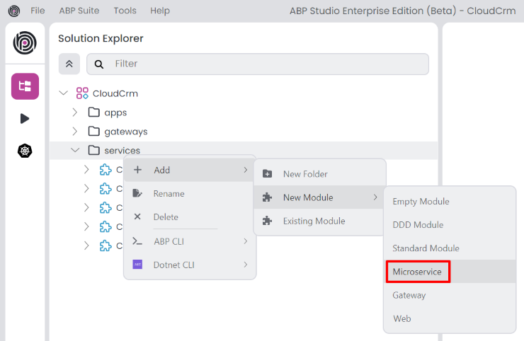

# Microservice Tutorial Part 02: Creating the initial Catalog Microservice

````json
//[doc-nav]
{
  "Previous": {
    "Name": "Creating the initial solution",
    "Path": "tutorials/microservice/part-01"
  },
  "Next": {
    "Name": "Building the Catalog service",
    "Path": "tutorials/microservice/part-03"
  }
}
````

In this tutorial, you will create a new Catalog service and integrate it to the solution.

## Creating the Service

Right-click the `services` folder in the *Solution Explorer* panel, select the *Add* -> *New Module* -> *Microservice* command:



This command opens a new dialog to define the properties of the new microservice. You can use the following values to create a new microservice named `Catalog`:


When you click the *Next* button, you are redirected to the database provider selection step.

### Selecting the Database Type

Here, you can select the database provider to be used by the new microservice:


Select *Entity Framework Core* option and proceed the *Next* step.

### Integrating to the Solution

In this step, we can select the options for integrating the new microservice to the rest of the solution components:


ABP Studio intelligently selects the right values for you, but you should still check them carefully since they directly affect what we will do in the next parts of this tutorial.

**Ensure the options are configured the same as in the preceding figure**, and click the *Create* button.

f