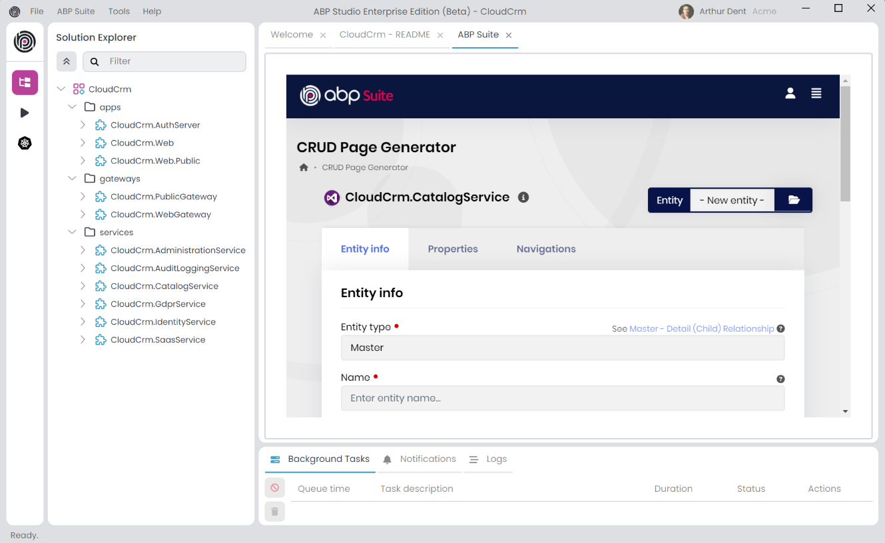

# Microservice Tutorial Part 03: Building the Catalog Microservice

````json
//[doc-nav]
{
  "Previous": {
    "Name": "Creating the initial Catalog Microservice",
    "Path": "tutorials/microservice/part-02"
  },
  "Next": {
    "Name": "Creating the initial Ordering Microservice",
    "Path": "tutorials/microservice/part-04"
  }
}
````

In the previous part, we've created a new microservice named Catalog. In this part, we will build functionality to create and manage products in our system.

In this part, we will use [ABP Suite](../../suite/index.md) to automatically create all the necessary code for us. So, you will see how to use ABP Suite in a microservice solution. We will do everything manually while we will create the Ordering microservice in next parts, so you will learn the details better. We suggest to use ABP Suite wherever it is possible, because it saves a lot of time. You can then investigate the changes done by ABP Suite to understand what it produced.

## Opening the ABP Suite

First of all, **stop all the applications** in ABP Studio's *Solution Runner* panel, because ABP Suite will make changes in the solution and it will also needs to build the solution in some steps. Running the solution prevents to build it.

Now, select the *ABP Suite* -> *Open* command on the main menu to open ABP Suite:


It will ask to you which module you want to use:


The `CloudCrm` microservice solution contains more than one .NET solution. Typically, each ABP Studio module represents a separate .NET solution (see the [concepts](../../studio/concepts.md) document). ABP Suite works on a single .NET solution to generate code, so we should select a module here.

Select the `CloudCrm.Catalog` module and click the *OK* button. It will open ABP Suite as shown below:



## Generating a Products Page

In the next section, we will use ABP Suite to create a fully functional CRUD page with ABP Suite. The UI part will be in the main web application (`CloudCrm.Web`) and the application service and others parts will be generated in the Catalog microservice.

### Configuring the Product Entity Information

Type `Product` for the *Name* field and leave the other options as is. ABP Suite will automatically calculate proper values for your:


### Configuring Properties of the Product Entity

Open the *Properties* tab and create the properties shown in the following figure:


Here the details:

* `Name` is required, minimum length is `2` and maximum length is `120`.
* `Description` is not required, it is a *Text area*, not *Filterable*, not *Shown on the list page*.
* `StockCount` has a *Default value* `0`, minimum value `0` and maximum value `999999`.
* `ReleaseDate` is *Nullable*.

You can leave the other configurations as default.

### Generating the Code

That's all. You can click the *Save and generate* button to start the code generation process.

TODO: I give a break in that point since we are waiting ABP Suite team to complete generating UI for microservices.

