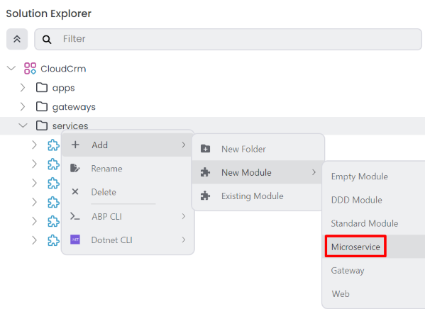
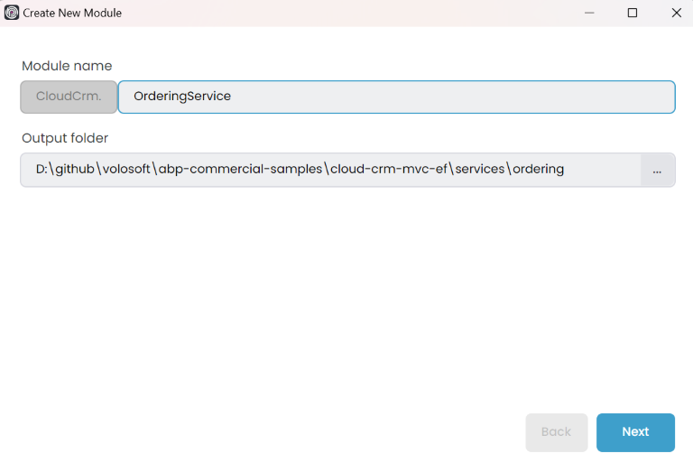
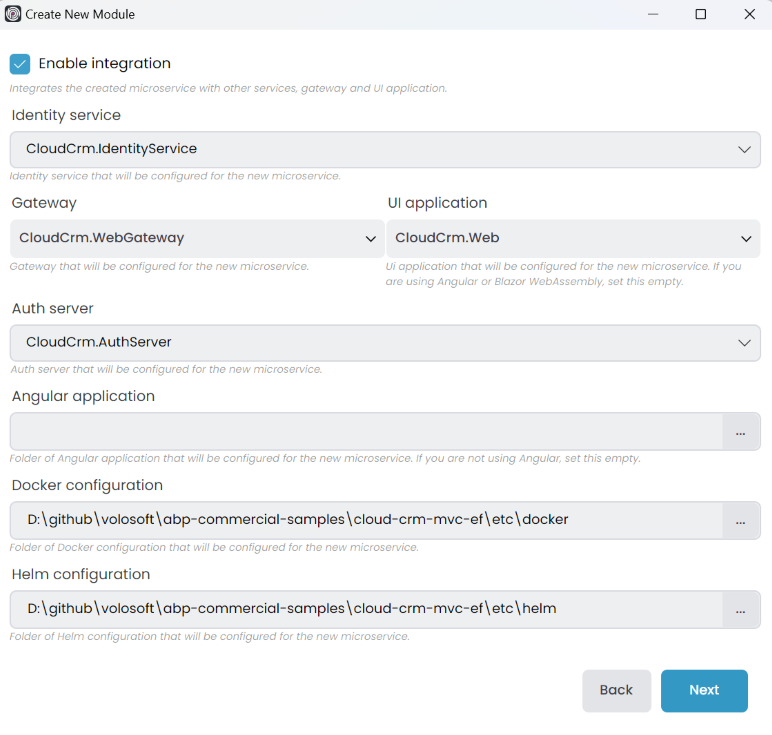
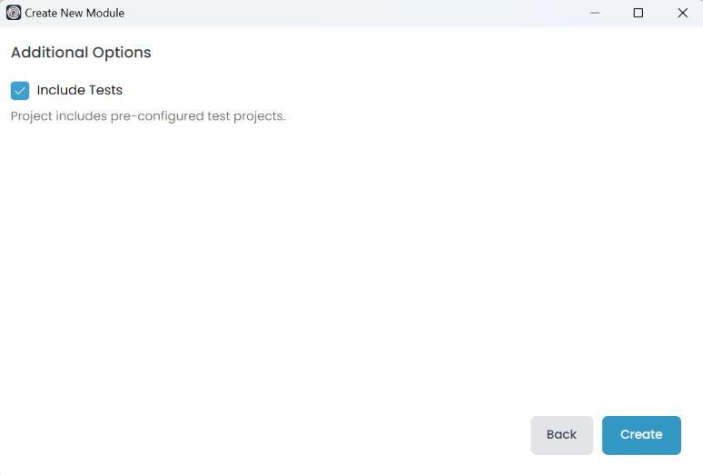

# Microservice Tutorial Part 04: Creating the initial Ordering Microservice

````json
//[doc-nav]
{
  "Previous": {
    "Name": "Building the Catalog Microservice",
    "Path": "tutorials/microservice/part-03"
  },
  "Next": {
    "Name": "Building the Ordering module",
    "Path": "tutorials/microservice/part-05"
  }
}
````

In the previous part, we implemented the Catalog microservice functionality using ABP Suite. In this part, we will create the Ordering microservice, and the following part will cover implementing its functionality manually.

## Creating the Ordering Microservice

Right-click the `services` folder in the *Solution Explorer* panel, select the *Add* -> *New Module* -> *Microservice* command:



This command opens a new dialog to define the properties of the new microservice. You can use the following values to create a new microservice named `OrderingService`:



When you click the *Next* button, you are redirected to the database provider selection step.

### Selecting the Database Type

Here, you can select the database provider to be used by the new microservice:


Select *Entity Framework Core* option and proceed the *Next* step.

### Integrating to the Solution

In this step, we can select the options for integrating the new microservice to the rest of the solution components:



ABP Studio intelligently selects the right values for you, but you should still check them carefully since they directly affect what we will do in the next parts of this tutorial.

**Ensure the options are configured the same as in the preceding figure**, and click the *Next* button.

### Additional Options



In this step, you can select additional options for the new microservice. You can leave them as default and click the *Create* button.

That's all, ABP Studio creates the new microservice and arranges all the integration and configuration for you.

## Exploring the New Ordering Microservice

In this section, we will investigate the new microservice in overall.
