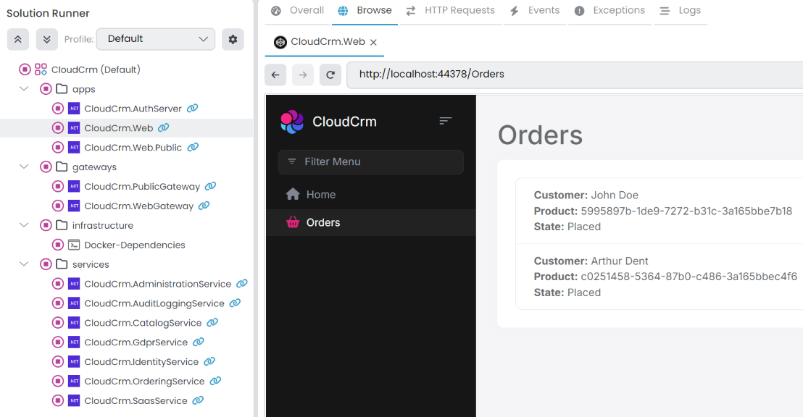

# Microservice Tutorial Part 06: Integrating the services: HTTP API Calls

````json
//[doc-nav]
{
  "Previous": {
    "Name": "Building the Ordering service",
    "Path": "tutorials/microservice/part-05"
  },
  "Next": {
    "Name": "Integrating the services: Using Distributed Events",
    "Path": "tutorials/microservice/part-07"
  }
}
````

In the previous part, we implemented the functionality of the Ordering microservice. However, when listing orders, we need to display the product name instead of the product ID. To achieve this, we must call the Catalog service to retrieve the product name for each order item. 

In this section, we will integrate the Ordering microservice with the Catalog service using HTTP API calls.

## The Need for the Integration Services

In a microservices architecture, each service is responsible for its own data and business logic. However, services often need to communicate with each other to fulfill their responsibilities. This communication can be synchronous or asynchronous, depending on the requirements.



In our case, the Ordering service needs to display the product name instead of the product ID. To achieve this, we need to call the Catalog service to retrieve the product details based on the product ID. This is a typical example of a synchronous communication pattern between microservices. As a solution to that problem, we will use an [integration service](../../framework/api-development/integration-services.md) that will handle the communication with the Catalog service. Integration service concept in ABP is designed for request/response style inter-module (in modular applications) and inter-microservice (in distributed systems) communication.

## Creating a Products Integration Service

First, we need to create a service that will handle the communication with the Catalog service. This service will be responsible for fetching the product details based on the product ID.

### Defining the `IProductIntegrationService` Interface

Open the `CloudCrm.CatalogService` .NET solution in your IDE. Locate the `CloudCrm.CatalogService.Contracts` project, and create a new folder named `Integration` within the `Services` folder. Inside this folder, add a new interface named `IProductIntegrationService` with the following code:

```csharp
using System;
using System.Collections.Generic;
using System.Threading.Tasks;
using CloudCrm.CatalogService.Products;
using Volo.Abp;
using Volo.Abp.Application.Services;

namespace CloudCrm.CatalogService.Services.Integration;

[IntegrationService]
public interface IProductIntegrationService : IApplicationService
{
    Task<List<ProductDto>> GetProductsByIdsAsync(List<Guid> ids);
}
```

`IProductIntegrationService` is very similar to a typical [application service](../../framework/architecture/domain-driven-design/application-services.md). The only difference is that it is marked with the `[IntegrationService]` attribute. This attribute is used to identify the service as an integration service, which allows ABP to handle the communication between services. ABP behave differently for them (for example, ABP doesn't expose [integration services](../../framework/api-development/integration-services.md) as HTTP APIs by default if you've configured the [Auto API Controllers](../../framework/api-development/auto-controllers.md) feature)