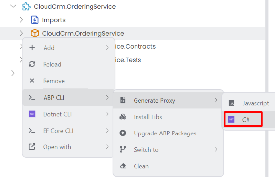

# Microservice Tutorial Part 06: Integrating the services: HTTP API Calls

````json
//[doc-nav]
{
  "Previous": {
    "Name": "Building the Ordering service",
    "Path": "tutorials/microservice/part-05"
  },
  "Next": {
    "Name": "Integrating the services: Using Distributed Events",
    "Path": "tutorials/microservice/part-07"
  }
}
````

In the previous part, we implemented the functionality of the Ordering microservice. However, when listing orders, we need to display the product name instead of the product ID. To achieve this, we must call the Catalog service to retrieve the product name for each order item. 

In this section, we will integrate the Ordering service with the Catalog service using HTTP API calls.

## The Need for the Integration Services

In a microservices architecture, each service is responsible for its own data and business logic. However, services often need to communicate with each other to fulfill their responsibilities. This communication can be synchronous or asynchronous, depending on the requirements.


In our case, the Ordering service needs to display the product name instead of the product ID. To achieve this, we need to call the Catalog service to retrieve the product details based on the product ID. This is a typical example of a synchronous communication pattern between microservices. As a solution to that problem, we will use an [integration service](../../framework/api-development/integration-services.md) that will handle the communication with the Catalog service. Integration service concept in ABP is designed for request/response style inter-module (in modular applications) and inter-microservice (in distributed systems) communication.

## Creating a Products Integration Service

First, we need to create a service that will handle the communication with the Catalog service. This service will be responsible for fetching the product details based on the product ID.

### Defining the `IProductIntegrationService` Interface

Open the `CloudCrm.CatalogService` .NET solution in your IDE. Locate the `CloudCrm.CatalogService.Contracts` project, and create a new folder named `IntegrationServices`. Inside this folder, add a new interface named `IProductIntegrationService` with the following code:

```csharp
using System;
using System.Collections.Generic;
using System.Threading.Tasks;
using CloudCrm.CatalogService.Products;
using Volo.Abp;
using Volo.Abp.Application.Services;

namespace CloudCrm.CatalogService.IntegrationServices;

[IntegrationService]
public interface IProductIntegrationService : IApplicationService
{
    Task<List<ProductDto>> GetProductsByIdsAsync(List<Guid> ids);
}
```

`IProductIntegrationService` is very similar to a typical [application service](../../framework/architecture/domain-driven-design/application-services.md). The only difference is that it is marked with the `[IntegrationService]` attribute. This attribute is used to identify the service as an integration service, which allows ABP to handle the communication between services. ABP behave differently for them (for example, ABP doesn't expose [integration services](../../framework/api-development/integration-services.md) as HTTP APIs by default if you've configured the [Auto API Controllers](../../framework/api-development/auto-controllers.md) feature)

`IProductIntegrationService` contains a single method named `GetProductsByIdsAsync`. This method takes a list of product IDs and returns a list of `ProductDto` objects. This is exactly what we need in the Ordering service.

> **Design Tip**
>
> You may think if we can use the existing application services (like `IProductAppService`) from other services instead of creating specific integration services. Technically you can use, ABP has no restriction. However, from good design and best practice points, we don't suggest it. Because, application services are designed to be consumed specifically by the presentation layer. They will have different authorization and validation logic, they will need different DTO input and output properties, they will have different performance, optimization and caching requirements, and so on. And most importantly, all these will change by the time based on UI requirements and these changes may break your integrations later. It is best to implement specific integration APIs that is designed and optimized for that purpose.
>
> We've reused the `ProductDto` object created for `IProductAppService`, which can be reasonable from a maintenance point of view. But if you think your integration service results will be different from the application service results in the future, it can be good to separate them from the first day so you don't need to introduce breaking changes later.

### Implementing the `ProductIntegrationService` Class

Now, let's implement the `IProductIntegrationService` interface. Create a new folder named `IntegrationServices` in the `CloudCrm.CatalogService` project. Inside this folder, add a new class named `ProductIntegrationService` with the following code:

```csharp
using System;
using System.Collections.Generic;
using System.Threading.Tasks;
using CloudCrm.CatalogService.Localization;
using CloudCrm.CatalogService.Products;
using Volo.Abp;
using Volo.Abp.Application.Services;
using Volo.Abp.Domain.Repositories;

namespace CloudCrm.CatalogService.IntegrationServices;

[IntegrationService]
public class ProductIntegrationService : ApplicationService, IProductIntegrationService
{
    private readonly IRepository<Product, Guid> _productRepository;

    public ProductIntegrationService(IRepository<Product, Guid> productRepository)
    {
        LocalizationResource = typeof(CatalogServiceResource);
        _productRepository = productRepository;
    }

    public async Task<List<ProductDto>> GetProductsByIdsAsync(List<Guid> ids)
    {
        var products = await _productRepository.GetListAsync(
            product => ids.Contains(product.Id)
        );

        return ObjectMapper.Map<List<Product>, List<ProductDto>>(products);
    }
}
```

`ProductIntegrationService` is a typical application service class that implements the `IProductIntegrationService` interface. It has a constructor that takes an `IRepository<Product, Guid>` object. This repository is used to fetch the product details from the database.

> Here, we directly used `List<T>` classes, but instead, you could wrap inputs and outputs into [DTOs](../../framework/architecture/domain-driven-design/data-transfer-objects.md). In that way, it can be possible to add new properties to these DTOs without changing the signature of your integration service method (and without introducing breaking changes for your client applications).

### Exposing the Integration Service as an API

Integration services are not exposed as HTTP APIs by default. However, you can expose them as HTTP APIs if you need to. To do this, you should configure the `AbpAspNetCoreMvcOptions` in the `ConfigureServices` method of the `CloudCrmCatalogServiceModule`. Open the `CloudCrm.CatalogService` project and locate the `CloudCrmCatalogServiceModule` class. Add the following code to the `ConfigureServices` method:

```csharp
public override void ConfigureServices(ServiceConfigurationContext context)
{
    // Other configurations...

    Configure<AbpAspNetCoreMvcOptions>(options =>
    {
        options.ExposeIntegrationServices = true;
    });
}
```

This code configures the `AbpAspNetCoreMvcOptions` to expose integration services as HTTP APIs. This is useful when you need to call the integration service from a different service using HTTP. You learn more about this in the [Integration Services](../../framework/api-development/integration-services.md#exposing-integration-services) document.

## Consuming the Products Integration Service

Now that we have created the `IProductIntegrationService` interface and the `ProductIntegrationService` class, we can consume this service from the Ordering service.

### Adding a Reference to the `CloudCrm.CatalogService.Contracts` Package

First, we need to add a reference to the `CloudCrm.CatalogService.Contracts` package in the Ordering service. Open the ABP Studio, and stop the application(s) if it is running. Then, open the *Solution Explorer* and right-click on the `CloudCrm.OrderingService` package. Select *Add* -> *Package Reference* command:


In the *Add Package Reference* window, select the `CloudCrm.CatalogService.Contracts` package from the *This solution* tab. Click the *OK* button to add the reference:


ABP Studio adds the package reference and arranges the [module](../../framework/architecture/modularity/basics.md) dependency.

> Instead of directly adding such a package reference, it can be best to import the module first (right-click the `CloudCrm.OrderingService`, select the _Import Module_ command and import the `CloudCrm.CatalogService` module), then install the package reference. In that way, it would be easy to see and keep track of inter-module dependencies.

### Using the Products Integration Service

Now, we can use the `IProductIntegrationService` interface to fetch the product details in the `OrderAppService` class.

Open the `OrderAppService` class (the `OrderAppService.cs` file under the `Services` folder of the `CloudCrm.OrderingService` project of the `CloudCrm.OrderingService` .NET solution) and change its content as like the following code block:

```csharp
using System;
using System.Collections.Generic;
using System.Linq;
using System.Threading.Tasks;
using CloudCrm.CatalogService.IntegrationServices;
using CloudCrm.OrderingService.Entities;
using CloudCrm.OrderingService.Enums;
using CloudCrm.OrderingService.Localization;
using Volo.Abp.Application.Services;
using Volo.Abp.Domain.Repositories;

namespace CloudCrm.OrderingService.Services;

public class OrderAppService : ApplicationService, IOrderAppService
{
    private readonly IRepository<Order> _orderRepository;
    private readonly IProductIntegrationService _productIntegrationService;

    public OrderAppService(
        IRepository<Order, Guid> orderRepository,
        IProductIntegrationService productIntegrationService)
    {
        LocalizationResource = typeof(OrderingServiceResource);

        _orderRepository = orderRepository;
        _productIntegrationService = productIntegrationService;
    }

    public async Task<List<OrderDto>> GetListAsync()
    {
        var orders = await _orderRepository.GetListAsync();

        // Prepare a list of products we need
        var productIds = orders.Select(o => o.ProductId).Distinct().ToList();
        var products = (await _productIntegrationService
                .GetProductsByIdsAsync(productIds))
            .ToDictionary(p => p.Id, p => p.Name);

        var orderDtos = ObjectMapper.Map<List<Order>, List<OrderDto>>(orders);

        orderDtos.ForEach(orderDto =>
        {
            orderDto.ProductName = products[orderDto.ProductId];
        });

        return orderDtos;
    }

    public async Task CreateAsync(OrderCreationDto input)
    {
        var order = new Order
        {
            CustomerName = input.CustomerName,
            ProductId = input.ProductId,
            State = OrderState.Placed
        };

        await _orderRepository.InsertAsync(order);
    }
}
```

Now open the `OrderDto` class (the `OrderDto.cs` file under the `Services` folder of the `CloudCrm.OrderingService.Contracts` project of the `CloudCrm.OrderingService` .NET solution) and add a new property named `ProductName`:

```csharp
using System;
using CloudCrm.OrderingService.Enums;

namespace CloudCrm.OrderingService.Services;

public class OrderDto
{
    public Guid Id { get; set; }
    public string CustomerName { get; set; }
    public Guid ProductId { get; set; }
    public string ProductName { get; set; } // New property
    public OrderState State { get; set; }
}
```

Lastly, open the `OrderingServiceApplicationAutoMapperProfile` class (the `OrderingServiceApplicationAutoMapperProfile.cs` file under the `ObjectMapping` folder of the `CloudCrm.OrderingService` project of the `CloudCrm.OrderingService` .NET solution) and ignore the `ProductName` property in the mapping configuration:

```csharp
using AutoMapper;
using CloudCrm.OrderingService.Entities;
using CloudCrm.OrderingService.Services;
using Volo.Abp.AutoMapper;

namespace CloudCrm.OrderingService.ObjectMapping;

public class OrderingServiceApplicationAutoMapperProfile : Profile
{
    public OrderingServiceApplicationAutoMapperProfile()
    {
        CreateMap<Order, OrderDto>()
            .Ignore(x => x.ProductName); // New line
    }
}
```
Let's explain the changes we made:

- We added a new property named `ProductName` to the `OrderDto` class. This property will hold the product name.
- We modified the `GetListAsync` method of the `OrderAppService` class to fetch the product details using the `IProductIntegrationService` interface. We first fetch the product IDs from the orders, then call the `GetProductsByIdsAsync` method of the `IProductIntegrationService` interface to fetch the product details. Finally, we map the product names to the `OrderDto` objects.

### Generating Proxy Classes for the Integration Service

We have created the `IProductIntegrationService` interface and the `ProductIntegrationService` class in the `CloudCrm.CatalogService` solution. Now, we need to generate the proxy classes for the integration service in the `CloudCrm.OrderingService` package. First, *Build & Start* the `CloudCrm.CatalogService` application in ABP Studio *Solution Runner*. Then, open the *Solution Explorer* and right-click on the `CloudCrm.OrderingService` package. Select the *ABP CLI* -> *Generate Proxy* -> *C#* command:



It opens the *Generate C# proxies* window. Select the `CloudCrm.CatalogService` application from the *Application* dropdown list. Then, choose the *catalog* module from the *Module* dropdown list and choose the *integration* service from the *Service type* dropdown list. Check the *Without contracts* checkbox and click the *Generate* button:


We have generated the proxy classes for the `IProductIntegrationService` interface. Now, we must add the *Remote Service* url to the `appsettings.json` file of the `CloudCrm.OrderingService` project. Open the `appsettings.json` file (the `appsettings.json` file of the `CloudCrm.OrderingService` project of the `CloudCrm.OrderingService` .NET solution) and add the *CatalogService* section following configuration:

```json
{
  "RemoteServices": {
    "CatalogService": {
      "BaseUrl": "http://localhost:44334"
    }
  }
}
```

> **BaseUrl** refers to the base URL of the Catalog service. You can use the *Copy Url* option from the Catalog service's context menu in the ABP Studio **Solution Runner** to paste it here.

### Updating the UI to Display the Product Name

Open the `Index.cshtml` file (the `Index.cshtml` file under the `Pages/Orders` folder of the `CloudCrm.Web` project of the `CloudCrm.Web` .NET solution) and update the table content to display the product name instead of the product ID:

```html
@page
@model CloudCrm.Web.Pages.Orders.Index

<h1>Orders</h1>

<abp-card>
    <abp-card-body>
        <abp-list-group>
            @foreach (var order in Model.Orders)
            {
                <abp-list-group-item>
                    <strong>Customer:</strong> @order.CustomerName <br />
                    <strong>Product:</strong> @order.ProductName <br />
                    <strong>State:</strong> @order.State
                </abp-list-group-item>
            }
        </abp-list-group>
    </abp-card-body>
</abp-card>
```

That's it! Now, you can *Build & Start* the all applications and run it in ABP Studio to see the result:


Now, the Ordering service displays the product name instead of the product ID. We have successfully integrated the Ordering service with the Catalog service using HTTP API calls.

> **Design Tip**
>
> It is suggested that you keep that type of communication to a minimum and not couple your services with each other. It can make your solution complicated and may also decrease your system performance. When you need to do it, think about performance and try to make some optimizations. For example, if the Ordering service frequently needs product data, you can use a kind of [cache layer](../../framework/fundamentals/caching.md), so it doesn't make frequent requests to the Catalog service.
