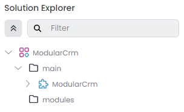
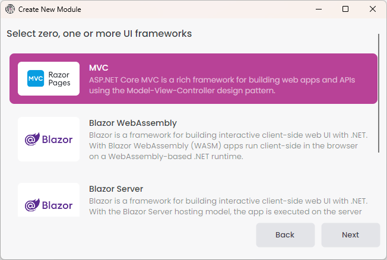

## Modular Monolith Application Development Tutorial

ABP provides a great infrastructure and tooling to build modular software solutions. In this tutorial, you will learn how to create application modules, compose and communicate them to build a monolith modular web application.

## Tutorial Outline

This tutorial is organized as the following parts:

* *TODO*

## Creating the Solution

Follow the [Get Stared](../../get-started/layered-web-application.md) guide to create a new layered web application with [ABP Studio](../../studio/index.md) the following configuration:

* **Solution name**: `ModularCrm`
* **UI Framework**: ASP.NET Core MVC / Razor Pages
* **Database Provider**: Entity Framework Core

You can select the other options based on your preference.

> **Please complete the [Get Stared](../../get-started/layered-web-application.md) guide and run the web application.**

The initial solution structure should be like the following in ABP Studio's *Solution Explorer*:

Initially, you see a `ModularCrm` solution and a `ModularCrm` module under that solution.

> An ABP Studio module is typically a .NET solution and an ABP Studio solution is an umbrella concept for multiple .NET Solutions (see the [concepts](../../studio/concepts.md) document for more).

`ModularCrm` module is your main application, which is a layered .NET solution that consists of several packages (.NET projects). You can expand the `ModularCrm` module to see its packages:

## Creating the Product Module

In this part, you will create a new module for product management and add it to the main application.

You can create folders and sub-folders in *Solution Explorer* to better organize your solution. Right-click to the solution root on the *Solution Explorer* panel, and select Add -> New Folder command:

That command opens a dialog where you can set the folder name:

Create `main` and `modules` folder using the *New Folder* command, then move the `ModularCrm` module into the `main` folder (simply by drag & drop). The *Solution Explorer* panel should look like below now:

Now, we can create a new module in our solution. Right-click the `modules` folder on the *Solution Explorer* panel, and select the *Add* -> *New Module* -> *DDD Module* command:

This command opens a new dialog to define properties of the new module. You can use the following values to create a new module named `ModularCrm.Products`:

When you click the *Next* button, you are redirected to the UI selection step. Here, you can select the UI type you want to support in your module:

A module;

* May not contain a UI part to leave the UI development to the final application.
* May contain a single UI implementation that is typically in the same technology with the main application.
* May contain more than one UI implementation if you want to create a reusable application module and you want to make that module usable by different applications with different UI technologies. For example, all of [pre-built ABP modules](https://abp.io/modules) support multiple UI options.

In this tutorial, we are selecting the MVC UI since we are building that module only for our `ModularCrm` solution and we are using the MVC UI in the main application. So, select the MVC UI and click the *Next* button.

The next step is to select the database provider (or providers) you want to support with your module:

Since our main application is using Entity Framework Core and we will use the `ModularCrm.Products` module only for that main application, we can select the *Entity Framework Core* option and click the *Create* button.

## Download the Source Code

*TODO*