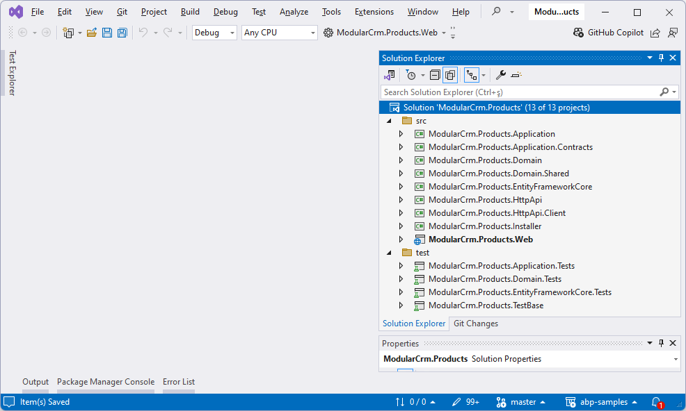

# Building the Products Module

````json
//[doc-nav]
{
  "Previous": {
    "Name": "Creating the initial products module",
    "Path": "tutorials/modular-crm/part-02"
  },
  "Next": {
    "Name": "TODO",
    "Path": "tutorials/modular-crm/part-04"
  }
}
````

In this part, you will learn how to create entities, services and a basic user interface for the products module.

> **This module's functionality will be minimal to focus on modularity.** You can follow the [Book Store tutorial](../book-store/index.md) to learn building more real-world applications with ABP.

If it is still running, please stop the web application before continuing with the tutorial.

## Creating a Product Entity

Open the `ModularCrm.Products` module in your favorite IDE. You can right-click the `ModularCrm.Products` module and select the *Open With* -> *Visual Studio* command to open the `ModularCrm.Products` module's .NET solution with Visual Studio. If you can not find your IDE in the *Open with* list, open with the *Explorer*, then open the `.sln` file with your IDE:


The `ModularCrm.Products` .NET solution should look like the following figure:



Add a new `Product` class under the `ModularCrm.Products.Domain` project (Right-click the `ModularCrm.Products.Domain` project, select *Add* -> *Class*):

````csharp
using System;
using Volo.Abp.Domain.Entities;

namespace ModularCrm.Products;

public class Product : AggregateRoot<Guid>
{
    public string Name { get; set; }
    public int StockCount { get; set; }
}
````

## Mapping Entity to Database

The next step is to configure Entity Framework Core `DbContext` class for the new entity.

### Add a DbSet Property

Open the `ProductsDbContext` in the `ModularCrm.Products.EntityFrameworkCore` project and add a new `DbSet` property for the `Product` entity. The final `Product.cs` file content should be the following:

````csharp
using Microsoft.EntityFrameworkCore;
using Volo.Abp.Data;
using Volo.Abp.EntityFrameworkCore;

namespace ModularCrm.Products.EntityFrameworkCore;

[ConnectionStringName(ProductsDbProperties.ConnectionStringName)]
public class ProductsDbContext : AbpDbContext<ProductsDbContext>, IProductsDbContext
{
    public DbSet<Product> Products { get; set; } //NEW: DBSET FOR THE PRODUCT ENTITY

    public ProductsDbContext(DbContextOptions<ProductsDbContext> options)
        : base(options)
    {

    }

    protected override void OnModelCreating(ModelBuilder builder)
    {
        base.OnModelCreating(builder);
        builder.ConfigureProducts();
    }
}
````

### Configure the Table Mapping

The DDD module template has designed flexible so that your module can have a separate physical database, or store its tables inside another database, like the main database of your application. To make that possible, it configures the database mapping in an extension method (`ConfigureProducts`) that is called inside the `OnModelCreating` method above. Find that extension method (in the `ProductsDbContextModelCreatingExtensions` class) and change its content as the following code block:

````csharp
using Microsoft.EntityFrameworkCore;
using Volo.Abp;
using Volo.Abp.EntityFrameworkCore.Modeling;

namespace ModularCrm.Products.EntityFrameworkCore;

public static class ProductsDbContextModelCreatingExtensions
{
    public static void ConfigureProducts(
        this ModelBuilder builder)
    {
        Check.NotNull(builder, nameof(builder));

        builder.Entity<Product>(b =>
        {
            //Configure table & schema name
            b.ToTable(ProductsDbProperties.DbTablePrefix + "Products",
                      ProductsDbProperties.DbSchema);

            //Always call this method to setup base entity properties
            b.ConfigureByConvention();

            //Properties of the entity
            b.Property(q => q.Name).IsRequired().HasMaxLength(100);
        });
    }
}
````

As first, we are setting the database table name with the `ToTable` method. `ProductsDbProperties.DbTablePrefix` defines a constant that is added as a prefix to all database table names of this module. If you see the `ProductsDbProperties` class, `DbTablePrefix` value is `Products`. In that case, the table name for the `Product` entity will be `ProductsProducts`. We think that is unnecessary for such a simple module and we can remove that prefix. So, you can change the `ProductsDbProperties` class with the following content to set an empty string to the `DbTablePrefix` property:

````csharp
namespace ModularCrm.Products;

public static class ProductsDbProperties
{
    public static string DbTablePrefix { get; set; } = "";
    public static string? DbSchema { get; set; } = null;
    public const string ConnectionStringName = "Products";
}
````

> When you use Entity Framework Core, it is typical to add a new database migration and update the database after changing your database configuration. However, by design, we are leaving the database migrations to the main application, so it can be flexible to select the DBMS (Database Management System) to use and share physical databases among different modules.

## Creating the Application Service

TODO