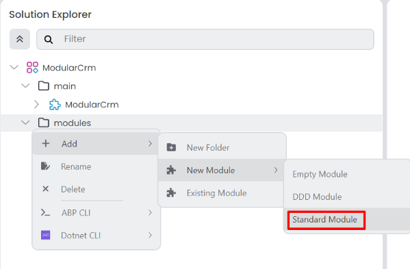
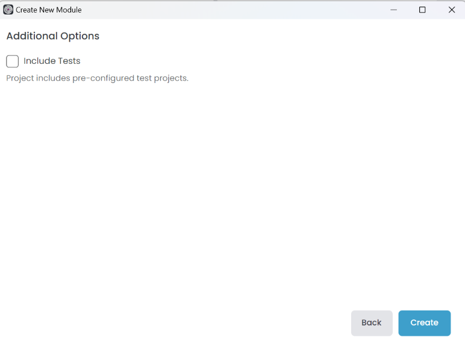
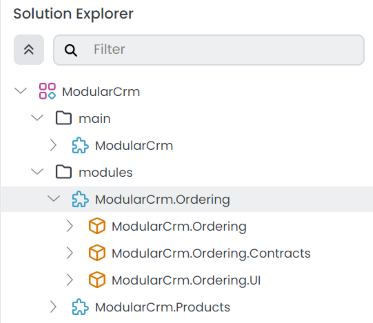
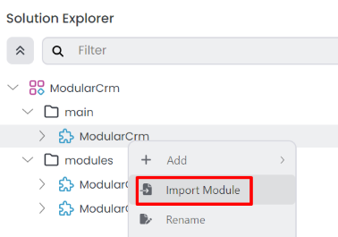
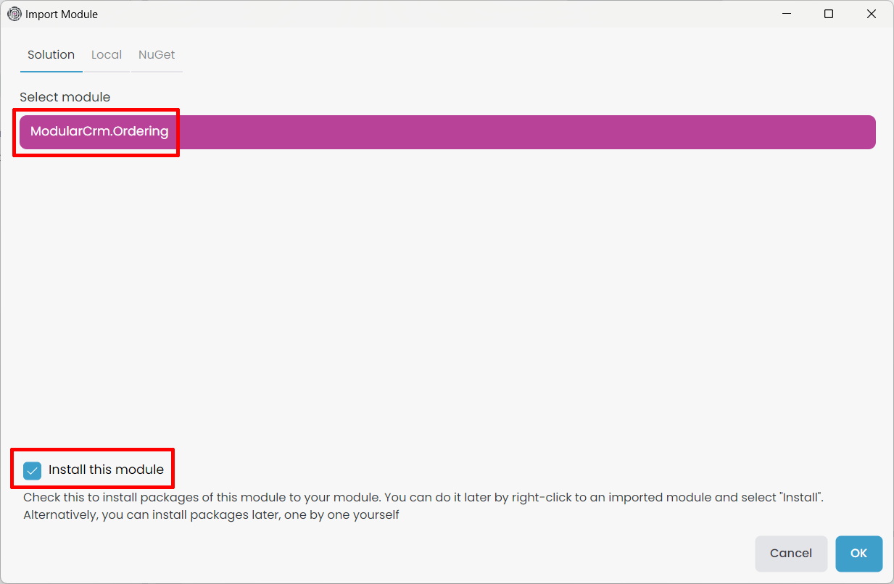
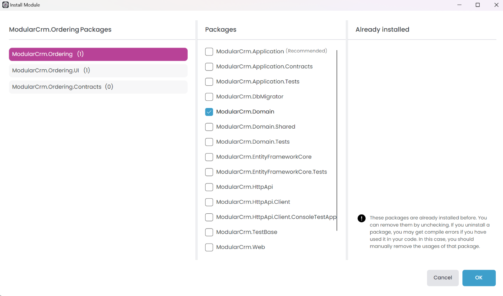

# Creating the Initial Ordering Module

````json
//[doc-nav]
{
  "Previous": {
    "Name": "Building the Products Module",
    "Path": "tutorials/modular-crm/part-03"
  },
  "Next": {
    "Name": "Building the Ordering module",
    "Path": "tutorials/modular-crm/part-05"
  }
}
````

In this part, you will build a new module for placing orders and install it in the main CRM application.

## Creating a Standard Module

In this part, we have used the *DDD Module* template for the Product module and will use the *Standard Module* template for the Ordering module.

Right-click the `modules` folder on the *Solution Explorer* panel, and select the *Add* -> *New Module* -> *Standard Module* command:



That command opens a dialog to define the properties of the new module:


Set `ModularCrm.Ordering` as the *Module name*, leave the *Output folder* as is and click the *Next* button.


Similar to DDD module creation, you can choose the type of UI you want to support in your module or select *No UI* if you don't need a user interface. In this example, we'll select the *MVC* option and click *Next*. One difference is that, for a standard module, you can only choose one UI type.


The same limitation applies to the database selection. You can only choose one database provider for a standard module. Select the *Entity Framework Core* option and click *Next*.



You can uncheck the *Include Tests* option to keep the module simple. Click the *Create* button to create the module.



Since we've created a standard module, it doesn't have multiple layers like the DDD module. If you open the `modules/modularcrm.ordering` in your file system, you can see the initial files:


Since only one UI package can be selected, the UI type doesn’t matter. This is why the package name is changed to *ModuleCrm.Ordering.UI*. Additionally, there are no *Domain*, *EntityFrameworkCore*, or *Http* layers like in the DDD module. We're going to use the `ModularCrm.Ordering` package for the domain business logic. You can open `ModularCrm.Ordering.sln` in your favorite IDE (e.g. Visual Studio):


## Creating the Module Packages

In this section, we will create packages under the Ordering module. The Products module was well layered based on Domain Driven Design principles. This time, we will keep things very simple and will only create two packages for the Ordering module:

* `ModularCrm.Ordering`: Contains all the module code without any layering. It will contain entities, database access code, services, controllers, UI pages and whatever we need to implement the *Ordering* module.
* `ModularCrm.Ordering.Contracts`: Contains the services and objects we want to share with other modules. `ModularCrm.Ordering` uses (and implements) this package.

> If your modules are relatively small and easy to maintain, they will only be used by your main application, and you don't care about layering, then you can create such simple module structures.

We will create and configure everything from scratch. You have already learned the easy way in the previous parts, where we created the Products module. It is time to deepen your understanding of the details and learn how ABP Studio allows you to set up custom structures. Let's begin.

### Creating the `ModularCrm.Ordering.Contracts` Package

Right-click the `ModularCrm.Ordering` module on the *Solution Explorer* and select the *Add* -> *Package* -> *New Package* command as shown in the following figure:


That command opens a new dialog to create a new package:


With that dialog, you can build your module or application layer by layer. There are templates for any package. However, here we will go with the simplest one: *ABP Class Library*. ABP Class Library is an empty C# class library with the [core ABP package](https://www.nuget.org/packages/Volo.Abp.Core) dependency and a [module class](../../framework/architecture/modularity/basics.md).

Type `ModularCrm.Ordering.Contracts` as the *Package name* and click the *Create* button. It will add the package under the `ModularCrm.Ordering` module:


### Creating the `ModularCrm.Ordering` Package

Right-click the `ModularCrm.Ordering` module on the *Solution Explorer* again and select the *Add* -> *Package* -> *New Package* command to create a second package:


This time, we select the MVC UI template and set the Package name to `ModularCrm.Ordering`. Then, click the Create button to add the new package.

### Add Package Reference

After the package has been added, right-click the `ModularCrm.Ordering` package and select the *Add Package Reference* command:


That command opens a dialog to select the package:


In that dialog, you can add package references from various sources. Here, we will add a reference for the package in the current module. So, select the `ModularCrm.Ordering.Contracts` package in the *This module* tab and click the *OK* button. You can see the package reference under the *Projects* dependencies on the *Solution Explorer* panel:


The initial module creation has been completed. Now, we have a new module with two packages. However, it is not related to other modules and applications in the solution yet.

## Installing into the Main Application

In this section, we will install the `ModularCrm.Ordering` module in the main application so it can be part of the system.

> Before the installation, please ensure the web application is not running.

Right-click the `ModularCrm` module (under the `main` folder) and select the *Import Module* command:



That command opens the *Import Module* dialog:



Select the `ModularCrm.Ordering` module and check the *Install this module* option as shown in the preceding figure. When you click the OK button, a new dialog is shown to select the packages to install:



Select the `ModuleCrm.Ordering` package in the left area and the `ModularCrm.Domain` package in the middle area, as shown in the preceding figure, and click the *OK* button.

> Since the Ordering module is not layered, we didn't install its packages to the layers of our main application. We are installing it only to `ModularCrm.Domain`. In this way, we can use the Ordering module from any layer of our application since `ModularCrm.Domain` is one of the core packages of our application. If you build your modules as non-layered and you don't have much code in the main application's .NET solution, you can also consider creating a non-layered main application that composes these modules.

In this part of the tutorial, we've created an empty module and added packages. This allows you to create modules or applications with a custom structure. In the next part, we will add functionality to the Ordering module.
