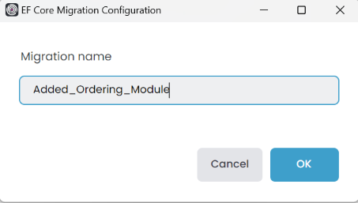
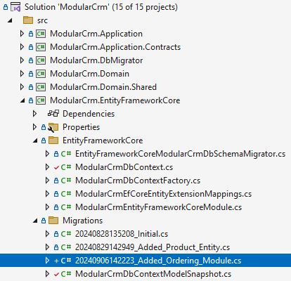
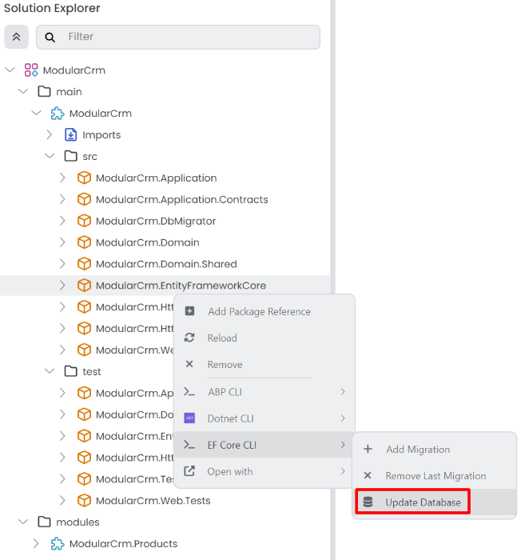
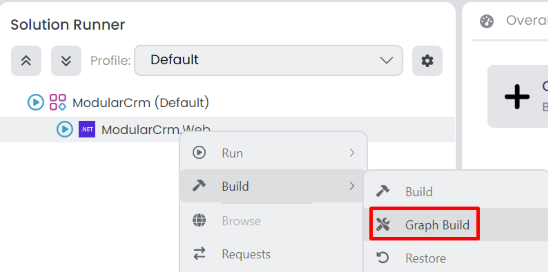

# Building the Ordering Module

````json
//[doc-nav]
{
  "Previous": {
    "Name": "Creating the Initial Ordering Module",
    "Path": "tutorials/modular-crm/part-04"
  },
  "Next": {
    "Name": "Integrating Modules",
    "Path": "tutorials/modular-crm/part-06"
  }
}
````

In the previous part, we've created a custom Ordering module and installed it into the main application. However, the Ordering module has no functionality now. In this part, we will create an `Order` entity and add functionality to create and list the orders.

## Creating an `Order` Entity

Open the `ModularCrm.Ordering` .NET solution in your IDE.

> Tip: You can open the folder of a module's .NET solution by right-clicking the related module in ABP Studio, selecting the *Open with* -> *Explorer* command.

The following figure shows the `ModularCrm.Ordering` module in the *Solution Explorer* panel of Visual Studio:


### Adding `Volo.Abp.Ddd.Domain` Package Reference

As you see in the preceding figure, the solution structure is very minimal. It also has a minimal ABP dependency. ABP Framework has [hundreds of NuGet packages](https://abp.io/packages), but the `ModularCrm.Ordering` project only has the [`Volo.Abp.AspNetCore.Mvc.UI.Theme.Shared`](https://abp.io/package-detail/Volo.Abp.AspNetCore.Mvc.UI.Theme.Shared) package reference:


We will create an [entity class](../../framework/architecture/domain-driven-design/entities.md) and ABP defines base entity classes and other related infrastructure in the [`Volo.Abp.Ddd.Domain`](https://abp.io/package-detail/Volo.Abp.Ddd.Domain) package. So, we need to add a reference to that NuGet package.

You can add that package and arrange the [module](../../framework/architecture/modularity/basics.md) class dependency manually. However, here we will use ABP Studio as a more practical way.

Return to ABP Studio, right-click the `ModularCrm.Ordering` package in the *Solution Explorer* and select the *Add Package Reference* command:


That command opens a dialog to add a new package reference:


Select the *NuGet* tab, type `Volo.Abp.Ddd.Domain` as the *Package name* and write the version of the package you want to install. Please be sure that you are installing exactly the same version with the other ABP packages you are already using. In future versions, ABP Studio will provide an easier way to select the package and its version.

Click the *OK* button and then you can check the *Packages* under the `ModularCrm.Ordering` module *Dependencies* to see the `Volo.Abp.Ddd.Domain` package is installed:


### Adding an `Order` Class

Now, you can return your IDE and add an `Order` class to the `ModularCrm.Ordering` project (open an `Entities` folder and place the `Order.cs` into that folder):

````csharp
using System;
using Volo.Abp.Domain.Entities;
using ModularCrm.Ordering.Contracts.Enums;

namespace ModularCrm.Ordering.Entities
{
    public class Order : AggregateRoot<Guid>
    {
        public Guid ProductId { get; set; }
        public string CustomerName { get; set; }
        public OrderState State { get; set; }
    }
}
````

We are allowing to place only a single product within an order. In a real-world application, the `Order` entity would be much more complex. However, the complexity of the `Order` entity doesn't effect modularity, so we keep it simple to focus on modularity in this tutorial.

### Adding an `OrderState` Enumeration

We used an `OrderState` enumeration that is not defined yet. Open an `Enums` folder in the `ModularCrm.Ordering.Contracts` project and create an `OrderState.cs` file inside it:

````csharp
namespace ModularCrm.Ordering.Contracts.Enums;

public enum OrderState : byte
{
    Placed = 0,
    Delivered = 1,
    Canceled = 2
}
````

Final structure of the Ordering module should be similar to the following figure in your IDE:


## Configuring the Database Mapping

The `Order` entity has been created. Now, we need to configure the database mapping for that entity. We will first install the Entity Framework Core package, define the database table mapping, create a database migration and update the database.

### Installing the Entity Framework Core Package

> In this section, we will install the [`Volo.Abp.EntityFrameworkCore`](https://abp.io/package-detail/Volo.Abp.EntityFrameworkCore) package to the Ordering module. That package is DBMS-independent and leaves the DBMS selection to the final application. If you want, you can install DBMS-specific package instead. For example, you can install the [`Volo.Abp.EntityFrameworkCore.SqlServer`](https://abp.io/package-detail/Volo.Abp.EntityFrameworkCore.SqlServer) package if you are using SQL server and want to make SQL Server specific configuration for your module's database.
> You can search for other packages on the [abp.io/packages](https://abp.io/packages) page.

Stop the web application if it is still running. Return to ABP Studio, right-click the `ModularCrm.Ordering` package on the *Solution Explorer* panel and select the *Add Package Reference* command:


Select the *NuGet* tab, type `Volo.Abp.EntityFrameworkCore` as the *Package name* and specify a *Version* that is compatible with the ABP version used by your solution:


Once you click the *OK* button, the NuGet package reference is added.

### Defining the Database Mappings

Entity Framework Core requires to define a `DbContext` class as the main object for the database mapping. We want to use the main application's `DbContext` object. In that way, we can control the database migrations in a single point, ensure database transactions on multi-module operations and establish relations between database tables of different modules. However, the Ordering module can not use the main application's `DbContext` object, because it doesn't depend on the main application and we don't want to establish such a dependency.

As a solution, we will define a `DbContext` interface in the Ordering module which is then implemented by the main module's `DbContext`.

Open your IDE, create a `Data` folder under the `ModularCrm.Ordering` project, and create an `IOrderingDbContext` interface under that folder:

````csharp
using Microsoft.EntityFrameworkCore;
using ModularCrm.Ordering.Entities;
using Volo.Abp.EntityFrameworkCore;

namespace ModularCrm.Ordering.Data
{
    public interface IOrderingDbContext : IEfCoreDbContext
    {
        DbSet<Order> Orders { get; set; }
    }
}
````

Now, we can inject and use the `IOrderingDbContext` in the Ordering module. Actually, we will not directly use that interface most of the time. Instead, we will use ABP's [repositories](../../framework/architecture/domain-driven-design/repositories.md).

It is best to configure the database table mapping for the `Order` entity in the Ordering module. We will create an extension method that will be called by the main application later. Create a class named `OrderingDbContextModelCreatingExtensions` in the same `Data` folder:

````csharp
using Microsoft.EntityFrameworkCore;
using ModularCrm.Ordering.Entities;
using Volo.Abp;
using Volo.Abp.EntityFrameworkCore.Modeling;

namespace ModularCrm.Ordering.Data
{
    public static class OrderingDbContextModelCreatingExtensions
    {
        public static void ConfigureOrdering(this ModelBuilder builder)
        {
            Check.NotNull(builder, nameof(builder));

            builder.Entity<Order>(b =>
            {
                //Configure table name
                b.ToTable("Orders");

                //Always call this method to setup base entity properties
                b.ConfigureByConvention();

                //Properties of the entity
                b.Property(q => q.CustomerName).IsRequired().HasMaxLength(120);
            });
        }
    }
}
````

#### Configuring the Main Application

Open the main application's solution in your IDE, find the `ModularCrmDbContext` class under the `ModularCrm.EntityFrameworkCore` project and follow the 3 steps below:

**(1)** Add the following attribute on top of the `ModularCrmDbContext` class:

````csharp
[ReplaceDbContext(typeof(IOrderingDbContext))]
````

`ReplaceDbContext` attribute makes it possible to use the `ModularCrmDbContext` class in the services in the Ordering module.

**(2)** Implement the `IOrderingDbContext` by the `ModularCrmDbContext` class:

````csharp
public class ModularCrmDbContext :
    AbpDbContext<ModularCrmDbContext>,
    ITenantManagementDbContext,
    IIdentityDbContext,
    IProductsDbContext,
    IOrderingDbContext //NEW: IMPLEMENT THE INTERFACE
{
    public DbSet<Product> Products { get; set; }
    public DbSet<Order> Orders { get; set; } //NEW: ADD DBSET PROPERTY
	...
}
````

**(3)** Finally, call the `ConfigureOrdering()` extension method inside the `OnModelCreating` method after other `Configure...` module calls:

````csharp
protected override void OnModelCreating(ModelBuilder builder)
{
    ...
    builder.ConfigureOrdering(); //NEW: CALL THE EXTENSION METHOD
}
````

In this way, `ModularCrmDbContext` can be used by the Ordering module over the `IProductsDbContext` interface. This part is only needed for one time for a module. Next time, you can just add a new database migration as explained in the next section.

#### Add a Database Migration

Now, we can add a new database migration. You can use Entity Framework Core's `Add-Migration` (or `dotnet ef migrations add`) terminal command, but we will use ABP Studio's shortcut UI in this tutorial.

Ensure that the solution has built. You can right-click the `ModularCrm` (under the `main` folder) on ABP Studio *Solution Runner* and select the *Dotnet CLI* -> *Graph Build* command.

Right-click the `ModularCrm.EntityFrameworkCore` package and select the *EF Core CLI* -> *Add Migration* command:


The *Add Migration* command opens a new dialog to get a migration name:



Once you click the *OK* button, a new database migration class is added into the `Migrations` folder of the `ModularCrm.EntityFrameworkCore` project:



Now, you can return to ABP Studio, right-click the `ModularCrm.EntityFrameworkCore` project and select the *EF Core CLI* -> *Update Database* command:



After the operation completes, you can check your database to see the new `Orders` table has been created:


## Creating the User Interface

Since this is a non-layered module, we can directly use entities and repositories on the user interface. If you think that is not a good practice, then use the layered module template as we've already done for the *Products* module. But for the Ordering module, we will keep it very simple for this tutorial to show it is also possible.

### Creating a `_ViewImports.cshtml` File

Open the `ModularCrm.Ordering` .NET solution in your favorite IDE, locate the `ModularCrm.Ordering` project and create a `Pages` folder under that project. Then add a `_ViewImports.cshtml` file under that `Pages` folder with the following content:

````csharp
@addTagHelper *, Microsoft.AspNetCore.Mvc.TagHelpers
@addTagHelper *, Volo.Abp.AspNetCore.Mvc.UI
@addTagHelper *, Volo.Abp.AspNetCore.Mvc.UI.Bootstrap
@addTagHelper *, Volo.Abp.AspNetCore.Mvc.UI.Bundling
````

That file simply imports some tag helpers from ASP.NET Core and ABP. The `Pages` folder should be like the following figure:


### Creating the Orders Page

Create an `Orders` folder under the `Pages` folder and add an `Index.cshtml` Razor Page inside that new folder. Then replace the `Index.cshtml.cs` content with the following code block:

````csharp
using Microsoft.AspNetCore.Mvc.RazorPages;
using ModularCrm.Ordering.Entities;
using System;
using System.Collections.Generic;
using System.Threading.Tasks;
using Volo.Abp.Domain.Repositories;

namespace ModularCrm.Ordering.Pages.Orders
{
    public class IndexModel : PageModel
    {
        public List<Order> Orders { get; set; }

        private readonly IRepository<Order, Guid> _orderRepository;

        public IndexModel(IRepository<Order, Guid> orderRepository)
        {
            _orderRepository = orderRepository;
        }

        public async Task OnGetAsync()
        {
            Orders = await _orderRepository.GetListAsync();
        }
    }
}
````

Here, we are injecting a repository to query `Order` entities from database to show on the page. Open the `Index.cshtml` file and replace the content with the following code block:

````html
@page
@model ModularCrm.Ordering.Pages.Orders.IndexModel

<h1>Orders</h1>

<abp-card>
    <abp-card-body>
        <abp-list-group>
            @foreach (var order in Model.Orders)
            {
                <abp-list-group-item>
                    <strong>Customer:</strong> @order.CustomerName <br />
                    <strong>Product:</strong> @order.ProductId <br />
                    <strong>State:</strong> @order.State
                </abp-list-group-item>
            }
        </abp-list-group>
    </abp-card-body>
</abp-card>
````

This page simply shows a list of orders on the UI. We haven't created a UI to create new orders, and we will not do it to keep this tutorial simple. If you want to learn how to create advanced UIs with ABP, please follow the [Book Store tutorial](../book-store/index.md).

### Creating Some Sample Data

You can open the database and manually create a few order records to show on the UI:


You can get `ProductId` values from the `Products` table and [generate](https://www.guidgenerator.com/) some random GUIDs for other GUID fields.

### Building the Application

Now, we will run the application to see the result. First of all, stop the application if it is already running. Then open the *Solution Runner* panel, right-click the `ModularCrm.Web` application, select the *Build* -> *Graph Build* command:



We've performed a graph build since we've made a change on a module and only building the main application is not enough. *Graph Build* command also builds the depended modules if it is necessary. Alternatively, you could build the Ordering module first (on ABP Studio or on your IDE), then Build right-click the `ModularCrm.Web` application and select the *Run* -> *Build & Start*. This approach can be faster if you have too many modules and you made change in one of the modules.

### Running the Application

Run the main application on ABP Studio, manually type `/Orders` to end of your application's URL to open the *Orders* page:


Great! We can see the list of orders. However, there are two problems:

1. We don't see the Orders item on the main menu. This is because we haven't configured the [navigation menu system](../../framework/ui/mvc-razor-pages/navigation-menu.md) yet.
2. We see Product's GUID ID instead of its name. This is because the Ordering module has no integration with the Products module and doesn't have access to Product module's database to perform a JOIN query.

We will solve the second problem in the [next part](part-06.md), but we can easily add a menu item for the Orders page now.

### Adding a Menu Item

TODO