# LeptonX MVC UI
LeptonX theme is implemented and ready to use with ABP. No custom implementation is needed for Razor Pages.

## Installation

- Install the package to your **Web** project with the CLI.
```bash
abp add-package Volo.Abp.AspNetCore.Mvc.UI.Theme.LeptonX
```
- Remove the `Volo.Abp.AspNetCore.Mvc.UI.Theme.Lepton` and the `Volo.Abp.LeptonTheme.Management.Web` references from the project since it's not necessary after switching to LeptonX.

- Make sure the old theme is removed and LeptonX is added in your Module class.

```diff
[DependsOn(
        // ...
        // remove the following lines
-       typeof(LeptonThemeManagementWebModule),
-       typeof(AbpAspNetCoreMvcUiLeptonThemeModule),

        // add the line below
+       typeof(AbpAspNetCoreMvcUiLeptonXThemeModule),
)]
```

- Replace `LeptonThemeBundles` with `LeptonXThemeBundles` in AbpBundlingOptions.

```csharp
    options.StyleBundles.Configure(
            LeptonXThemeBundles.Styles.Global, // 👈 Here
            bundle =>
            {
                bundle.AddFiles("/global-styles.css");
            }
        );
```

## Source-Code
You can download the source code of the LeptonX Theme according to your ABP License.

Visit the [LeptonX Source Code](index#source-code) section to download the source-code.

## Customization

Before starting to customize the theme, you can consider downloading the source code of the theme. You can find the original codes of the related components below in the source code.

---

### Appearance
You can set a default theme, add or remove appearance styles by using **LeptonXThemeOptions**.

- `DefaultStyle`: Defines the default fallback theme. The default value is **Dim**
  
```csharp
Configure<LeptonXThemeOptions>(options =>
{
    options.DefaultStyle = LeptonXStyleNames.Dark;
});
```

- `Styles`: Defines the selectable appearances from UI.


```csharp
Configure<LeptonXThemeOptions>(options =>
{
    // Removing the existing styles
    options.Styles.Remove(LeptonXStyleNames.Light);

    // Adding a new style
    options.Styles.Add("red", 
        new LeptonXThemeStyle(
        LocalizableString.Create<YourResource>("Theme:Red"),
        "bi bi-circle-fill"));
});

```

> `red.css` and `bootstrap-red.css` have to be added under **wwwroot/Themes/LeptonX/Global/side-menu/css/** folder for switching to your custom theme properly when selected.
>
> If your layout is **TopMenu**, then you have to add them under the **wwwroot/Themes/LeptonX/Global/top-menu/css/** folder.

--- 

### LeptonXThemeMvcOptions
Layout options of the MVC Razor Pages UI can be manageable by using **LeptonXThemeMvcOptions**.

- `ApplicationLayout`: Layout of the main application. The default value is `LeptonXMvcLayouts.SideMenu`

    ```csharp
    Configure<LeptonXThemeMvcOptions>(options =>
    {
        options.ApplicationLayout = LeptonXMvcLayouts.SideMenu;
        // Or your custom implemented layout:
        options.ApplicationLayout = "~/Shared/_Layout.cshtml";
    });
    ```

- `MobileMenuSelector`: Defines items to be displayed at the mobile menu. The default value is the first 2 items from the main menu items.

    

    ```csharp
    Configure<LeptonXThemeMvcOptions>(options =>
    {
        options.MobileMenuSelector = items => items.Where(x => x.MenuItem.Name == "MyProjectName.Home" || x.MenuItem.Name == "MyProjectName.Dashboard");
    });
    ```

### Layouts

**LeptonX** offers two **ready-made layouts** for your web application. One of them is **placed** with the **menu items** on the **top** and the other with the **menu items** on the **sides**.

### Top Menu Layout


### Side Menu Layout


> The layouts are defined in the **Themes/LeptonX/Layouts/Application** folder and you can **override it** by creating the file (**SideMenuLayout.cshtml** or **TopMenuLayout.cshtml**) with the **same name** and under the **same folder**. 

> There are **partial views** that are defined in the **Themes/LeptonX/Layouts/Application** folder. You can **override** them by creating the file with the **same name** and under the **same folder**. 

> - **_Footer.cshtml**
> - **_Sidebar.cshtml**
> - **_Toolbar.cshtml**

### Account Layout

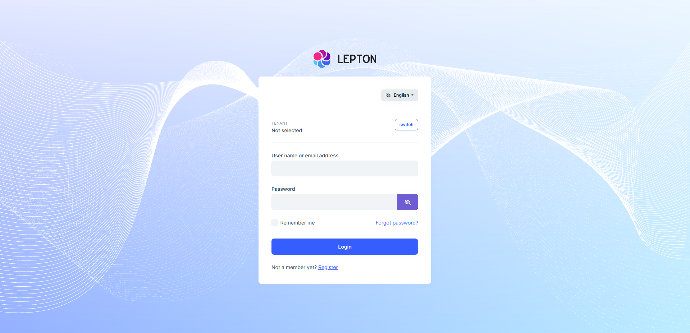

> The **account layout** is defined in the **Themes/LeptonX/Layouts/Account** folder and you can **override** it by creating the file (**Default.cshtml**) with the **same name** and under the **same folder**. There is a **partial view**, its name is **Footer.cshtml**. You can **override** it by **following** the **same way**. 

---

## Components

Abp **helps** you make **highly customizable UI**. You can easily **customize** your themes to fit your needs. **The Virtual File System** makes it possible to **manage files** that **do not physically** exist on the **file system** (disk). It's mainly used to embed **(js, css, image..)** files into assemblies and **use them like** physical files at runtime. 

An application (or another module) can **override** a **virtual file of a module** just like placing a file with the **same name** and **extension** into the **same folder** of the **virtual file**.

LeptonX is built on the [ABP](https://abp.io/), so you can **easily** customize your Asp.Net Core Mvc user interface by following [Abp Mvc UI Customization](../../framework/ui/mvc-razor-pages/customization-user-interface.md).

## Common Components

Commonly used components in all layouts.

### Breadcrumb


Breadcrumbs can be customized by using the `IPageLayout` service. See [PageLayout - Breadcrumb](https://abp.io/docs/latest/UI%2FAspNetCore%2FPage-Header#breadcrumb) for more information. 

If you need to replace the component, you can follow the steps below.

- The **breadcrumb component page (.cshtml file)** is defined in the `Themes/LeptonX/Components/Common/BreadCrumb/Default.cshtml` file and you can **override it** by creating a file with the **same name** and **under** the **same folder**.  

- The **breadcrumb component (C# file)** is defined in the `Themes/LeptonX/Components/Common/BreadCrumb/ContentBreadCrumbViewComponent.cs` file and you can **override it** by creating a file with the **same name** and **under** the **same folder**.


### Content Title

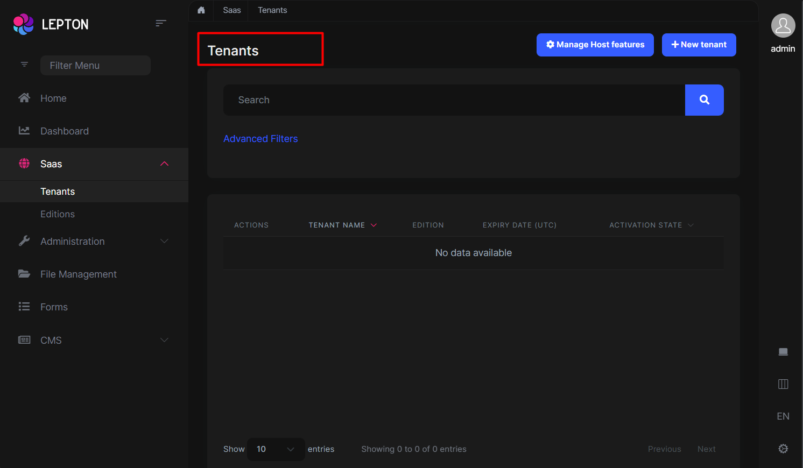

Page Titles can be customized by using the `IPageLayout` service. See [PageLayout - Page Title](https://abp.io/docs/latest/UI%2FAspNetCore%2FPage-Header#page-title) for more information.

If you need to replace the component, you can follow the steps below.

* The **content title component page (.cshtml file)** is defined in the `Themes/LeptonX/Components/Common/ContentTitle/Default.cshtml` file and you can **override it** by creating a file with the **same name** and **under** the **same folder**.

* The **content title component (C# file)** is defined in the `Themes/LeptonX/Components/Common/ContentTitle/ContentTitleViewComponent.cs` file and you can **override it** by creating a file with the **same name** and **under** the **same folder**.


### General Settings

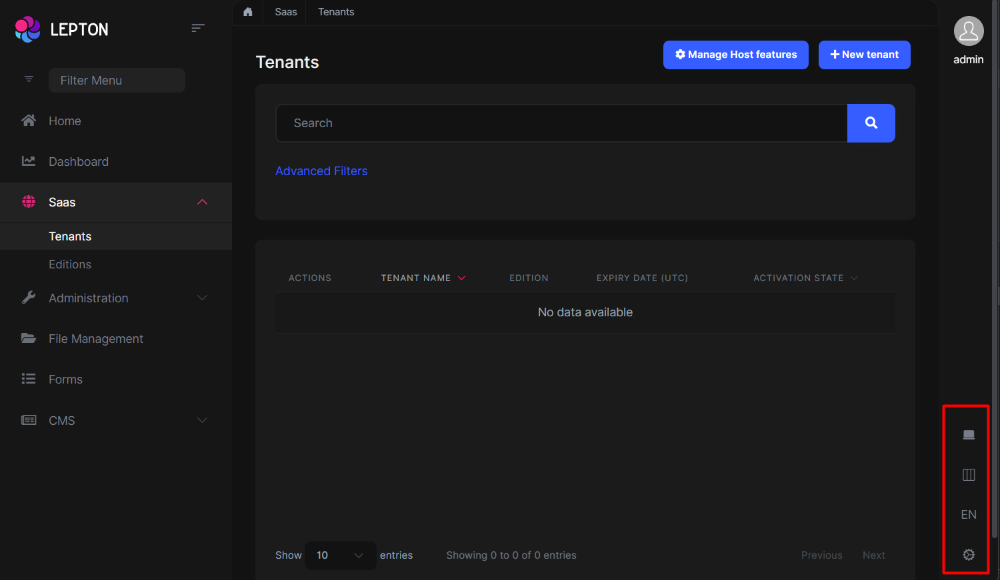

General Settings can be replaced with following files.

* The **general settings component page (.cshtml file)** is defined in the `Themes/LeptonX/Components/Common/GeneralSettings/Default.cshtml` file and you can **override it** by creating a file with the **same name** and **under** the **same folder**.

* The **general settings component (C# file)** is defined in the `Themes/LeptonX/Components/Common/GeneralSettings/GeneralSettingsViewComponent.cs` file and you can **override it** by creating a file with the **same name** and **under** the **same folder**.


### Main Header Branding

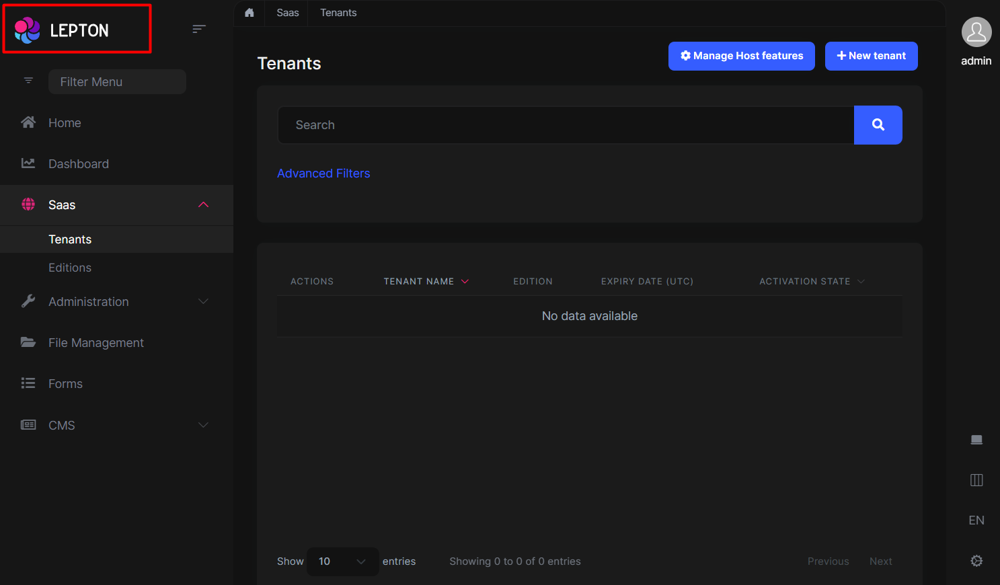

Application name and logo can be customized by using the `IBrandingProvider` service. See [Razor Pages: Branding](../../framework/ui/mvc-razor-pages/branding.md) for more information.

If you need to replace the component, you can follow the steps below.

* The **main header branding component page (.cshtml file)** is defined in the `Themes/LeptonX/Components/Common/MainHeaderBranding/Default.cshtml` file and you can **override it** by creating a file with the **same name** and **under** the **same folder**.

* The **main header branding component (C# file)** is defined in the `Themes/LeptonX/Components/Common/MainHeaderBranding/MainHeaderBrandingViewComponent.cs` file and you can **override it** by creating a file with the **same name** and **under** the **same folder**.

### Mobile General Settings

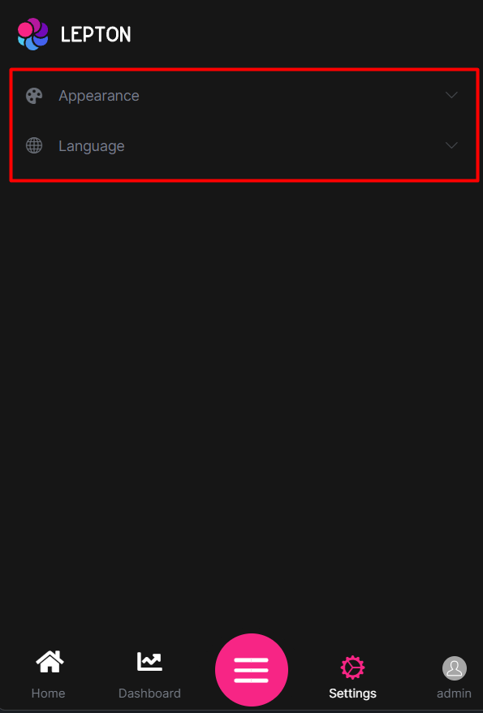

* The **mobile general settings component page (.cshtml file)** is defined in the `Themes/LeptonX/Components/Common/MobileGeneralSettings/Default.cshtml` file and you can **override it** by creating a file with the **same name** and **under** the **same folder**.

* The **mobile general settings component (C# file)** is defined in the `Themes/LeptonX/Components/Common/MobileGeneralSettings/MobileGeneralSettingsViewComponent.cs` file and you can **override it** by creating a file with the **same name** and **under** the **same folder**.

### Page Alerts

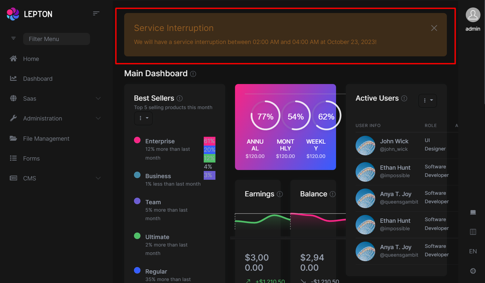

* The **page alerts component page (.cshtml file)** is defined in the `Themes/LeptonX/Components/PageAlerts/Default.cshtml` file and you can **override it** by creating a file with the **same name** and **under** the **same folder**.

* The **page alerts component (C# file)** is defined in the `Themes/LeptonX/Components/PageAlerts/PageAlertsViewComponent.cs` file and you can **override it** by creating a file with the **same name** and **under** the **same folder**.

---

## Side Menu Components

Components used in the side menu layout.

### Main Menu

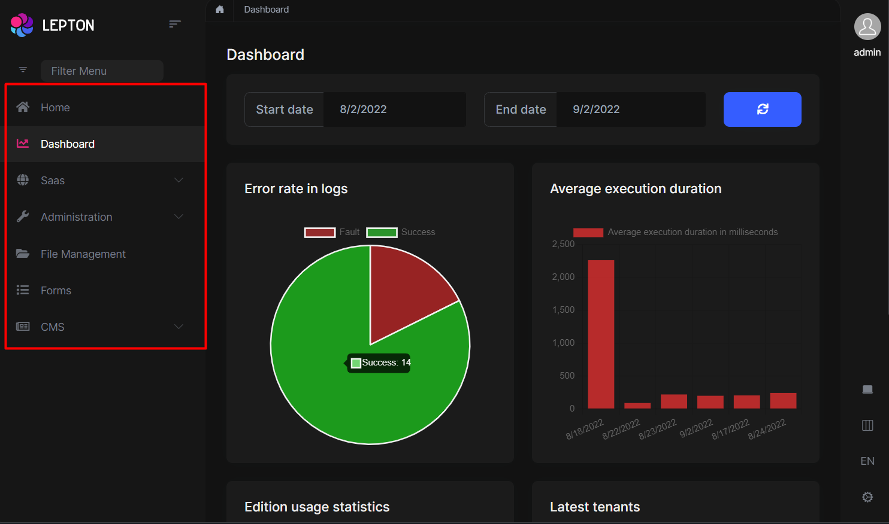

* The **main menu component page (.cshtml file)** is defined in the `Themes/LeptonX/Components/SideMenu/MainMenu/Default.cshtml` file and you can **override it** by creating a file with the **same name** and **under** the **same folder**.

* The **main menu component (C# file)** is defined in the `Themes/LeptonX/Components/SideMenu/MainMenu/MainMenuViewComponent.cs` file and you can **override it** by creating a file with the **same name** and **under** the **same folder**.

> The **main menu component** uses **partial view** to render the **menu items**. The **partial view** is defined in the `Themes/LeptonX/Components/SideMenu/MainMenu/_MenuItem.cshtml` file and you can **override it** by creating a file with the **same name** and **under** the **same folder**.

### Mobile Navbar


* The **mobile navbar component page (.cshtml file)** is defined in the `Themes/LeptonX/Components/SideMenu/MobileNavbar/Default.cshtml` file and you can **override it** by creating a file with the **same name** and **under** the **same folder**.

* The **mobile navbar component (C# file)** is defined in the `Themes/LeptonX/Components/SideMenu/MobileNavbar/MobileNavbarViewComponent.cs` file and you can **override it** by creating a file with the **same name** and **under** the **same folder**.

### Language Switch

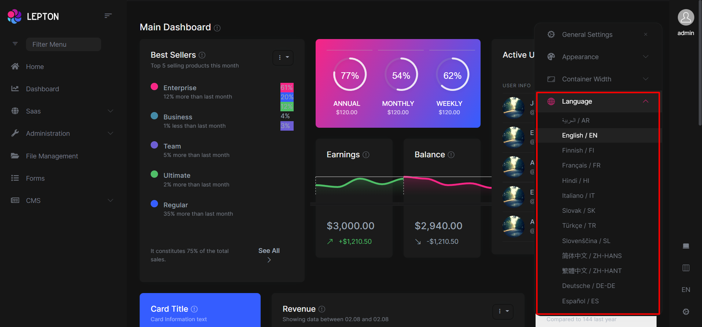

* The **language switch component page (.cshtml file)** is defined in the `Themes/LeptonX/Components/SideMenu/Toolbar/LanguageSwitch/Default.cshtml` file and you can **override it** by creating a file with the **same name** and **under** the **same folder**.

* The **language switch component (C# file)** is defined in the `Themes/LeptonX/Components/SideMenu/Toolbar/LanguageSwitch/LanguageSwitchViewComponent.cs` file and you can **override it** by creating a file with the **same name** and **under** the **same folder**.

### User Menu

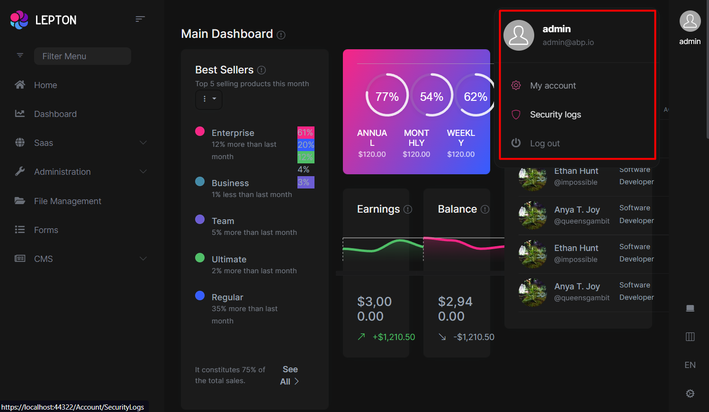

* The **user menu component page (.cshtml file)** is defined in the `Themes/LeptonX/Components/SideMenu/Toolbar/UserMenu/Default.cshtml` file and you can **override it** by creating a file with the **same name** and **under** the **same folder**.

* The **user menu component (C# file)** is defined in the `Themes/LeptonX/Components/SideMenu/Toolbar/UserMenu/UserMenuViewComponent.cs` file and you can **override it** by creating a file with the **same name** and **under** the **same folder**.

> LeptonX implements the ABP Menu [ABP Naviation/Menus](../../framework/ui/mvc-razor-pages/navigation-menu.md#standard-menus). So you can check it out to learn how to add/remove menu items to the user menu.

---

## Top Menu Components

Components used in the top menu layout.

### Main Header

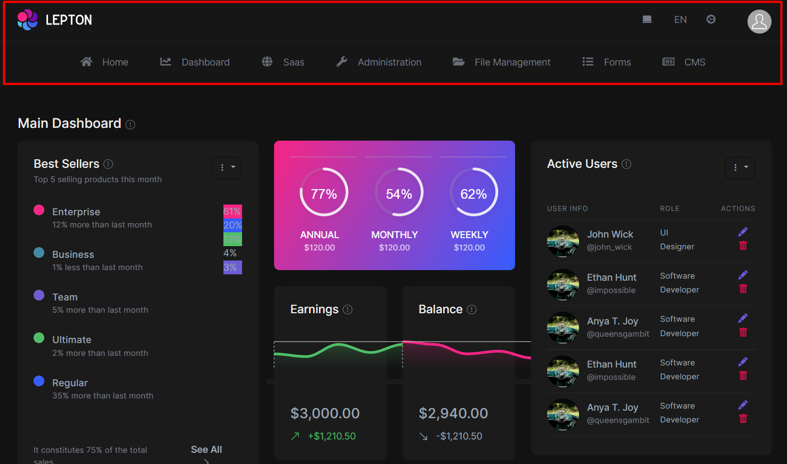

* The **main header component page (.cshtml file)** is defined in the `Themes/LeptonX/Components/TopMenu/MainHeader/Default.cshtml` file and you can **override it** by creating a file with the **same name** and **under** the **same folder**.

* The **main header component (C# file)** is defined in the `Themes/LeptonX/Components/TopMenu/MainHeader/MainHeaderViewComponent.cs` file and you can **override it** by creating a file with the **same name** and **under** the **same folder**.

### Main Header Toolbar


* The **main header toolbar component page (.cshtml file)** is defined in the `Themes/LeptonX/Components/TopMenu/MainHeaderToolbar/Default.cshtml` file and you can **override it** by creating a file with the **same name** and **under** the **same folder**.

* The **main header toolbar component (C# file)** is defined in the `Themes/LeptonX/Components/TopMenu/MainHeaderToolbar/MainHeaderToolbarViewComponent.cs` file and you can **override it** by creating a file with the **same name** and **under** the **same folder**.


> Before replacing the main header toolbar component, make a visit to the [ABP Toolbars](../../framework/ui/mvc-razor-pages/toolbars.md) documentation to learn how to add/remove menu items to the main header toolbar.

### Main Menu

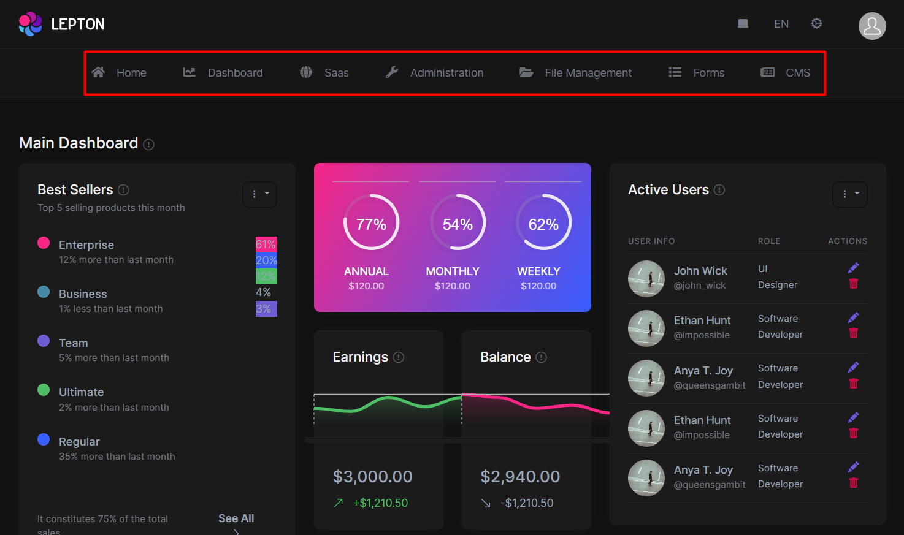

* The **main menu component page (.cshtml file)** is defined in the `Themes/LeptonX/Components/TopMenu/MainMenu/Default.cshtml` file and you can **override it** by creating a file with the **same name** and **under** the **same folder**.

* The **main menu component (C# file)** is defined in the `Themes/LeptonX/Components/TopMenu/MainMenu/MainMenuViewComponent.cs` file and you can **override it** by creating a file with the **same name** and **under** the **same folder**.

### User Menu

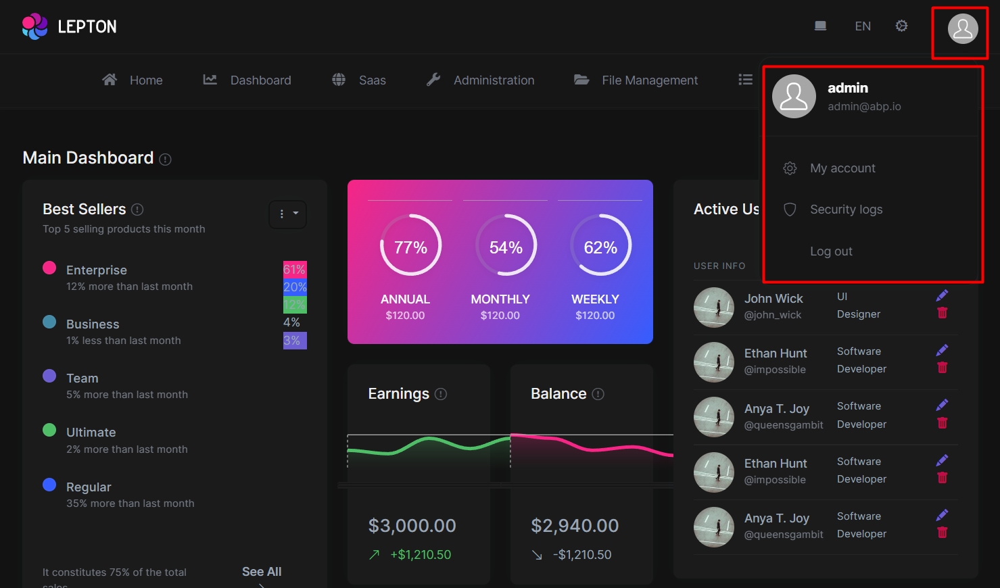

* The **user menu component page (.cshtml file)** is defined in the `Themes/LeptonX/Components/TopMenu/UserMenu/Default.cshtml` file and you can **override it** by creating a file with the **same name** and **under** the **same folder**.

* The **user menu component (C# file)** is defined in the `Themes/LeptonX/Components/TopMenu/UserMenu/UserMenuViewComponent.cs` file and you can **override it** by creating a file with the **same name** and **under** the **same folder**.

> Before replacing the user menu component, make a visit to the [ABP Naviation/Menus](../../framework/ui/mvc-razor-pages/navigation-menu.md#standard-menus) documentation to learn how to add/remove menu items to the user menu.
